# KHÓA HTML/CSS
# BUỔI 1: NHẬP MÔN WEB: CÁC KIẾN THỨC CƠ BẢN VỀ HTML.

## I. Cách thức hoạt động của một trang web.
- 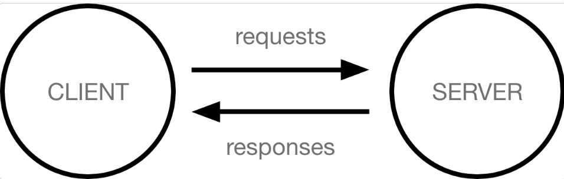
### 1. Client và Server: 
- 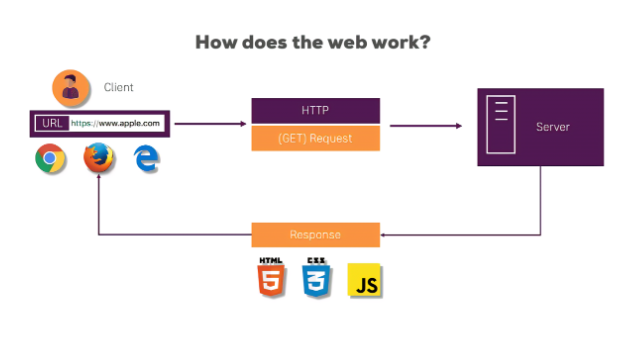
  1. Client: Là những thiết bị kết nối với WEB bằng Internet. VD: Điện thoaị, máy tính đc kết nối Internet và trình duyệt để kết nối web-site: GG, Edge,...
  2. Server: Là những máy tính lưu trữ dữ liệu về trang web,... Nếu người dùng muốn truy cập WEB, 1 bản copy của trang web từ server sẽ được hiển thị lên trình duyệt

### 2. Các khái niệm:
1. Kết nối Internet:
2. TCP/IP: 
   - 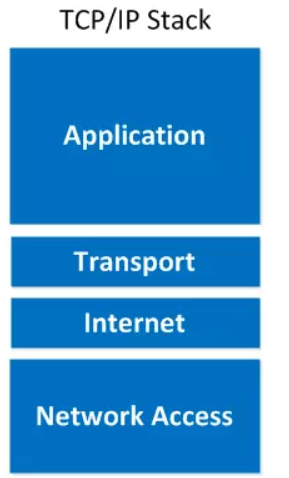
   - Transmission Control Protocol and Internet Protocol(Giao thức điều khiển truyền dẫn/ Giao thức Internet): Là 1 tập các quy tắc và thủ tục để **chỉ định cách dữ liệu được trao đổi qua Internet** bằng cách cung cấp thông tin trao đổi đầu cuối nhằm mục đích xác định cách thức nó được chia thành các gói, được gắn địa chỉ, vận chuyển,  định tuyến và nhận ở điểm đến. TCP/IP không yêu cầu quản lý nhiều và nó được thiết kế để khiến mạng đáng tin cậy hơn với khả năng phục hồi tự động.
   - Ở đây, IP có vai trò quan trọng, nó **cho phép các gói tin được gửi đến đích đã định sẵn**, bằng cách thêm các thông tin dẫn đường (chính là Header) vào các gói tin để các gói tin được đến đúng đích đã định sẵn ban đầu.
   - Giao thức TCP đóng vai trò **kiểm tra và đảm bảo sự an toàn cho mỗi gói tin khi đi qua mỗi trạm**. Trong quá trình này, nếu giao thức TCP nhận thấy gói tin bị lỗi, một tín hiệu sẽ được truyền đi và yêu cầu hệ thống gửi lại một gói tin khác.
3. DNS: 
   - Domain Name System - **Hệ thống tên miền**, nó giống như một cuốn số địa chỉ các websites. Khi bạn gõ một địa chỉ website lên trên thanh trình duyệt, trình duyệt sẽ tìm trong DNS để tìm được địa chỉ IP của website trước, sau khi tìm được thì sẽ sẽ bắt đầu truy suất trang web đó. Trình duyệt sẽ cần phải tìm ra địa chỉ của máy server đang chứa trang web đó để nó có thể gửi HTTP message tới đúng nơi. Cơ bản giống như việc bạn phải tìm được đúng địa chỉ của cửa hàng mà bạn muốn mua sắm.
4. HTTP: 
   - Hypertext Transfer Protocol - Giao thức truyền siêu văn bản. Nó là một giao thức ứng dụng nhằm **quy định ra một ngôn ngữ chung giữa client và server để chúng có thể dùng và giao tiếp với nhau**. Tưởng tượng nó giống như một ngôn ngữ bạn dùng để có thể đặt được những món hàng mà bạn muốn mua ở cửa hàng.
5. Component files: Một website được tạo thành từ rất nhiều files khác nhau, những files này sẽ được chia thành 2 loại chính:
   - Code files: Các trang web được xây dựng chủ yếu từ HTML, CSS và JavaScript, sau này có thể còn có nhiều các công nghệ khác.
   - Assets: Đây là tên chung cho tất cả nội dung khác tạo nên trang web, chẳng hạn như hình ảnh, âm nhạc, video, tài liệu Word và PDF.
6. WebHosting: 
- 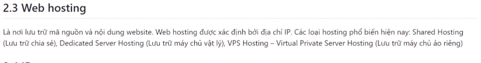
7. IP:
- 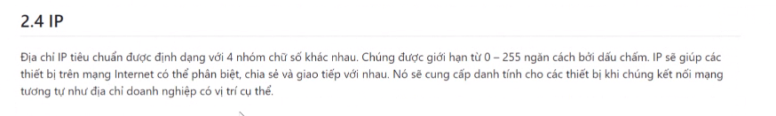
8. Các loại WEB:
- 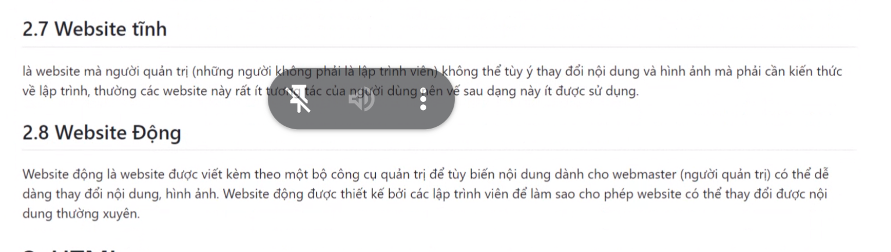
### 3. Cách thức hoạt động:
- 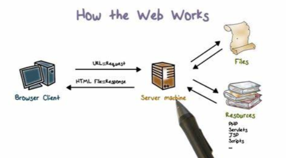 
1. Khi bạn gõ địa chỉ website lên trên thanh trình duyệt (tương đồng với việc bạn đang đi bộ tới cửa hàng):
   - Trình duyệt sẽ đi đến DNS server, tìm địa chỉ chính xác của cái server đang chứa website đó (tìm địa chỉ cửa hàng)
   - Trình duyệt sẽ gửi một HTTP request message tới server đó, yêu cầu máy server gửi về cho nó một bản copy của website đang muốn xem (bạn đi được tới cửa hàng và order hàng hoá muốn mua). Message gửi đi và tất cả các data được gửi qua lại giữa client và server nhờ internet connection sử dụng TCP/IP.
   - Lúc này nếu máy server chấp nhận request tới từ máy client, server sẽ gửi cho client một message "200 OK", nghĩa là "Okay nha, bạn có thể xem website này nha! Nó đây!", và tiếp theo đó server sẽ bắt đầu gửi về cho browser ở client các files của website, nó là một chuỗi các phần nhỏ được gọi là data packets (gói giữ liệu) (Lúc này cửa hàng chấp nhận đơn hàng và đưa hàng hoá cho bạn mang về nhà)
   - Trình duyệt sẽ tập hơn các file đó lại thành một website hoàn chỉnh và hiển thị lên cho bạn xem.
   Phân tích thứ
### 4. Các Thành phần, File cấu tạo nên WEBSITE:
- Khi browsers gửi request đến server để yêu cầu được tải các HTML files, các HTML files đó thường chứa các thẻ `<link>` thường gắn các liên kết để tải các file css, ngoài ra còn có thẻ `<script>` gắn liên kết để tải thên các file code javaScript khác. Việc hiểu được thứ tự parsing(phân tích cú pháp) của browser khi nó load một trang HTML là cực kỳ quan trọng:
  1. Browser sẽ phân tích cú pháp HTML trước nhất, như vậy thì browser mới có thể hiểu được thẻ như thẻ `<link> `hoặc thẻ `<script>` được gắn trên HTML
  2. Trong lúc đọc và phân tích HTML, khi đọc tới các thẻ <`link>/<script>`, browser sẽ gửi request ngược lại về phía server để tải tiếp các file css, javaScript được gắn kèm trong các thẻ đó để tiếp tục parsing (phân tích).
  3. Browser sẽ generates một cây DOM và lưu in-memory (vùng nhớ của browser) để lưu HTML sau khi phân tích, và một cấu trúc CSSOM (CSS Object Model) cũng được lưu in-memory dùng để chứa CSS sau khi phân tích, và sau cùng browser sẽ biên dịch và thực thi JavaScript.
  4. Sau khi làm xong các step trên, build cây DOM, apply stylesheet từ CSSOM và biên dịch, thực thi xong javaScript. Một website hoàn chỉnh sẽ được hiển thị lên trên browser cho người dùng thưởng thức.

### 5. Cách Website thực thi:
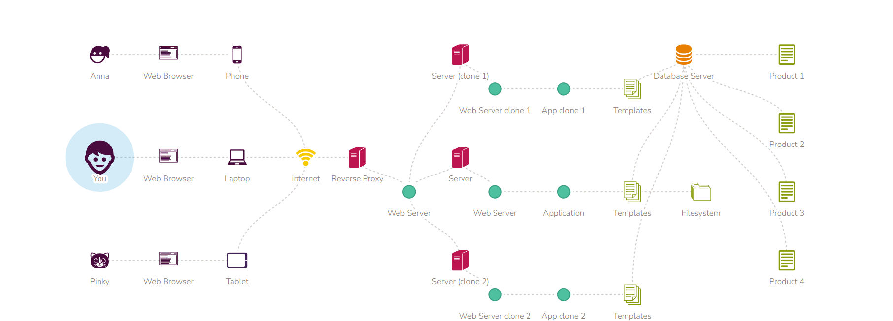
1. Toàn bộ các máy tính liên kết với nhau và kết nối với server: Mạng Internet
2. Máy chủ chạy 1 chương trình phần mềm gọi là WEB-SERVER để: chấp nhận yêu cầu truy cập, quyết định file, chương trình phù hợp,.. => Tương tự 1 cổng bảo mật
3. Các File được mã hóa trong server lưu ở dạng văn bản
4. Khi **có yêu cầu**, máy chủ sẽ **trả lại HTML** mô tả trang web nó tìm thấy (sau đó sẽ như P4)
5. **Web Application** là 1 chương trình phần mềm có thể tạo trang web động theo yêu cầu. Các Web Application có thể đọc từ một file mẫu và xây dựng một trang html động.Điều này có nghĩa là các trang web không thực sự tồn tại, một Web Application sẽ tạo ra chúng khi có người cần hiển thị.
6. Một **Web Application có thể tương tác với một cơ sở dữ liệu**(bằng cách truy vấn (đọc) cơ sở dữ liệu và điền các mẫu html để tạo ra trang sản phẩm động.). **Cơ sở dữ liệu** là một chương trình phần mềm được cài đặt trên máy chủ giúp lưu trữ và truy cập DỮ LIỆU hiệu quả.
7. **MÁY CHỦ CƠ SỞ DỮ LIỆU**: Để xử lý nhiều yêu cầu hơn, hoặc mở rộng ứng dụng của bạn, bạn có thể di chuyển phần mềm cơ sở dữ liệu của bạn đến máy chủ cơ sở dữ liệu (Database Server) nằm độc lập.Giờ đây, Web Server của bạn có thể tập trung vào việc phân phối các yêu cầu duyệt web, Trong khi Database Server của bạn nhận được nhiều sức mạnh
tính toán hơn để quản lý cơ sở dữ liệu.
## II. Các thuật ngữ, lĩnh vực (domain, server, hosting, IP, ...).
## III. Khái niệm, cấu trúc HTML và ý nghĩa các thẻ.

### 1. ĐN HTML: 
- HTML (HyperText Markup Language) : là một ngôn ngữ đánh dấu được thiết kế ra để tạo nên các trang web, nghĩa là các mẩu thông tin được trình bày trên World Wide Web.
- Không phải NN Lập trình
- Có tác dụng tạo bố cụ, định dạng Web

### 2. Cấu trúc:
```
   <!DOCTYPE html>
   <html lang="en">
      <head>
         <meta charset="UTF-8">
         <meta name="viewport" content="width=device-width, initial-scale=1.0">
         <title>Document</title>
      </head>
      <body>
      
      </body>
   </html>
```

1. `<!DOCTYPE html>`: Kiểu tài liệu
2. `<html></html>`: Cặp thẻ lớn nhất, đóng gói tất cả các thẻ còn lại ở trong nó
3. `<head></head>`: Khai báo thông tin meta của trang web: tiêu đề, charset,...
4. `<title></title>`: cặp thẻ trong head, dùng để khai báo tiêu đề
5. `<body></body>`: đóng gói tất cả các nọi dung trong đó

## IV. Một số thẻ meta, comment, element, attribute.

### 1. 1 số thẻ meta: 
1. Thẻ meta: để khai báo 1 số thông tin của trang web, được code trong thẻ `<head></head>`
2. VD:
   1. `<meta charset="UTF-8">` Xác định bộ kí tự sử dụng
   2. `<meta name="keywords" content="HTML co ban">` Xác định từ khóa cho công cụ tìm kiếm.
   3. `<meta name="description" content="front-end">` Viết mô tả khi tìm kiếm trang web
      - 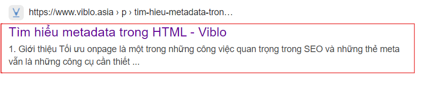
   4. `<meta name="author" content = "Name">` Xác định tên tác giả 

3. Các thuộc tính của thẻ meta:
- 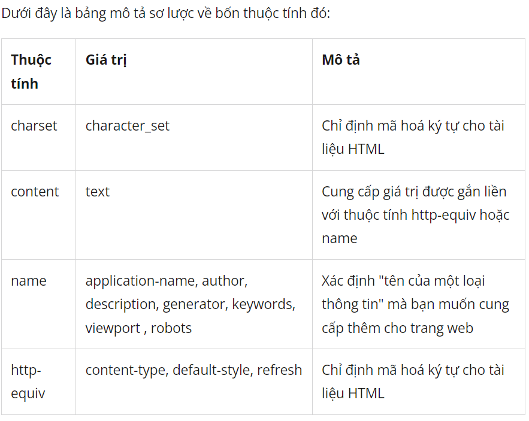
  1. Thuộc tính charset
     - Thuộc tính charset dùng để xác định kiểu mã hóa ký tự của trang web. (Tiếng Việt của chúng ta sử dụng kiểu mã hóa ký tự là UTF-8)
     - Ví dụ: `<meta charset="UTF-8">`

  2. Thuộc tính name
     - Thuộc tính name dùng để xác định "tên của một loại thông tin" mà bạn muốn cung cấp thêm cho trang web. Lưu ý: Thuộc tính name chỉ dùng để xác định tên của loại thông tin mà bạn muốn cung cấp thêm cho trang web, còn nội dung của thông tin đó thì phải sử dụng thuộc tính `content`.
     - Dưới đây là một số giá trị thường được dùng bởi thuộc tính name: 
      1. Giá trị `author` Xác định tên tác giả (chủ sở hữu) của trang web. Ví dụ: `<meta name="author" content="Web cơ bản">`
         - Thẻ trên cung cấp cho trình duyệt và các công cụ tìm kiếm biết tác giả (chủ sở hữu) của trang web chính là "Web cơ bản". Khi tìm kiếm trên google, tên tác giả sẽ hiển thị kế bên kết quả tìm kiếm.
      2. Giá trị `keywords` Xác định danh sách những từ khóa mà bạn muốn khi người dùng gõ vào các cỗ máy tìm kiếm như google, bing, .... thì sẽ hiển thị kết quả là trang web của bạn.
         - Ví dụ: Bạn muốn khi người dùng gõ trên google một trong những từ khóa bên dưới sẽ hiển thị kết quả là trang web của bạn: xem phim hd, phim hay, phim hành động:
         - `<meta name="keywords" content="xem phim hd, phim hay, phim hành động">`
         - Lưu ý: Giữa các từ khóa phải được ngăn cách bởi dấu phẩy.
      3. Giá trị description Mô tả ngắn gọn nội dung chính của trang web (khoảng 150 ký tự là hợp lý) Ví dụ:
          - `<meta name="description" content="Website xem phim hành động hay chất lượng full HD miễn phí">`
          - Lưu ý: Nội dung của thuộc tính description tốt nhất nên chứa các từ trong danh sách từ khóa (keywords), điều đó sẽ hỗ trợ tốt cho thuộc tính keywords cũng như việc hiển thị trang web của bạn trên các cỗ máy tìm kiếm.
      4. Giá trị `robots`. Thẻ Meta `robots` là một thẻ có tác dụng **điều hướng cho bộ tìm kiếm của Google thu thập thông tin trên những trang đánh chỉ mục và những trang loại trừ của một website**. Bạn có thể cho phép hoặc không cho phép công cụ tìm kiếm index trang, theo dõi các liên kết của nó hoặc lưu trữ nó, hoặc ngăn chặn không cho nó index một số trang không cần thiết. 
       - Ví dụ: `<meta name=”robots” content=”noindex, nofollow” />`
       - Thẻ meta này không cho công cụ tìm kiếm index trang và ngăn cản họ theo dõi các liên kết trên trang. Nếu bạn tình cờ được sử dụng hai thuật ngữ mâu thuẫn (ví dụ noindex và index), Google sẽ chọn tùy chọn hạn chế nhất là noindex.
       - Tại sao thẻ này hữu ích cho SEO? Trước hết đó là một cách đơn giản để ngăn chặn các chỉ số hoá nội dung trùng lặp, ví dụ phiên bản để in của một trang. Nó cũng có thể có ích cho các trang chưa hoàn thiện hoặc các trang web có thông tin bí mật.
       - Tham khảo thêm một số giá trị khai báo:
         - “index“: Các bọ tìm kiếm của Google khi thu thập thông tin được phép đánh chỉ mục trang này.
         - “follow“: Thuộc tính cho phép các bọ tìm kiếm của Google dựa vào những liên kết trên trang hiện tại của website để tìm kiếm thông tin trên các trang khác có liên quan đến trang này.
         - “all” hoặc “index, follow”: Bao gồm cả 2 giá trị của index và follow là cho phép google index, lập chỉ mục và đi theo các liên kết có trong bài viết.
         - “noindex”: không cho phép google hay robots index trang này.
         - “nofollow“: Không cho phép Robots đi theo link trong trang để tới các trang khác liên kết.
         - “none” hay “noindex, nofollow“: bao gồm 2 thuộc tính noindex và nofollow, không cho google index trnag và không cho robots đi theo các liên kết trong trang.

  3. Thuộc tính http-equiv
     - Thuộc tính http-equiv thường được dùng để: Xác định kiểu nội dung và kiểu mã hóa ký tự của trang web và xác định việc tải lại trang.
     - Lưu ý: Tương tự như thuộc tính name, thuộc tính http-equiv phải sử dụng kèm với thuộc tính content.
     - Dưới đây là các giá trị được dùng bởi thuộc tính http-equiv:
     - Giá trị content-type Xác định kiểu nội dung và kiểu mã hóa ký tự của trang web.
     - Ví dụ: `<meta http-equiv="content-type" content="text/html; charset=UTF-8">`
     - Tuy nhiên, ta có thể thay thế bằng <meta charset="UTF-8"> cho ngắn gọn hơn.
     - Giá trị refresh Xác định việc trang sẽ tự động được tải lại.
     - Ví dụ: Sau 2 giây trang sẽ tự động được tải lại.
      ```html
         <!DOCTYPE html>
         <html>
         <head>
            <meta http-equiv="refresh" content="2">
         </head>
         <body>
            <h1>Bức tranh bên dưới có tên là The Scream</h1>
            
         </body>
         </html>
      ```
  4. Thuộc tính content
     - Thuộc tính content dùng để xác định nội dung của loại thông tin mà ta muốn cung cấp cho trình duyệt và các công cụ tìm kiếm.

### 2. Comment:
1. Cú pháp:
   ```html
   <!-- Đây là một chú thích -->

   <p>This is a paragraph.</p>

   <!-- Nhớ viết thêm thông tin vào đây -->
   ```

### 3. Element:
1. Element(Phần tử): Là danh sách những thẻ HTML mà trình duyệt hỗ trợ. Phần tử trong HTML được quy ước bao gồm:
   1. Có thẻ mở và thẻ đóng (VD: `<h1></h1>`)
   2. Nội dung bên trong
   3. Các TH khác: Các thẻ không có thẻ đóng (VD: meta, img,..)
2. Các thẻ trong HTML có thể lồng nhau tạo thành một bố cục mà ta mong muốn
   1. VD: 
   2. 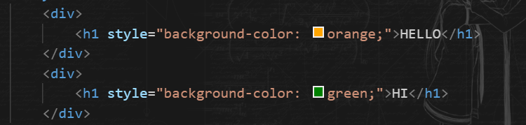
   3. 


### 4. Attribute(Thuộc tính của thẻ) 
1. Mỗi thẻ đều có chức năng, thuộc tính riêng cả thẻ
2. VD:
   1. 
   2. 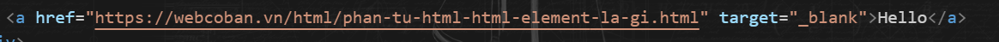
   3. Thẻ a có thuộc tính target, nếu chọn _blank, thì khi nhấn vào liên hết, nó sẽ chuyển hướng sang tab mới, còn nếu chọn _self thì sẽ mở ngay ở tab hiện tại


## V. Thẻ heading, p, format, a, img, video, audio

### 1. Thẻ heading
1. Là những thẻ tiêu đề hiển thị trên WEB:
2. Có 6 loại thẻ heading: từ `<h1></h1> => <h6></h6>`

### 2. Thẻ p (Đoạn văn)
- Là thẻ trích dẫn 1 đoạn nội dung
1. Đặc điểm:
   - Luôn bắt đầu trên 1 dòng mới.
   - Cú pháp: `<p></p>`
   - Nếu muốn xuống dòng 1 cách chủ động, ta sử dụng thẻ :`<br>`
   - Nếu muốn ngắt đoạn, ta sử dung thẻ: `<hr>`


### 3. Thẻ format (Định dạng) : Để format văn bản
- 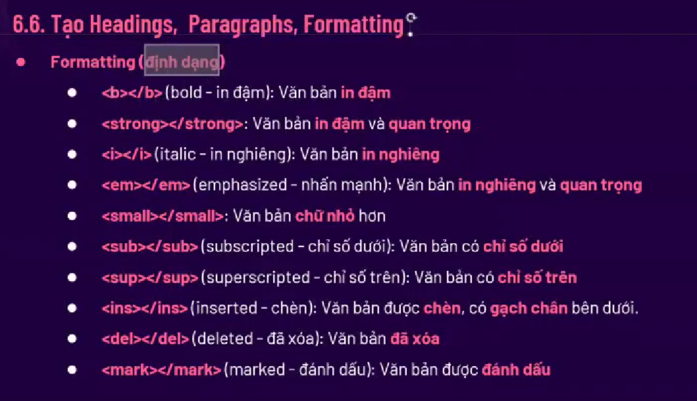


### 4. VD:

## VI. Thẻ block, inline.

### 1. ĐN:
1. Block và Inline là 2 Kiểu hiển thị Element
### 2. Block:
1. DD: 
   1. Luôn xuất hiện trên 1 dòng mới, trình duyệt tự thêm khoảng trống trc, sau element
   2. Luôn chiếm full khoảng cách ngang có sẵn
2. VD:
   1. `<address> <article> <aside> <h1> -> <h6> <ul> <li> <p> <table>`

### 3. Inline:
1. ĐN:
   - Ko xuất hiện trên 1 dòng mới, chiều rộng bằng luôn phần nôi dung bên trong nó
2. VD:
   1. `<a> <b> <button>  <input> <label>, <span> <textarea>`

## VII. Phân biệt div, span.

### 1. Thẻ div:

1. ĐN:
   1. Là 1 thẻ block
   2. Có tác dụng Chứa đựng các thẻ, tạo nên bố cục trang WEB
   3. Có thể sửa layout qua CSS
2. VD:
   1. VD: 
   2. 
   3. 


### 2. Thẻ span:
1. ĐN:
   1. Là 1 thẻ Inline
   2. Có thể sửa layout qua CSS
2. VD:
   1. VD: 
   2. 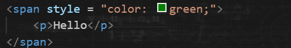


## VIII. Các thẻ text content: ul, ol, li, h1, h2

### 1. Thẻ ul, ol, li: Chèn List:
1. ul: 
   1. Mục con trong thẻ sẽ không đc đánh số, chỉ đánh dấu bằng 1 kí hiệu
   2. VD:
      1. 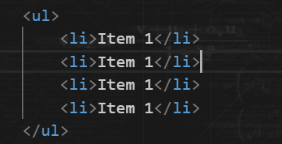
      2. 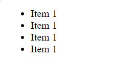
   3. Thuộc tính:
      1. type: loại kí hiệu:circle, disc, square
2. ol: 
   1. Mục con trong thẻ sẽ đc đánh số, có thể là số tự nhiên, hoặc la mã,...
   2. VD:
      1. 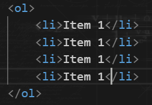
      2. 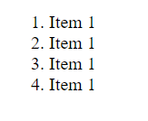
      3. 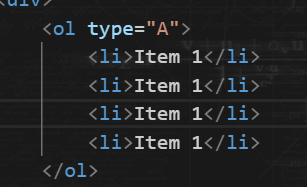
      4. 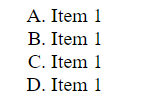
      5. 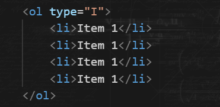
      6. 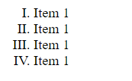
   3. Thuộc tính:
      1. type: loại kí hiệu: A, 1, I,...


### 2. Thẻ h1, h2, p (ở phần trên)


## BUổi học:

### 1. Cách trình duyệt làm việc:
- Tìm kiếm
- Nhận HTML:
  - 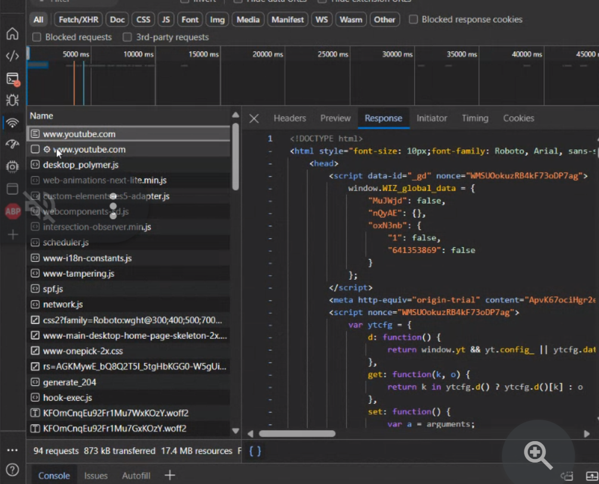
- Đọc các thẻ Script, Link (CSS, JS) => Tải chúng về.