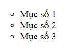
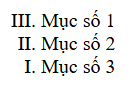

# [BUỔI 1] 
---
## 1. Cách thức hoạt động của một trang web:
\- `Website` là tập hợp nhiều trang web có chứa văn bản, hình ảnh, âm thanh, ... có liên kết với nhau và gói gọn trong một tên miền (`domain`) và được phát hành thông qua máy chủ web (`web server`).

\- Trang web có thể truy cập công khai tạo thành world wide web (`www`), hoặc cũng có những trang web riêng tư chỉ có thể truy cập được thông qua mạng riêng.

\- **Phân biệt trang web và website:**
- Cách gọi:
  - trang web: phụ thuộc vào tên danh mục hoặc tiêu đề.
  - website: thường được gọi bằng tên miền (domain).
- Quy mô:
  - mỗi trang web chỉ chứa 1 trang duy nhất chứa thông tin và hình ảnh về một chủ đề cụ thể.
  - một website chứa nhiều trang khác nhau.
- Chức năng:
  - hiển thị thông tin, nội dung hoặc tài liệu cụ thể.
  - thực hiện nhiều chức năng khác nhau.

\- **Trang web hoạt động như thế nào ?**


1. Người dùng truy cập vào trình duyệt web (`browser`)
2. Người dùng truy cập vào địa chỉ website `https://www.facebook.com` 
3. Trình duyệt gửi yêu cầu đến `DNS server`. DNS server có nhiệm vụ phân giải domain thành IP của server chứa source code của website ứng với domain đó.
4. Sau khi nhận được IP, trình duyệt sẽ gửi yêu cầu truy xuất thông tin của website đến web server thông qua IP đã nhận được.
5. Khi web server nhận được yêu cầu truy xuất nội dung website từ trình duyệt, server sẽ xử lý thông tin và trả về website nội dung theo yêu cầu. (là các file HTML, CSS, hình ảnh, âm thanh ...)
6. Sau khi nhận được nội dung của server, trình duyệt sẽ render thành giao diện website hiển thị trên trình duyệt.

\- **Web hosting** là dịch vụ cung cấp bởi các nhà cung cấp dịch vụ Internet hoặc các công ty hosting, cho phép bạn lưu trữ các tệp và dữ liệu của trang web trên các máy chủ web của họ. Điều này giúp cho trang web của bạn có thể được truy cập ở bất cứ đâu thông qua Internet.
- Các loại hosting phổ biến:
  - shared hosting: nhiều trang web chia sẻ một máy chủ, là lựa chọn phổ biến cho các trang web nhỏ, có lưu lượng truy cập thấp, tuy nhiên tài nguyên (RAM, CPU, băng thông ...) sẽ bị chia sẻ cho các trang web trên cùng máy chủ.
  - vps hosting (Virtual private hosting): một máy chủ vật lý được chia thành nhiều máy chủ ảo độc lập, phù hợp cho các trang web có lưu lượng truy cập từ trung bình đến cao yêu cầu hiệu suất ổn định hơn.
  - dedicated hosting: lưu trữ máy chủ vật lý, cung cấp tài nguyên tối đa và kiểm soát toàn bộ máy chủ, cho phép lưu lượng truy cập và hiệu suất cao. 
  - cloud hosting: lưu trữ máy chủ đám mây, là mô hình điện toán sử dụng công nghệ máy tính và sự phát triển vào mạng Internet, đảm bảo tính sẵn sàng cao và mở rộng nhanh chóng khi nhu cầu tăng đột ngột.
...

\- **Web server** - máy chủ web là nơi lưu trữ mã nguồn (source code) và nội dung website, được định danh bởi một địa chỉ IP, mỗi máy chỉ có một địa chỉ IP duy nhất, thường dành cho các website lớn.

\- **Địa chỉ IP** là một chuỗi số được sử dụng để xác định các thiết bị kết nối với mạng Internet hoặc mạng cục bộ. Mỗi thiết bị kết nối với Internet đều có một địa chỉ IP riêng biệt để nhận dạng và giao tiếp với các thiết bị khác.

\- **Domain** - tên miền là tên định danh cho một website, thay thế cho địa chỉ IP của một web server.

\- **DNS server** (Domain name system server) có nhiệm vụ gắn một tên miền (domain) với một địa chỉ IP của một web server nào đó. Để khi người dùng nhập tên miền, DNS server sẽ trả về địa chỉ IP của server đó cho trình duyệt để trình duyệt biết cần lấy nội dung từ server nào.

\- **Banwidth** - băng thông lượng dữ liệu có thể truyền tải qua một kết nối mạng trong một khoảng thời gian nhất định.

## 2. HTML
\- **HTML là gì ?** : là viết tắt của cụm từ **Hypertext Markup Language** (ngôn ngữ đánh dấu siêu văn bản). **HTML** được sử dụng để tạo và cấu trúc các thành phần trong trang web hoặc ứng dụng, phân chia các đoạn văn, heading, titles, blockquotes,... và HTML không phải là ngôn ngữ lập trình. HTML có thể được hỗ trợ bởi các công nghệ như `CSS` và ngôn ngữ lập trình kịch bản như `JavaScript`. 

\- **HTML dùng để làm gì ?**: HTML được sử dụng với 3 mục đích chính là tạo nội dung, thiết kế giao diện và lập trình tương tác cho trang web.

\- **Cấu trúc của HTML** 
- Các thành phần (element) trong html thường được mở đầu bằng `<` (thẻ mở) hoặc `</` (thẻ đóng) tiếp đến là tên thẻ, thuộc tính thẻ và kết thúc bằng `>`.
- Phần khai báo khai báo loại file code là file html `<!DOCTYPE html>` : xuất hiện phần trên cùng của file. 
- Phần khai báo đầu, khai báo về meta, little, javascript, css,... có cấu trúc bắt đầu bằng thẻ `<head>` và kết thúc bằng thẻ đóng `</head>`.
- Phần chứa và hiển thị nội dung của trang web, có cấu trúc bắt đầu bằng thẻ `<body>` và kết thúc bằng thẻ `</body>`.

#### Element 
\- Là thành phần cơ bản tạo nên một trang web
- phần tử đầy đủ: `<tagname>Content</tagname>`
- phần tử tự đóng: `<tagname/>`

\- các thành phần cơ bản của element
- thẻ mở `<tagname>`
- thẻ đóng (nếu thẻ tự đóng thì sẽ không có) `</tagname>`
- content: ```<tagname>Content</tagname>```
- attribute ```<tagname attribute="value">Content<tagname>```


#### Thẻ meta
\- mô tả bộ kí tự, mô tả trang, từ khóa, tác giả,...

\- các thuộc tính của thẻ meta:

- **charset**: định nghĩa bộ kí tự được sử dụng trên trang web, phổ biển nhất là utf-8.
- **name**: chỉ định tên cho kiểu dữ liệu
- **http-equiv**: cung cấp tiêu đề http cho thông tin/giá trị của thuộc tính content
- **content**: chỉ định giá trị liên kết với http-equiv hoặc name


```html
<!-- Thẻ meta dùng để xác định từ khóa  -->
<meta name="keywords" content="HTML, the meta trong HTML, hoc HTML co ban va nang cao" />
<!-- Thẻ meta dùng để mô tả tài liệu -->
<meta name="description" content="The meta trong HTML." />
<!-- Ngày sửa cuối cùng của tài liệu -->
<meta name="revised" content="Nguyễn Tùng, 08/07/2024" />
<!-- Refresh tài liệu, content="5" cứ 5s refresh 1 lần, nếu để 1 url đằng sau thì sau 5s sẽ chuyển hướng đến url đó -->
<meta http-equiv="refresh" content="5; url=https://facebook.com" />
<!-- Thiết lập cookie -->
<meta http-equiv="cookie" content="userid=463426; expires=Wednesday" />
<!-- Thiết lập tên tác giả -->
<meta name="author" content="bluet52hzzz" />
<!-- Đặt chế độ xem -->
<meta name="viewport" content="width=device-width, initial-scale=1.0">
```

#### Thẻ heading
\- là thẻ tiêu đề của trang, dùng để **khái quát nội dung chính** của trang web. Có 6 thẻ heading từ h1 đến h6, giảm dần theo mức độ quan trọng.
\- Thẻ heading giúp cho người dùng dễ nắm bắt được nội dung của trang web, hỗ trợ cho các công cụ tìm kiếm đánh giá nội dung trang web.

```html
<h1>Heading 1</h1>
<h2>Heading 2</h2>
<h3>Heading 3</h3>
<h4>Heading 4</h4>
<h5>Heading 5</h5>
<h6>Heading 6</h6>
```


#### Thẻ p
\- Viết tắt của paragraph, dùng để định nghĩa một đoạn văn, trình duyệt sẽ tự động thêm 1 dòng trống trước và sau mỗi phần tử `<p>`. Có thể sử dụng CSS để tạo kiểu cho đoạn văn.
\- Nội dung trong `<p>` sẽ được viết trong cùng 1 dòng cho dù ta có cố tình xuống dòng trong phần nội dung, để xuống dòng, ta cần sử dụng thẻ `<br>` hoặc ngăn cách giữa các đoạn `<hr>`.
```html
<p>
  Dòng 1
  Dòng 2
  Dòng 3
  Dòng 4
  Dòng 5
</p>
```
><p>
>  Dòng 1 
>  Dòng 2
>  Dòng 3
>  Dòng 4 
>  Dòng 5
></p>

```html
<p>
  Dòng 1 <br>
  Dòng 2 <br>
  Dòng 3 <br>
  Dòng 4 <br>
  Dòng 5 <br>
</p>
```
><p>
>  Dòng 1 <br>
>  Dòng 2 <br>
>  Dòng 3 <br>
>  Dòng 4 <br>
>  Dòng 5 <br>
></p>

```html
<p>
  Dòng 1 <hr>
  Dòng 2 <hr>
  Dòng 3 <hr>
  Dòng 4 <hr>
  Dòng 5 <hr>
</p>
```
><p>
>  Dòng 1 <hr>
>  Dòng 2 <hr>
>  Dòng 3 <hr>
>  Dòng 4 <hr>
>  Dòng 5 <hr>
></p>

#### Các loại thẻ format
\- **Chữ in đậm**: sử dụng cặp thẻ `<b> </b>`
```html
<p> Đây là nội dung cần <b>in đậm</b></p>
```
> <p> Đây là nội dung cần <b>in đậm</b>.</p>

\- **Chữ in nghiêng**: sử dụng cặp thẻ `<i> </i>`
```html
<p> Đây là nội dung cần <i>in nghiêng</i></p>
```
> <p> Đây là nội dung cần <i>in nghiêng</i>.</p>

**Có thể sử dụng kết hợp các thẻ format với nhau**
```html
<p> Đây là nội dung cần <b><i>in đậm và nghiêng</i></b></p>
```
> <p> Đây là nội dung cần <b><i>in đậm và nghiêng</i></b></p>

\- **Chữ bị gạch chân**: sử dụng cặp thẻ `<u></u>`

```html
<p> <u> Đây là đoạn văn có chữ bị ngạch chân.</u></p>
```

> <p> <u> Đây là đoạn văn có chữ bị ngạch chân.</u></p>

\- **Đánh dấu văn bản**: sử dụng cặp thẻ `<mark> </mark>`

```html
<p>Đánh dấu chữ <mark style="background-color:red; color:white"> Test </mark> </p>
```

> <p> Đánh dấu chữ <mark style="background-color:red; color:white"> Test </mark> </p>

\- **Chữ bị kẻ ngang**: sử dụng cặp thẻ `<del></del>` hoặc `<strike></strike>` (đã bị loại bỏ trong HTML5).

```html
<p>Đây là chữ đã bị <del>xóa.</del></p>
```

> <p>Đây là chữ đã bị <del>xóa.</del></p>

\- **Hiển thị văn bản bên trên văn bản khác**: sử dụng cặp thẻ `<sup> </sup>`

```html
<p>2<sup>3 </sup> = 8</p>
```

> <p>2<sup>3 </sup> = 8</p>

\- **Hiển thị văn bản bên dưới văn bản khác**: sử dụng cặp thẻ `<sub> </sub>`

```html
<p>log<sub>2</sub>8 = 2</p>
```

> <p>log<sub>2</sub>8 = 3</p>

#### Thẻ a (anchor)
\- Sử dụng để tạo liên kết cho văn bản, cho phép bạn liên kết đến các trang web khác, các phần khác của văn bản, hoặc các tài nguyên khác như hình ảnh, video, âm thanh,...

\- Các thuộc tính phổ biến của thẻ a:
- href: địa chỉ url muốn trỏ tới.
- target: xác định nơi mở liên kết, các giá trị phổ biến là:
  - _self:  mở liên kết trong ngay tab đó.
  - _blank: mở liên kết trong tab mới.
  - _parent: mở liên kết trong khung cha của khung hiện tại
  - _top: mở liên kết trong tab trên cùng, loại bỏ tất cả các khung.
- title: hiển thị mô tả của url khi người dùng di chuột tới.
- rel: xác định mối liên hệ văn bản hiện tại với url được liên kết.

```html
<a href="https://www.facebook.com" target="_blank">Truy cập facebook.com trong tab mới</a>
```

> <a href="https://www.facebook.com" target="_blank" title = "Mở FB">Truy cập facebook.com trong tab mới</a>

#### Thẻ img (image)
\- dùng để chèn hình ảnh vào trang web, là một thẻ tự đóng không chứa nội dung bên trong.
\- Các thuộc tính phổ biến của ``:
- src: đường dẫn đến tệp hình ảnh.
- alt: văn bản thay thế cho hình ảnh nếu src có vấn đề, thuộc tính này rất quan trọng cho khả năng tiếp cận của các công cụ tìm kiếm.
- width, height: chiều rộng/ cao của hình ảnh, có thể là giá trị cụ thể hoặc %
- title: hiển thị mô tả khi người dùng di chuột đến.
- loading: đặc tả khi hình ảnh nên được tải.

```html

```
> 


#### Thẻ video
\- Dùng để nhúng và phát video trên trang web
\- Các thuộc tính phổ biến của thẻ video:
- src: đường dẫn đến tệp video, có thẻ thay thể bằng source để cung cấp nhiều định dạng.
- controls: hiển thị các điều khiển mặc định của trình phát video (tạm dừng/tiếp tục/âm lượng, tiến trình,...).
- autoplay: video sẽ tự động phát khi tải trang
- loop: tự phát lại khi video kết thúc
- muted: tắt âm thanh của video
- poster: đường dẫn hình ảnh trước khi video được phát hoặc hiển thị khi video không phát được.
- width/height: chiều rộng/cao của khung video.

```html
<video src="img/IMG_0272.mp4" controls loop muted>
```
> <video src="img/IMG_0272.mp4" controls loop autoplay poster="https://scontent.fhan14-3.fna.fbcdn.net/v/t39.30808-6/309308580_539328494862947_511661730965918452_n.png?_nc_cat=110&ccb=1-7&_nc_sid=6ee11a&_nc_eui2=AeG7-mFuxtVVDwZHyfHTco8H41vC_bUqPeDjW8L9tSo94POImYWGiQfEewI40VRLTkwaBH4RV6-F-qi0ycmXm5DN&_nc_ohc=xhAvdH0aLhYQ7kNvgGCPccs&_nc_ht=scontent.fhan14-3.fna&oh=00_AYBHWzLkz7yDu2ujrFyE19GYenBEEhQ-fu08oJme1K95cg&oe=669273CE" width="50%"> Video </video>

#### Thẻ audio
\- Dùng để nhúng và phát âm thanh trên trang web
\- Các thuộc tính phổ biến của thẻ audio:
- src: đường dẫn đến tệp âm thanh
- controls: hiển thị bảng điều khiển cảu trình phát âm thanh.
- autoplay: audio sẽ tự động phát khi tải trang
- loop: tự phát lại khi audio kết thúc
- muted: tắt âm thanh của audio
- volumn: âm lượng mặc định
- preload: xác định cách trình duyệt tải audio

```html
<audio src="audio.mp3" controls autoplay loop>
    Your browser does not support the audio tag.
</audio>

```

> <audio src="audio.mp3" controls autoplay loop> Your browser does not support the audio tag.</audio>

#### Phần tử dạng block và inline
\- Trong văn bản HTML, các phần tử được phân loại theo 2 cấp độ theo các thức mà phần tử được trình duyệt hiển thị cho người dùng là **inline** (hiển thị trong hàng) và **block** (hiển thị theo khối).

\- Phần tử cấp độ block là những phần tử sắp xếp theo chiều đứng của phần tử cha, trình duyệt luôn tạo ra một dòng mới -> không gian dành cho phần tử này -> kết thúc là một dòng mới. Các phần tử ở dạng này sẽ chiếm hết chiều rộng của phần tử cha, chiều cao phụ thuộc vào nội dung của phần tử đó. Các phần tử dạng block là `<h1>`, `<form>`, `<li>`, `<ol>`, `<ul>`,...

\- Phần tử cấp độ inline là những phần tử chiếm không gian theo chiều ngang của phần tử cha, không tạo ra dòng mới trước và sau phần tử. Các phần tử dạng inline là  `<b>`, `<a>`, `<strong>`, ``,...

> Chú ý: Nguyên tắc đảm bảo mô hình nội dung của HTML:
> \- Phần tử cấp độ inline không được chứa phần tử cấp độ block, chỉ có thể chứ phần tử inline hoặc dữ liệu khác. Ngoại lệ như thẻ `<a>` có thể chứa các phần tử block khác.
> \- Phần tử cấp độ block có thể chứa các phần tử block, inline, dữ liệu.

#### Phân biệt div và span
\- Thẻ div: viết tắt của division là phần tử cấp độ block dùng để phân nội dung thành các phân đoạn, chứa các phần tử HTML khác.

\- Thẻ span: là loại thẻ cấp độ inline với mục đích dùng tổng quát, thường được dùng để chứa dữ liệu và các phần tử inline khác.

#### Các thẻ text content: ul, ol, li, h1, h2
\- **Thẻ li (list item)**: các mục trong danh sách được định nghĩa.
\- **Thẻ ul (unorderlist)**: dùng để tạo danh sách không có thứ tự.
- Các thuộc tính phổ biến của `<ul>`:
  - `type`: xác định loại danh sách. Các giá trị phổ biến **disc** (mặc định, tròn đen), **circle**(hình tròn rỗng), **square**(hình vuông rỗng).
  - `start`: giá trị bắt đầu của danh sách.
  - `compact`: xác định khoảng các giữa các mục trong danh sách.
```html
<ul type="circle">
    <li>Mục số 1</li>
    <li>Mục số 2</li>
    <li>Mục số 3</li>
</ul>
```
> 

```html
<ul type="circle">
    <li>Mục số 1</li>
    <li>Mục số 2</li>
    <li>Mục số 3</li>
</ul>
```
\- **Thẻ ol (orderlist)**: dùng để tạo danh sách có thứ tự.
- Các thuộc tính phổ biến của `<ol>`:
  - `type`: xác định kiểu danh sách: **1**(kiểu mặc định, đánh số từ 1), **A, a** (đánh chữ cái thường và hoa), **I, i** (đánh số la mã thường và hoa).
  - `start`: xác định giá trị bắt đầu của danh sách.
  - `reversed`: đảo ngược thứ tự của danh sách.

```html
<ol type="I" reversed>
    <li>Mục số 1</li>
    <li>Mục số 2</li>
    <li>Mục số 3</li>
</ol>
```

> 