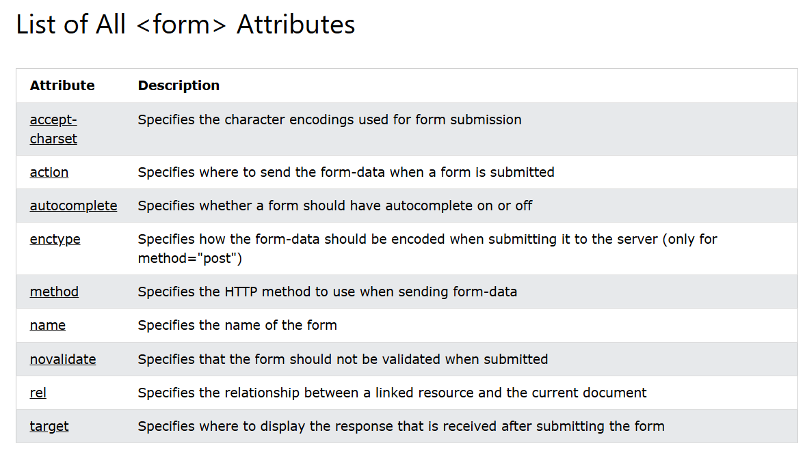

# [BUỔI 2] NHỮNG KIẾN THỨC CƠ BẢN VỀ HTML (tiếp)

### 1. HTML Forms:
\- HTML Forms là một phần của trang web chứa các phần như trường văn bản, trường nhập mật khẩu,... thường được dùng để thu thập thông tin đầu vào người dùng. Dữ liệu này thường được gửi đến máy chủ để xử lí.

\- Khai báo HTML Form:

```html
<form>
    <!-- form elements -->
</form>
```
### 2. HTML Form Attribute:
Các thuộc tính của thẻ `<form>`:
\- **action**: xác định URL mà dữ liệu của form sẽ được gửi đi khi người dùng bấm nút gửi, thường sẽ được gửi đến máy chủ để xử lí.

\- **target**: chỉ định vị trí hiển thị phản hồi nhận được sau khi dữ liệu được gửi đi.
- các giá trị phổ biến của target:
  - _blank: phản hồi sẽ được hiển thị ở cửa sổ hoặc tab mới.
  - _self: phản hồi sẽ được hiển thị ở cửa sổ hiện tại.
  - _parent: phản hồi sẽ được hiển thị ở frame cha.
  - _top: phản hồi được hiển thị trong toàn bộ nội dung của cửa sổ.
  - framename: phản hồi được hiển thị trong iframe chỉ định.

\- **method**: chỉ định phương thức HTTP được sử dụng khi gửi biển mẫu. Phương thức HTTP mặc định khi gửi biểu mẫu là GET.

> **Lưu ý về GET:**
> \- Thêm dữ liệu biểu mẫu vào URL, thêm cặp tên/giá trị
> \- Không bao giờ sử dụng GET để gửi dữ liệu nhạy cảm vì dữ liệu sẽ được hiển thị trong URL
> \- Độ dài của URL giới hạn 2048 kí tự
> \- Hữu ích cho việc gửi biểu mẫu mà người dùng muốn đánh dấu kết quả
> \- GET phù hơp với dữ liệu không bảo mật như chuỗi truy vấn trong Google.

> **Lưu ý về POST:**
> \- Nối dữ liệu biểu mẫu vào bên trong nội dung của yêu cầu HTTP (dữ liệu trong biểu mẫu đã được gửi không được hiển thị trong URL)
> \- POST không giới hạn kích thước và có thể gửi lượng lớn dữ liệu.
> \- Các lần gửi form bằng phương thức POST không thể được đánh dấu trang (bookmark).

\- **autocomplete**: chỉ định xem biểu mẫu phải bật hoặc tắt tính năng tự động hoàn tất. Khi tính năng tự động hoàn tất được bật, trình duyệt sẽ hiển thị các giá trị gợi ý mà người dùng đã nhập trước đó. Ngoài `on` và `off`, autocomplete còn có thể nhận các giá trị cụ thể giúp trình duyệt hiểu rõ hơn về dữ liệu đầu vào và cung cấp gợi ý chính xác hơn như: name. email, username,...

\- **novalidate**: là một thuộc tính boolean, được sử dụng để tắt tính năng kiểm tra hợp lệ mặc định của trình duyệt đối với các trường dữ liệu của form khi form được gửi đi.

```html
<form action="/submit_form" method="post" novalidate>
    <label for="name">Tên:</label>
    <input type="text" id="name" name="name" required><br><br>
    
    <label for="email">Email:</label>
    <input type="email" id="email" name="email" required><br><br>
    
    <input type="submit" value="Gửi">
</form>
```

\- Ngoài ra còn có các thuộc tính khác của form như:



### 3. HTML Form Elements:

#### 3.1 `<Input>` element:
\- các thuộc tính của input:
https://www.w3schools.com/tags/tag_input.asp

```html
<input type="button">
<input type="checkbox">
<input type="color">
<input type="date">
<input type="datetime-local">
<input type="email">
<input type="file">
<input type="hidden">
<input type="image">
<input type="month">
<input type="number">
<input type="password">
<input type="radio">
<input type="range">
<input type="reset">
<input type="search">
<input type="submit">
<input type="tel">
<input type="text"> (default value)
<input type="time">
<input type="url">
<input type="week">
```

```html
<form action="/action_page.php">
  <label for="fname">First name:</label>
  <input type="text" id="fname" name="fname"><br><br>
  <label for="lname">Last name:</label>
  <input type="text" id="lname" name="lname"><br><br>
  <input type="submit" value="Submit">
</form>
```

> <form action="/action_page.php">
>  <label for="fname">First name:</label>
>  <input type="text" id="fname" name="fname"><br><br>
>  <label for="lname">Last name:</label>
>  <input type="text" id="lname" name="lname"><br><br>
>  <input type="submit" value="Submit">
></form>


#### 3.2 Thẻ label
\- Dùng để xác định nhãn cho một input elements như text, checkbox, color, date, datetimelocal,...

\- Sử dụng label có tác dụng:
- giúp người đọc hiểu được ý nghĩa của input.
- khi bấm vào label sẽ trỏ thẳng tới khu vực input tương ứng.

\- Các thuộc tính của label:
- for: Chỉ định id của phần tử biểu mẫu mà label được liên kết với.
- form: chỉ định hình thức của nhãn.

#### 3.11 Thẻ option

```html
<label for="cars">Choose a car:</label>

<select id="cars">
  <option value="volvo">Volvo</option>
  <option value="saab">Saab</option>
  <option value="opel">Opel</option>
  <option value="audi">Audi</option>
</select>
```

#### 3.10 Thẻ optgroup 
\- Thẻ được sử dụng để nhóm các tùy chọn liên quan trong phần tử select.
\- Các thuộc tính:
- disabled
- label	

```html
<label for="cars">Choose a car:</label>
<select  name="cars" id="cars">
  <optgroup label="Swedish Cars">
    <option value="volvo">Volvo</option>
    <option value="saab">Saab</option>
  </optgroup>
  <optgroup label="German Cars">
    <option value="mercedes">Mercedes</option>
    <option value="audi">Audi</option>
  </optgroup>
</select>
```
<label for="cars">Choose a car:</label>
<select  name="cars" id="cars">
  <optgroup label="Swedish Cars">
    <option value="volvo">Volvo</option>
    <option value="saab">Saab</option>
  </optgroup>
  <optgroup label="German Cars">
    <option value="mercedes">Mercedes</option>
    <option value="audi">Audi</option>
  </optgroup>
</select>

#### 3.3 Thẻ select html
\- Các thuộc tính:
- autofocus: Chỉ định rằng danh sách thả xuống sẽ tự động focus khi vừa tải trang
- disabled: danh sách tải xuống bị vô hiệu hóa.
- form_id: Xác định hình thức danh sách thả xuống thuộc về
- multiple: Chỉ định rằng nhiều tùy chọn có thể được chọn cùng một lúc
- name: Xác định tên cho danh sách thả xuống
- required: Chỉ định rằng người dùng được yêu cầu chọn một giá trị trước khi gửi biểu mẫu
- number: Xác định số lượng tùy chọn hiển thị trong danh sách thả xuống


```html
<label for="cars">Choose a car:</label>

<select name="cars" id="cars">
  <option value="volvo">Volvo</option>
  <option value="saab">Saab</option>
  <option value="mercedes">Mercedes</option>
  <option value="audi">Audi</option>
</select>
```

<label for="cars">Choose a car:</label>

<select name="cars" id="cars">
  <option value="volvo">Volvo</option>
  <option value="saab">Saab</option>
  <option value="mercedes">Mercedes</option>
  <option value="audi">Audi</option>
</select>

#### 3.4 Thẻ textarea
\- Cho phép người dùng nhập nhiều dòng, thường dùng để thu thập lời nhận xét và đánh giá.

\- Các thuộc tính:
- autofocus: Chỉ định rằng một vùng văn bản sẽ tự động focus khi tải trang.
- cols: xác định chiều rộng hiển thị của textarea.
- dirname: Chỉ định rằng địa chỉ văn bản của vùng văn bản sẽ được gửi.
- disabled: Xác định rằng một vùng văn bản sẽ bị vô hiệu hóa
- form: Chỉ định vùng văn bản thuộc về dạng nào
- maxlength: Chỉ định số ký tự tối đa được phép trong vùng văn bản
- name: Xác định tên cho vùng văn bản
- placeholder: Chỉ định một gợi ý ngắn mô tả giá trị dự kiến của vùng văn bản
- readonly: chỉ cho phép đọc
- required: Chỉ định rằng một vùng văn bản là bắt buộc / phải được điền
- rows: số dòng hiển thị của textarea
- wrap: Xác định cách ngắt dòng văn bản trong vùng văn bản khi gửi trong biểu mẫu

```html
<label for="review">Review:</label>

<textarea id="review" name="review" rows="4" cols="50">
  Lorem ipsum dolor sit amet consectetur adipisicing elit. Sed perferendis mollitia possimus.
</textarea>
```

<label for="review">Review:</label>

<textarea id="review" name="review" rows="4" cols="50">
  Lorem ipsum dolor sit amet consectetur adipisicing elit. Sed perferendis mollitia possimus.
</textarea>


#### 3.5 Thẻ button
\- Các thuộc tính:
- autofocus	
- disabled	
- form	
- formaction	
- formenctype	
- formmethod	
- formnovalidate	
- formtarget	
- popovertarget	
- popovertargetaction	
- name	
- type	
- value	

```html
<button type="button" onclick="alert('Hello World!')">Click Me!</button>
```

<button type="button" onclick="alert('Hello World!')">Click Me!</button>
 
#### 3.6 Thẻ legend:
\- định nghĩa tên cho thẻ fieldset

#### 3.7 Thẻ fieldset
\- được sử dụng để nhóm các yếu tố liên quan trong một biểu mẫu.

\- các thuộc tính:
- disabled	
- form	
- name	

```html
<form action="/action_page.php">
  <fieldset>
    <legend>Personalia:</legend>
    <label for="fname">First name:</label>
    <input type="text" id="fname" name="fname"><br><br>
    <label for="lname">Last name:</label>
    <input type="text" id="lname" name="lname"><br><br>
    <label for="email">Email:</label>
    <input type="email" id="email" name="email"><br><br>
    <label for="birthday">Birthday:</label>
    <input type="date" id="birthday" name="birthday"><br><br>
    <input type="submit" value="Submit">
  </fieldset>
</form>
```

<form action="/action_page.php">
  <fieldset>
    <legend>Information:</legend>
    <label for="fname">First name:</label>
    <input type="text" id="fname" name="fname"><br><br>
    <label for="lname">Last name:</label>
    <input type="text" id="lname" name="lname"><br><br>
    <label for="email">Email:</label>
    <input type="email" id="email" name="email"><br><br>
    <label for="birthday">Birthday:</label>
    <input type="date" id="birthday" name="birthday"><br><br>
    <input type="submit" value="Submit">
  </fieldset>
</form>

#### 3.8 Thẻ datalist:
\- Là danh sách dữ liệu với các tùy chọn được xác định trước (được kết nối với thẻ input):

```html
<label for="browser">Choose your browser from the list:</label>
<input list="browsers" name="browser" id="browser">

<datalist id="browsers">
  <option value="Edge">
  <option value="Firefox">
  <option value="Chrome">
  <option value="Opera">
  <option value="Safari">
</datalist>
```

<label for="browser">Choose your browser from the list:</label>
<input list="browsers" name="browser" id="browser">

<datalist id="browsers">
  <option value="Edge">
  <option value="Firefox">
  <option value="Chrome">
  <option value="Opera">
  <option value="Safari">
</datalist>

#### 3.9 Thẻ output:
\- Thẻ được sử dụng để biểu diễn kết quả của một phép tính (giống như kết quả được thực hiện bởi một tập lệnh).

\- Các thuộc tính:
- for
- form
- name

```html
<form oninput="x.value=parseInt(a.value)+parseInt(b.value)">
  <input type="range" id="a" value="50">
  +<input type="number" id="b" value="25">
  =<output name="x" for="a b"></output>
</form>
```

<form oninput="x.value=parseInt(a.value)+parseInt(b.value)">
  <input type="range" id="a">
  <input type="number" id="b" value="25">
  =<output name="x" for="a b"></output>
</form>

## 4. Table:
\- Một bảng trong HTML bao gồm các ô bảng bên trong các hàng và cột.

\- table cells: `<td> </td>`

\- table rows: `<tr></tr>`

\- table header: `<th></th>`

```html
<table>
  <tr>
    <th>Person 1</th>
    <th>Person 2</th>
    <th>Person 3</th>
  </tr>
  <tr>
    <td>Emil</td>
    <td>Tobias</td>
    <td>Linus</td>
  </tr>
  <tr>
    <td>16</td>
    <td>14</td>
    <td>10</td>
  </tr>
</table>
```

<table>
  <tr>
    <th>Person 1</th>
    <th>Person 2</th>
    <th>Person 3</th>
  </tr>
  <tr>
    <td>Emil</td>
    <td>Tobias</td>
    <td>Linus</td>
  </tr>
  <tr>
    <td>16</td>
    <td>14</td>
    <td>10</td>
  </tr>
</table>


## 5. Semantic Elements
\- Dùng để mô tả rõ ràng ý nghĩa của nó đối với cả trình duyệt và nhà phát triển.

Ví dụ:
-  non-semantic elements: `<div>`, `<span>`
-  semantic elements: `<form>`, `<table>`, ...