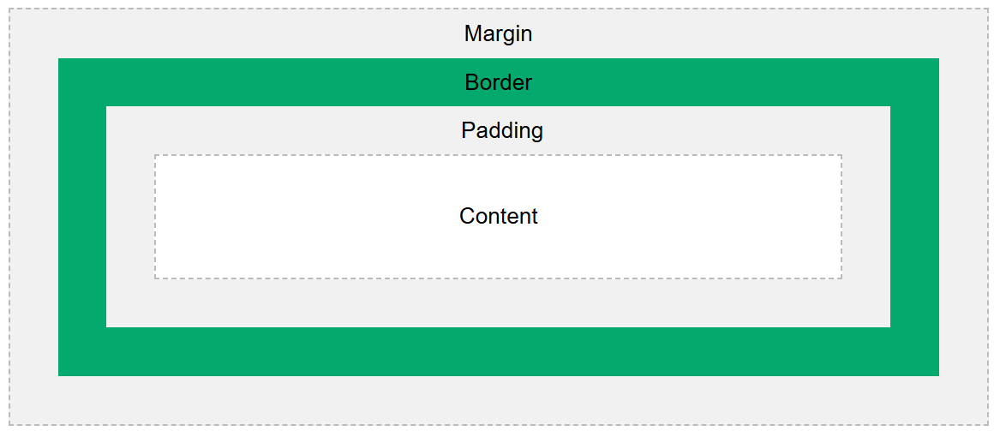

# [BUỔI 3] CSS CƠ BẢN (BUỔI 1)

## 1. Khái niệm, cú pháp, selectors:

### 1.1. Khái niệm:

\- CSS (Cascading Style Sheets) là một ngôn ngữ được sử dụng để **tìm và định dạng** lại các phần tử được tạo ra bởi HTML.

\- Phương thức hoạt động của CSS là dựa vào các vùng chọn, cùng chọn có thể là tên một thẻ HTML, tên một ID, class hay nhiều kiểu khác, sau đó sẽ áp dụng các thuộc tính cần thay đổi lên vùng chọn đó.

### 1.2 Cú pháp:

```
vùng chọn {
    thuộc tính:giá trị;
    thuộc tính:giá trị.
}
```

### 1.3 Selectors:

\- CSS selectors được dùng để tìm các thành phần HTML mà bạn muốn tạo kiểu. 
\- Có 5 kiểu CSS selectors:
- **simple selector** (bộ chọn đơn giản): chọn các phần tử dựa trên tên, id, lớp.

> **Universal Selector (*)**: Áp dụng cho tất cả các phần tử trong tài liệu.

```css
* {
    margin: 0;
    padding: 0;
}
```

> **Element Selector:** Chọn tất cả các phần tử của một loại cụ thể.

```css
p {
    font-size: 16px;
}
```

> **Class Selector:**  Chọn các phần tử có cùng class.

```css
.highlight {
    background-color: yellow;
}
```

> **ID Selector:** Chọn phần tử có một ID duy nhất.

```css
#header {
    font-size: 24px;
}
```

- **Combinator selectors (bộ chọn tổ hợp):** dựa trên mối quan hệ cụ thể giữa chúng.

> **Descendant Selector (space):** Chọn tất cả các phần tử con (ở bất kỳ cấp nào) của một phần tử khác.

```css
div p {
    color: blue;
}
/* tất cả các phần tử <p> bên trong phần tử <div> sẽ có màu chữ màu xanh. */
```

> **Child Selector (>):** Chọn tất cả các phần tử con trực tiếp của một phần tử khác.

```css
ul > li {
    list-style-type: none;
}
/* tất cả các phần tử <li> là con trực tiếp của phần tử <ul> sẽ không có dấu chấm hoặc số. */
```

> **Adjacent Sibling Selector (+):** Chọn phần tử kế tiếp ngay sau phần tử khác (cùng cấp).

```css
h1 + p {
    margin-top: 0;
}
/* phần tử <p> ngay sau phần tử <h1> sẽ có margin-top bằng 0. */
```

> **General Sibling Selector (~):** Chọn tất cả các phần tử cùng cấp sau một phần tử khác.

```css
h1 ~ p {
    color: green;
}
/* tất cả các phần tử <p> là anh em sau phần tử <h1> sẽ có màu chữ màu xanh lá. */
```

>  \- Khi áp dụng các combinator selectors này vào tài liệu HTML, ta có thể kiểm soát các kiểu dáng của các phần tử dựa trên vị trí của chúng trong cấu trúc cây DOM.

- **Pseudo-class selectors (bộ chọn lớp giả):** chọn các phần tử dựa trên một trạng thái nhất định.
```css
a:hover {
    color: red;
}
```
- **Pseudo-elements selectors (bộ chọn phần tử giả):** chọn và tạo kiểu cho 1 phần của phần tử.

```css
p::first-line {
    font-weight: bold;
}
```

- **Attribute selectors (bộ chọn thuộc tính):** chọn các phần tử dựa trên thuộc tính hoặc giá trị của thuộc tính.

```css
input[type="text"] {
    width: 200px;
}
```

## 2. 3 kiểu chèn CSS:

### 2.1 Inline CSS:
\- là cách chèn mã CSS vào bên trong thẻ mở của element HTML thông qua thuộc tính style.

```html
<p style="font-style: italic;">Mã CSS sẽ được chèn vào bên trong thẻ mở HTML.</p>
<p style="text-decoration: underline; color: red;">Mã CSS nội dòng chỉ áp dụng cho phần tử tương ứng mà mã CSS được thêm vào.</p>
```

> <p style="font-style: italic;">Mã CSS sẽ được chèn vào bên trong thẻ mở HTML.</p>
> <p style="text-decoration: underline; color: red;">Mã CSS nội dòng chỉ áp dụng cho phần tử tương ứng mà mã CSS được thêm vào.</p>

### 2.2 Internal CSS:

\- là cách chèn CSS vào trang bằng cách chèn chúng vào bên trong cặp thẻ style.

```html
<style type="text/css">
body {
    background-color: #fafafa;
    color: #333;
}
h1 {
    font-size: 25px;
    text-decoration: underline;
}
</style>
```

### 2.3 External CSS:
\- Tham chiếu đến một tập tin CSS bên ngoài hay external CSS được thực hiện bằng cách sử dụng thẻ `<link>`.

```html
    <link href="..." rel="stylesheet" type="text/css">
    <!-- thuộc tính href là địa chỉ URL của tập tin CSS mà ta muốn tham chiếu tới -->
```

\- Trong trường hợp chèn CSS theo cách này thì thông thường chúng ta sẽ đặt thẻ <link> bên trong cặp thẻ <head></head> để trình duyệt tải về tập tin CSS sớm hơn giúp cải thiện tốc độ tải trang so với đặt nó ở cuối trang.

## 3. Colors, Backgrounds, Height, Width

### 3.1 Colors:

```css
p {
    color: red;
}
/* Thiết lập màu sắc của văn bản. */

div {
    background-color: yellow;
}
/* Thiết lập màu nền cho một phần tử. */

.box {
    border: 2px solid black;
    border-color: blue;
}
/* Thiết lập màu sắc của viền xung quanh một phần tử. */

input:focus {
    outline-color: green;
}
/* Thiết lập màu sắc của viền ngoài (outline) xung quanh một phần tử. */

h1 {
    text-shadow: 2px 2px 5px gray;
}
/* Thiết lập hiệu ứng bóng cho văn bản. */

.card {
    box-shadow: 3px 3px 10px rgba(0, 0, 0, 0.5);
}
/* Thiết lập hiệu ứng bóng cho khung của phần tử. */

.transparent {
    opacity: 0.5;
}
/* Thiết lập độ trong suốt của phần tử. */

.semi-transparent {
    background-color: rgba(255, 0, 0, 0.5); /* Màu đỏ với độ trong suốt 50% */
    color: hsla(240, 100%, 50%, 0.3); /* Màu xanh với độ trong suốt 30% */
}
/* Thiết lập màu sắc sử dụng giá trị màu RGBA hoặc HSLA, cho phép điều chỉnh độ trong suốt. */

.gradient {
    background: linear-gradient(to right, red, yellow);
}
/* Tạo hiệu ứng chuyển màu. */

input {
    caret-color: blue;
}
/* Thiết lập màu sắc của con trỏ văn bản (caret) trong các trường văn bản và phần tử có thể chỉnh sửa. */

```

### 3.2 Backgrounds

```css
div {
    background-color: #f0f0f0;
}
/* Thiết lập màu nền của phần tử. */

div {
    background-image: url('background.jpg');
}
/* Thiết lập ảnh nền cho phần tử. */

div {
    background-image: url('background.jpg');
    background-repeat: no-repeat;
}
/*  Thiết lập cách lặp lại của ảnh nền.
    repeat: Lặp lại ảnh nền cả theo chiều ngang và dọc.
    repeat-x: Lặp lại ảnh nền theo chiều ngang.
    repeat-y: Lặp lại ảnh nền theo chiều dọc.
    no-repeat: Không lặp lại ảnh nền.
*/

div {
    background-image: url('background.jpg');
    background-position: center center;
}
/*  Thiết lập vị trí của ảnh nền. 
    Từ khóa: top, right, bottom, left, center.
    Đơn vị đo lường: px, em, percentage.     
*/

div {
    background-image: url('background.jpg');
    background-size: cover;
}
/*  Thiết lập kích thước của ảnh nền. 
    auto: Kích thước gốc của ảnh.
    cover: Ảnh được thu phóng để bao phủ toàn bộ vùng của phần tử.
    contain: Ảnh được thu phóng để vừa với vùng của phần tử.
    Chiều rộng và chiều cao: px, em, percentage.
*/

div {
    background-image: url('background.jpg');
    background-attachment: fixed;
}
/*  Thiết lập cách ảnh nền được cuộn với phần tử. 
    scroll: Ảnh nền cuộn cùng với nội dung.
    fixed: Ảnh nền cố định và không cuộn cùng nội dung.
    local: Ảnh nền cuộn cùng nội dung của phần tử.
*/

div {
    background-image: url('background.jpg');
    background-clip: padding-box;
}
/*  Thiết lập vùng hiển thị của ảnh nền. 
    border-box: Ảnh nền mở rộng tới viền của phần tử.
    padding-box: Ảnh nền mở rộng tới vùng padding của phần tử.
    content-box: Ảnh nền chỉ mở rộng tới vùng nội dung của phần tử.
*/

div {
    background-image: url('background.jpg');
    background-origin: content-box;
}
/*  Thiết lập vị trí gốc của ảnh nền. 
    border-box: Vị trí gốc là viền của phần tử.
    padding-box: Vị trí gốc là vùng padding của phần tử.
    content-box: Vị trí gốc là vùng nội dung của phần tử.
*/

```

### 3.3 Height, Width
\- Dùng để thiết lập chiều cao, chiều rộng của phần tử.

\- Các giá trị có thể sử dụng:
- auto: Chiều cao tự động dựa trên nội dung của phần tử.
- đơn vị đo lường: px, em, rem, %.
- đơn vị chiều cao, chiều rộng của viewport: vh, vw.

```css
div {
    width: 200px; /* Chiều rộng 200 pixel */
    width: 50%;   /* Chiều rộng 50% của phần tử cha */
    width: 50vw;  /* Chiều rộng 50% của chiều rộng viewport */
}
```

\- min, max-width/height: chiều rộng tối thiểu/ tối đa của phần tử.

```css
div {
    max-height: 500px; /* Chiều cao tối đa 500 pixel */
    max-width: 100%;   /* Chiều rộng tối đa 100% của phần tử cha */
}
div {
    min-height: 100px; /* Chiều cao tối thiểu 100 pixel */
    min-width: 200px;  /* Chiều rộng tối thiểu 200 pixel */
}
```

## 4. Box Model, Borders, Padding, Margins

### 4.1 Box Model:
\- Mỗi một phần tử trong html có thể coi là một box.
\- Box Model hiểu cơ bản là một hộp bao quanh các phần tử HTML. Nó bao gồm content, padding, borders and margins.
- Content: chứa nội dung thực tế của phần tử, chẳng hạn như văn bản, hình ảnh, hoặc các phần tử con.
- Padding: Khoảng trống giữa nội dung và viền (border) của phần tử. Padding có thể có màu nền giống như nội dung.
- Border: Viền bao quanh padding và nội dung của phần tử. Border có thể có màu sắc, độ dày, và kiểu dáng khác nhau.
- Margin: Khoảng trống giữa viền (border) của phần tử và các phần tử khác xung quanh. Margin hoàn toàn trong suốt và không có màu nền.


### Các thuộc tính liên quan đến Box Model:
\- Content:
- width
- height

\- Padding:
- padding-top
- padding-right
- padding-bottom
- padding-left
- padding: Gộp lại các thuộc tính padding trên.  

\- Border:
- border-width
- border-style
- border-color
- border: Gộp lại các thuộc tính border trên.

\- Margin
- margin-top
- margin-right
- margin-bottom
- margin-left
- margin: Gộp lại các thuộc tính margin trên.

## 5. Text, Fonts, Icons, List, Table

### 5.1 Text:
\- Các thuộc tính phổ biến của Text:
- color: Thiết lập màu văn bản.
- text-align: Căn chỉnh văn bản (left, right, center, justify).
- text-decoration: Trang trí văn bản (underline, overline, line-through, none).
- text-transform: Biến đổi văn bản (uppercase, lowercase, capitalize).
- line-height: Chiều cao dòng.
- letter-spacing: Khoảng cách giữa các chữ cái.
- word-spacing: Khoảng cách giữa các từ.
- text-shadow: Đổ bóng cho văn bản.

### 5.2 Font:
\- Các thuộc tính phổ biến của font:
- font-family: Thiết lập phông chữ (Arial, 'Times New Roman', sans-serif, ...).
- font-size: Thiết lập kích thước phông chữ.
- font-style: Kiểu phông chữ (normal, italic, oblique).
- font-weight: Độ đậm của phông chữ (normal, bold, bolder, lighter, 100-900).
- font-variant: Biến thể của phông chữ (normal, small-caps).

### 5.3 Icons:
\- Sử dụng các thư viện như Font Awesome hoặc Material Icons để thêm biểu tượng vào trang web.

```html
<i class="fas fa-home"></i> Home
<i class="fas fa-envelope"></i> Mail
```

<i class="fas fa-home"></i> Home
<i class="fas fa-envelope"></i> Mail

### 5.4 List (Danh sách):

- list-style-type: Kiểu danh sách (none, disc, circle, square, decimal, lower-alpha, upper-alpha, ...).
- list-style-image: Hình ảnh sử dụng làm biểu tượng danh sách.
- list-style-position: Vị trí của biểu tượng danh sách (inside, outside)

```css
selector {
    list-style-image: url('image.png');
}
```

### 5.5 Table:

- border: Đường viền của bảng.
- border-collapse: Kiểm soát cách các đường viền của bảng được kết hợp (collapse, separate).
- border-spacing: Khoảng cách giữa các ô bảng.
- padding: Khoảng cách bên trong ô bảng.
- text-align: Căn chỉnh văn bản trong ô bảng.
- vertical-align: Căn chỉnh dọc văn bản trong ô bảng.

## 6. Display (inline, block, inline-block, none)
\- Được sử dụng để điều chỉnh một phần tử html trên trang web.

-  inline: Chuyển phần tử thành một phần tử inline
-  block: Chuyển phần tử thành một phần tử inline
-  inline-block: Kết hợp tính chất của cả inline và block.
-  none: ẩn phần tử đi, không chiếm không gian trên trang.
-  

### Phân biệt display: none với visibility: hidden

\- visibility: hidden : Làm cho phần tử trở thành không nhìn thấy, nhưng vẫn chiếm không gian trên trang. 

\- display: none : làm cho phần tử không nhìn thấy và cũng không chiếm không gian trên trang. Không thể truy cập được vào phần tử này bằng cách sử dụng CSS hoặc JavaScript.

## 7. Position:
\- Các giá trị của thuộc tính Position:
- static
  - Mô tả: Đây là giá trị mặc định của position cho mọi phần tử.
  - Đặc điểm: Phần tử sẽ được đặt theo thứ tự bình thường của tài liệu. Thuộc tính top, right, bottom, và left không có hiệu lực đối với phần tử có position: static;.
- relative
  - Mô tả: Đặt phần tử dựa trên vị trí ban đầu của nó trong luồng tài liệu, nhưng có thể di chuyển dựa trên các thuộc tính top, right, bottom, và left.
  - Đặc điểm: Khi bạn đặt position: relative; và thiết lập các giá trị top, right, bottom, hoặc left, phần tử sẽ di chuyển một cách tương đối từ vị trí ban đầu của nó, nhưng không ảnh hưởng đến các phần tử khác.
- absolute:
  - Mô tả: Đặt phần tử dựa trên phần tử cha gần nhất có position không phải là static. Nếu không có phần tử cha nào có position khác static, phần tử sẽ dựa trên thẻ <html>.
  - Đặc điểm: Phần tử sẽ được di chuyển từ vị trí của phần tử cha gần nhất có position khác static. Nó sẽ không chiếm không gian trong luồng tài liệu, điều này có nghĩa là các phần tử khác sẽ không biết về nó.
- fixed:
  - Mô tả: Đặt phần tử dựa trên cửa sổ trình duyệt. Nó sẽ giữ nguyên vị trí của nó ngay cả khi bạn cuộn trang web.
  - Đặc điểm: Phần tử sẽ không di chuyển khi bạn cuộn trang web. Nó thường được sử dụng cho các phần tử như thanh điều hướng hoặc thông báo mà bạn muốn hiển thị ở cùng một vị trí trên màn hình.
- sticky:
  - Mô tả: Đặt phần tử theo thời gian, nhưng hoạt động như relative cho đến khi nó gần với một điểm cuộn xác định (bao gồm top, right, bottom, left).
  - Đặc điểm: Khi bạn cuộn đến một vị trí đã chỉ định, phần tử sẽ "dán" ở đó trong khi phần còn lại của tài liệu tiếp tục cuộn.

## 8. Z-index, Overflow, Opacity

\- z-index xác định thứ tự sắp xếp chồng chéo của các phần tử có vị trí position không phải là static (ví dụ: relative, absolute, fixed, sticky). Phần tử có giá trị z-index lớn hơn sẽ hiển thị trước so với các phần tử có giá trị z-index nhỏ hơn.
- giá trị: số nguyên dương hoặc âm (giá trị mặc định `auto`).

```css
.element1 {
    position: relative;
    z-index: 1;
}

.element2 {
    position: relative;
    z-index: 2;
}
```

\- overflow: xác định cách xử lý nội dung của một phần tử khi nội dung bị tràn ra ngoài phạm vi của nó.
- giá trị: visible, hidden, scroll, auto.

```css
.container {
    width: 200px;
    height: 200px;
    overflow: hidden; /* Ẩn nội dung bị tràn ra ngoài khung của .container */
}
```

\- opacity xác định độ mờ của một phần tử. Giá trị của opacity là một số từ 0 (hoàn toàn trong suốt) đến 1 (hoàn toàn rõ ràng).
- giá trị: từ 0 đến 1.

```css
.element {
    opacity: 0.5; /* Đặt độ mờ của .element thành 50% */
}
```

