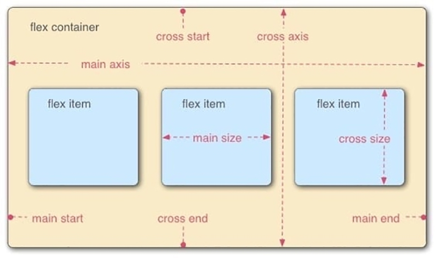

# [BUỔI 5]: CSS BUỔI 3  

## 1. Cơ bản về Flexbox:

\- Flexbox là một kiểu dàn trang (layout mode) mà nó sẽ tự cân đối kích thước của các phần tử bên trong để hiển thị trên mọi thiết bị. Ta không cần thiết lập kích thước của phần tử, không cần cho nó float mà chỉ cần thiết lập nó hiển thị chiều ngang hay chiều dọc, lúc đó các phần tử bên trong sẽ tự động hiển thị theo ý muốn.

\- Cấu trúc của Flexbox:



Trong đó:

- **container**: là phần lớn bao quanh các phần tử bên trong, ta có thể thiết lập theo kiểu inline hoặc block, khi đó các item bên trong sẽ hiển thị dựa trên thiết lập của các container này.

- **item**: là các phần tử con của container, ta có thể thiết lập được thứ tự hiển thị của nó.

- **main start**, **main end**: khi thiết lập Flexbox, điểm bắt đầu của container theo **main axis **gọi là main start, điểm kết thúc gọi là main end.

- **cross start**, **cross end** là điểm bắt đầu và kết thúc theo **cross axis**, là trục nằm vuông góc với main axis.

- **main size**: là kích thước của mỗi item dựa theo trục main axis.

- **cross size**: là kích thước của mỗi iem dựa theo trục cross axis.

### Cách sử dụng Flexbox:
\- khai báo thuộc tính `display : flex` cho thẻ ta dùng làm container.

## 2. Container:

\- Các thuộc tính phổ biến của container:
- display: dùng để khai báo khi ta muốn một phần tử là một flex container.
> **flex-direction:**

\- Dùng để xác định hướng hiển thị của các item.
  - row: là giá trị mặc định, đặt các item từ trái sang phải theo main axis.
  - row-reverse: đặt các item từ phải sang trái.
  - column: đặt các item từ trên xuống dưới theo cross axis.
  - column-reverse: đặt các item từ dưới lên trên theo cross axis.

> **flex-wrap:**

\- dùng để kiểm soát việc bọc các items nằm trong container.
  - nowrap: là giá trị mặc định, khi giảm chiều rộng của trình duyệt có thể không nhìn thấy 1 số item trên cùng 1 dòng.
  - wrap: các item sẽ được bọc trong container, nếu không đủ chiều rộng thì các item sẽ được hiển thị thành nhiều dòng.
  - wrap-reverse: các item được bọc trong container giống với wrap nhưng thứ tự hiển thị dòng ngược lại với wrap.

> **flex-flow:** 

\- là cách viết rút gọn của flex-direction và flex-wrap với giá trị đầu tiên là flex-direction thứ 2 là flex-wrap

> **justified-content:**

\- dùng để căn chỉnh vị trí các item so với main axis
  - flex-start: đặt item bắt đầu từ main start (giá trị mặc định)
  - flex-end: đặt item bắt đầu từ main end
  - center: đặt tất cả item ở giữa trục main axis.
  - space-between: chia đều khoảng cách thừa và thêm nó vào giữa các item
  - space-around: chia khoảng cách ở đầu và cuối. Khoảng cách ở đầu và cuối sẽ bằng 1 nửa khoảng cách ở giữa 2 item với nhau
  - space-evenly: chia khoảng cách đều khoảng cách giữa các item với item, item và main start, item với main end bằng nhau

> **align-items:**

\- dùng để căn chỉnh vị trí các item so với cross axis
  - stretch: Chiều dài của item sẽ bằng chiều dài của cross axis.
  - flex-start: Item được đặt ở điểm bắt đầu của cross start(trên cùng bên trái), và kích thước item không bị thay đổi.
  - flex-end: Item được đặt ở điểm bắt đầu của cross end(dưới cùng bên trái)
  - center: Item được đặt ở giữa điểm bắt đầu của cross start và điểm bắt đầu của cross end (ở giữa bên trái)
  - baseline: Item sẽ được đặt giữ theo các ký tự thuộc item đó. Mục đích chính là căn chỉnh dữ liệu dòng văn bản của các item.

> **align-content:**

\- Giống justify-content chỉ khác một chỗ là thay vì căn theo trục main axis thì align-content căn theo trục cros axis.
  - stretch
  - flex-start
  - flex-end
  - center
  - space-between
  - space-around

## 3. Item

\- các thuộc tính phổ biến của item:
> **Order**: 

\- Điều khiển thứ tự của item trong container, có giá trị mặc định là 0, các phần tử có giá trị order nhỏ hơn sẽ được xếp trước.

> **Flex-grow:**

\- Xác định khả năng phần tử có thể phát triển ra sao để chiếm hết không gian còn lại trong container.
- Giá trị mặc định là 0 (phần tử không phát triển)
- Nếu tất cả các phần tử có flex-grow bằng 1, chúng sẽ chia đều không gian còn lại. Nếu một phần tử có flex-grow là 2, nó sẽ chiếm gấp đôi không gian so với các phần tử có flex-grow là 1.

> **Flex-shrink:**

\- Xác định khả năng phần tử có thể co lại khi không còn đủ không gian trong container.
- Giá trị mặc định là 1 (phần tử sẽ co lại nếu cần).
- Nếu một phần tử có flex-shrink là 0, nó sẽ không co lại khi không gian bị hạn chế.

> **Flex-basis:**

\- Xác định kích thước cơ bản của phần tử trước khi không gian được phân phối dựa trên flex-grow và flex-shrink.
- Giá trị mặc định là auto, nghĩa là kích thước của phần tử sẽ phụ thuộc vào nội dung hoặc các thuộc tính CSS khác.
- Có thể được thiết lập bằng giá trị chiều dài cụ thể (px, %, em, v.v.).

> **Flex:**

\- Là thuộc tính viết tắt cho flex-grow, flex-shrink, và flex-basis.
- Cú pháp: flex: [flex-grow] [flex-shrink] [flex-basis];.

> **Align-self:**

\- Căn chỉnh phần tử con dọc theo trục chéo (cross axis).
- Ghi đè giá trị của align-items trên container cho phần tử cụ thể này.
- Giá trị có thể là auto (mặc định), flex-start, flex-end, center, baseline, hoặc stretch.

## 4. Grid:

\- CSS Grid Layout là một hệ thống bố trí hai chiều, cho phép tạo ra các thiết kế web phức tạp bằng cách chia một trang thành các hàng và cột.

\- Cách sử dụng: phần tử container khai báo thuộc tính `display: grid`

### 4.1 Grid container:

\- Các thuộc tính chính:

> **display:**

\- Kích hoạt Grid layout cho 1 container
- grid, inline-grid

> **grid-template-columns**, **grid-template-rows**

\- Xác định số lượng và kích thước của các cột và hàng.

```css
.container {
    display: grid;
    grid-template-columns: 100px 200px 100px;
    grid-template-rows: 50px 100px;
}
```

```css
.container {
    display: grid;
    grid-template-columns: repeat(3, 1fr);
    grid-template-rows: repeat(2, 100px);
}
```

> **grid-column-gap, grid-row-gap**

\- Đặt khoảng cách giữa các cột và hàng.

```css
.container {
    display: grid;
    grid-column-gap: 10px;
    grid-row-gap: 15px;
}
```

> **grid-template-areas:**

\- Xác định các khu vực lưới bằng cách đặt tên cho các ô lưới.

```css
.container {
    display: grid;
    grid-template-columns: 100px 100px 100px;
    grid-template-rows: 50px 50px;
    grid-template-areas:
        "header header header"
        "main main sidebar"
        "footer footer footer";
}

.header {
    grid-area: header;
}

.main {
    grid-area: main;
}

.sidebar {
    grid-area: sidebar;
}

.footer {
    grid-area: footer;
}
```

### 4.2 Grid Item:

\- Các thuộc tính chính:

> **grid-column-start, grid-column-end, grid-row-start, grid-row-end:**

\- Xác định bắt đầu và kết thúc của một mục lưới trong các hàng và cột.

```css
.item {
    grid-column-start: 1;
    grid-column-end: 3;
    grid-row-start: 1;
    grid-row-end: 3;
}
```
