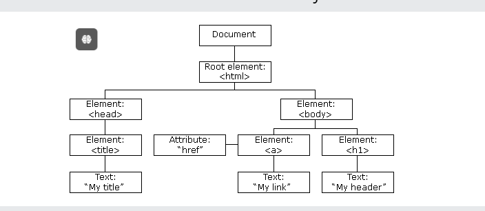

# [BUỔI 11] DOM PART 2

## 1. DOM Events:

\- là các hành động hoặc hiện tượng xảy ra trong trình duyệt web mà trình duyệt nhận diện và phản hồi lại. Các sự kiện này có thể được kích hoạt bởi các tương tác của người dùng (như nhấp chuột vào nút hoặc gõ vào ô văn bản), sự thay đổi đối với tài liệu, hoặc thậm chí các sự kiện do JavaScript tạo ra.

> **1. Sự kiện chuột**

- click: Kích hoạt khi người dùng nhấp chuột vào một phần tử.

```js
<button onclick="alert('Button clicked!')">Click me</button>
```

- dblclick: Kích hoạt khi người dùng nhấp đúp chuột vào một phần tử.

```js
<div ondblclick="alert('Double-clicked!')">Double click me</div>
```

> **2. Sự kiện bàn phím**

- keydown: Kích hoạt khi người dùng nhấn xuống một phím.

- keyup: Kích hoạt khi người dùng thả ra một phím.

```js
<input type="text" onkeydown="console.log('Keydown')" onkeyup="console.log('key up')">
```

> **3. Sự kiện tập trung**

- focus: Kích hoạt khi một phần tử nhận được sự tập trung.

- blur: Kích hoạt khi một phần tử mất sự tập trung.

```js
<input type="text" onfocus="console.log('focus')" onblur="console.log('blur')">
```

> **4. Sự kiện thay đổi:**

- change: Kích hoạt khi giá trị của một phần tử thay đổi.

```js
<select onchange="alert('Lựa chọn đã thay đổi!')">
  <option value="1">Lựa chọn 1</option>
  <option value="2">Lựa chọn 2</option>
</select>
```

> **5. Sự kiện tùy chỉnh**

```js
<element>.<ten_event> = function(){

}
```


## 2. DOM Event Listener

\- là một cơ chế trong JavaScript cho phép lắng nghe và xử lý các sự kiện trên các phần tử DOM . Event Listeners cung cấp một cách linh hoạt và mạnh mẽ để gắn các hàm xử lý sự kiện vào các phần tử mà không cần phải trực tiếp sửa đổi thuộc tính sự kiện trong HTML.

```js
element.addEventListener(event, handler, options);
```
- element: Phần tử DOM mà bạn muốn gắn Event Listener.
- event: Tên của sự kiện (ví dụ: "click", "keydown", "mouseover",...).
- handler: Hàm xử lý sự kiện sẽ được gọi khi sự kiện xảy ra.
- options: (Tùy chọn) Một đối tượng hoặc một giá trị boolean để cấu hình các thuộc tính của Event Listener, như capture, once, passive.

## 3. InnerText, textContent, InnerHTML

> **1. InnerText**

\-  là thuộc tính của DOM mà đại diện cho phần nội dung văn bản "hiển thị" của một phần tử. Nó sẽ trả về tất cả văn bản của phần tử và các phần tử con, giống như người dùng sẽ thấy trên trình duyệt.

\- innerText sẽ chỉ lấy nội dung văn bản mà được hiển thị trên trang. Nó sẽ bỏ qua các nội dung bị ẩn bởi CSS (ví dụ, display: none, visibility: hidden).

> **2. textContent**

\- là thuộc tính DOM mà đại diện cho toàn bộ nội dung văn bản của một phần tử và tất cả các phần tử con của nó. Nó bao gồm tất cả các văn bản trong cây DOM, bất kể các phần tử đó có được hiển thị hay không.

\- textContent trả về toàn bộ nội dung văn bản, bao gồm cả các nội dung bị ẩn bởi CSS.

> **3. innerHTML**

\- là thuộc tính DOM đại diện cho toàn bộ nội dung HTML của một phần tử. Nó bao gồm tất cả các thẻ HTML, thuộc tính, và văn bản bên trong phần tử.

\- innerHTML trả về nội dung HTML của phần tử, bao gồm các thẻ và văn bản. Điều này có nghĩa là ta có thể sử dụng nó để thêm hoặc thay đổi cấu trúc HTML của một phần tử.

## 4. PreventDefault & StopPropagation

> **1. preventDefault()**

\-  được sử dụng để ngăn chặn hành vi mặc định của trình duyệt đối với một sự kiện cụ thể.
\- Ví dụ: 
- Ngăn chặn form gửi đi khi người dùng nhấn vào nút gửi (`<button>` hoặc `<input type="submit">`).
- Ngăn chặn việc điều hướng của liên kết (`<a>`) khi nhấp vào.

> **2. stopPropagation()**

\- được sử dụng để ngăn chặn sự kiện từ việc lan truyền lên các phần tử cha trong DOM. Khi một sự kiện xảy ra trên một phần tử, nó sẽ "bong bóng" lên qua tất cả các phần tử cha của nó trừ khi stopPropagation() được gọi.

- Ngăn chặn một sự kiện được xử lý bởi các phần tử cha khi bạn chỉ muốn sự kiện được xử lý bởi phần tử con.
- Kiểm soát chính xác thứ tự xử lý sự kiện khi làm việc với nhiều Event Listeners trên các phần tử khác nhau trong DOM.

## DOM Nodes

\- là các thành phần cơ bản tạo nên cấu trúc của tài liệu HTML hoặc XML trong mô hình DOM (Document Object Model). Mỗi phần tử, thuộc tính, và phần văn bản trong tài liệu đều được biểu diễn dưới dạng một node.



\- Cấu trúc DOM và Quan hệ giữa các Node: 

- Parent Node (Nút cha): Node chứa các node khác bên trong nó. 

- Child Node (Nút con): Node được bao bọc bên trong một node khác.
 
- Sibling Node (Nút anh em): Các node nằm cùng một cấp trong cây DOM và có cùng một node cha.

- Ancestor Node (Nút tổ tiên): Node nằm trên node hiện tại trong cây DOM. Node cha, ông, hoặc cao hơn nữa đều được coi là tổ tiên.

- Descendant Node (Nút con cháu): Bất kỳ node nào nằm bên dưới node hiện tại trong cây DOM, bao gồm cả con, cháu, và các node sâu hơn nữa.