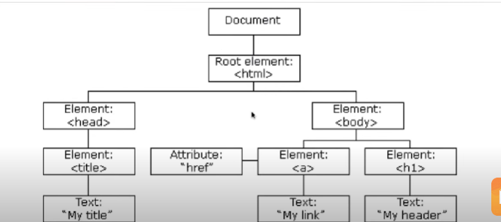
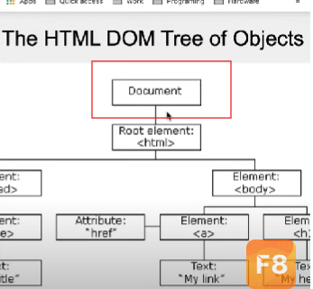
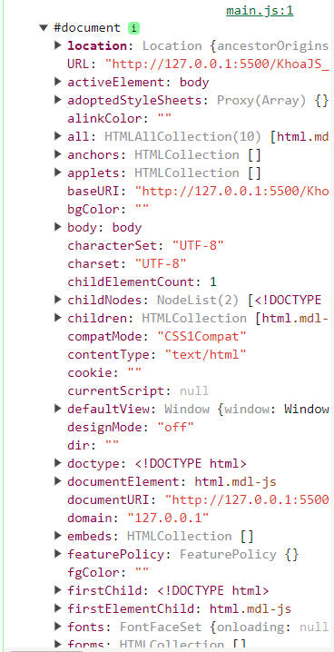
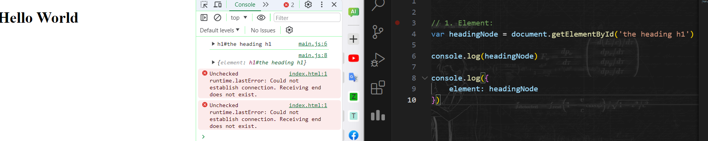
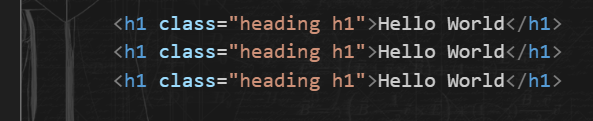
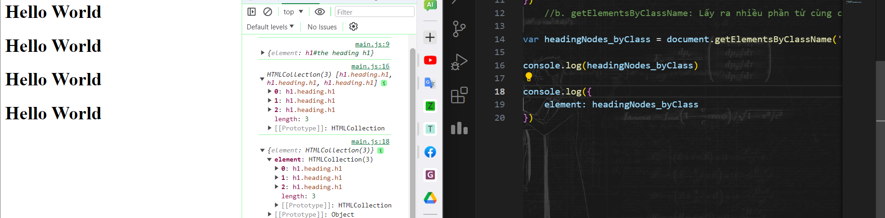
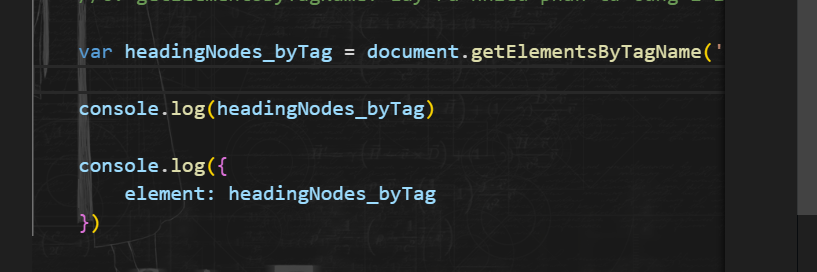
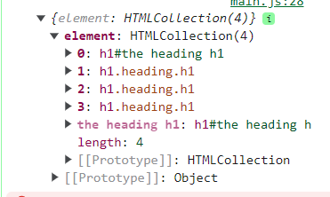

# Buổi 10. HTML DOM:

## I. HTML DOM:
1. ĐN: 
   1. DOM (Document Object Model): Mô hình các đối tượng trong tài liệu HTML.
   2. Thông qua DOM, ta có thể truy xuất, truy cập đến các thẻ HTML.
2. DOM có 3 thành phần, Mỗi thành phần đều đc coi là 1 Node.

   1. Element
   2. Attribute
   3. Text
3. Thực chất, cái ta học là HTML DOM(tiêu chuẩn cho HTML), ngoài ra còn có CoreDOM, XMLDOM,...
4. DOM được xây dựng bằng cách sử dụng nhiều API hoạt động cùng nhau. DOM cốt lõi xác định các thực thể mô tả bất kỳ tài liệu nào và các đối tượng bên trong nó. Điều này được mở rộng khi cần bởi các API khác bổ sung các tính năng và khả năng mới cho DOM. Ví dụ, API DOM HTML thêm hỗ trợ cho việc biểu diễn các tài liệu HTML vào DOM cốt lõi và API SVG thêm hỗ trợ cho việc biểu diễn các tài liệu SVG.

## II. DOM API:
1. DOM API:
   1. Là cái để Browser đọc HTML. Nó sẽ phải access vào DOM bằng DOM API (Web API)
   2. DOM không phải là một phần của ngôn ngữ JavaScript, mà là một Web API được sử dụng để xây dựng các trang web. JavaScript cũng có thể được sử dụng trong các ngữ cảnh khác. Ví dụ, Node.js chạy các chương trình JavaScript trên máy tính, nhưng cung cấp một bộ API khác và API DOM không phải là một phần cốt lõi của môi trường chạy Node.js.   
   3. DOM được thiết kế để độc lập với bất kỳ ngôn ngữ lập trình cụ thể nào, giúp biểu diễn cấu trúc của tài liệu có sẵn từ một API duy nhất và nhất quán. Ngay cả khi hầu hết các nhà phát triển web chỉ sử dụng DOM thông qua JavaScript, các triển khai của DOM có thể được xây dựng cho bất kỳ ngôn ngữ nào, như ví dụ Python này minh họa:
   4. HTML DOM API được tạo thành từ các giao diện xác định chức năng của từng phần tử trong HTML, cũng như bất kỳ loại và giao diện hỗ trợ nào mà chúng dựa vào.
2. Các loại DOM trong JS:
   1. DOM document: ALL
   2. DOM element: Truy xuêts tới các thẻ HTML thông qua các cái: id class, tag name. Các cách truy xuất:
      1. getElementByID.
      2. getELementsbyTagName
      3. getElementsbyClassName
      4. querySelector
   3. DOM HTML: thay đổi giá trị nội dung và thuộc tính của các thẻ HTLM.
      1. Thay đổi nội dung thẻ: `innerHTML`
      2. Thay đổi thuộc tính của thẻ: `getAttibute và setAttibute`
   4. DOM CSS: Có nhiệm vụ thay đổi các định dạng CSS của thet HTML
      1. Set Giá trị: `ELM.style.propertyName = 'value'`
      2. Lấy giá trị: `ELM.style.propertyName`
   5. DOM Event: Có nhiệm vụ gán csca sự kiênj như onclick(), onload() và các thet HTML.
   6. DOM Listerner: có nhiệm vụ lắng nhge các sự kiện tác động lên thẻ HTML
   7. DOM Navigation: Để tâunr lý, thao tác với csc thẻ HTML, thể hiện mới quan hệ cha con của các thẻ HTML
   8. DOM NOdes: Theo tác với HTML qua Object.

## III. DOM Document Object:
1. ĐN:
   1. 
   2. Là đại diện của cả Web. Là TK cha lớn nhất cuả tất cả các Node.
   3. Đc tích hợp sắn ở WEB API.
2. Các truy cập:
   1. Xuất ra document: `console.log(document)`
      1. 
   2. Khi ta check thử Object Document, có thể thấy nó bôi đen cả Web.
3. Lấy ra các Element trong DOM
   1. Lấy Element thông qua ID:
      1. 
      2. 
      3. Có 2 phương thức để lấy ELement qua ID: `getElementbyID`(chỉ lấy 1, nếu có nhiều tk thì chọn cái đầu tiên)
   2. Lấy NHIỀU Element qua Class Name: `getElementsByClassName`
      1. 
      2. 
   3. Lấy NHIỀU Element qua Tag Name (tên của thẻ): `getElementsByTagName`
      1. Sau khi lấy thì nó sẽ trả về 1 Object là HTML Collection:
      2. 
      3. 
   4. Lấy qua `querySelector` và `querySelectorAll`: Lấy bằng CSS Selector: Phổ biến nhất, vì nó có thể sử dụng thay cho tất cả đống trên

## IV. DOM Attribute và DOM HTML :
1. DOM HTML:
   1. Giúp ta truy cập vào nội dụng của các thẻ HTML
   2. Bao gồm: thay đổi content, text, thay đổi các thẻ con bên trong Element ta chọn
   3. Để thay đổi giá trị, ta sử dụng `innerHTML` 
2. DOM Attribute:
   1. Giúp ta truy cập, thay đổi Attribute của các thẻ.
   2. Để thay đổi giá trị, ta sử dụng: `document.getElementById(id).attribute = new value`
   3. Thay đổi thuộc tính của thẻ: `getAttibute và setAttibute`

## V. DOM CSS:
1. DOM CSS: Có nhiệm vụ thay đổi các định dạng CSS của thet HTML
2. Cú pháp thiết lập giá trị: ELM.style.propertyName = 'value'
3. Lấy giá trị: console ELM.style.propertyName
4. Chú ý các thuộc tính mà không hợp lệ với tên biến như font-size thì ta sẽ đổi thành fontSize
5. Cú pháp:
    ```js
        var boxElement8 = document.querySelector('.box_8')
        console.log(boxElement8.style)


        //VD1: Set cho the div w, h, background
        boxElement8.style.width = '100px'
        boxElement8.style.height = '100px'
    // boxElement8.style.backgroundColor = 'red'
        
        console.log(boxElement8.style.backgroundColor)
        // Muốn thay đổi nhiều mà ko cần gõ nhiều dòng:
        Object.assign(boxElement8.style, {
            width: '200px',
            height: '100px',
            backgroundColor: 'green'
        }) // dối số 1: style, 2: list các đối số muốn đổi + giá trị

        console.log(boxElement8.style.backgroundColor)
    ```