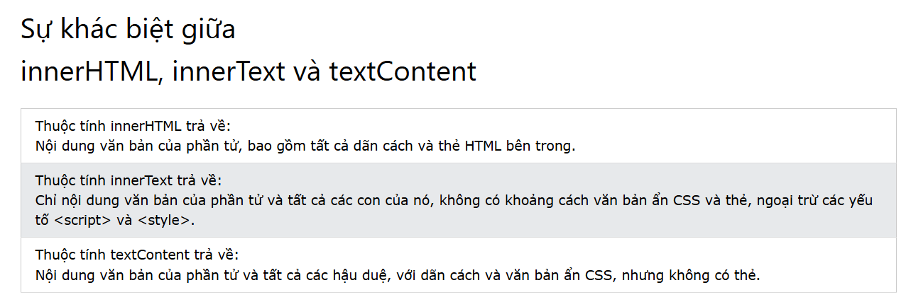

# Buổi 11. DOM JS

## I. DOM Events: 

1. ĐN: Là 1 tác động nào đó lên các đối tượng HTML. Qua đó, ta có thể bắt được sự kiện và viết 1 đoạn JS để thực thi 1 đoạn chương trình nào đó.
2. Cú pháp:
    ```js
        <ten_element>.<ten_event> = function(){
            //Code
        }
    ```
3. Các DOM Event phổ biến:
   1. onload: Khi duyệt xong mọi thứ của trình duyệt, thì đoạn code mới thực thi
   2. onblur: Khi bỏ focus 1 phần tử.
   3. onfocus: Khi kích hoạt 1 phần tử.
   4. onkeydown: Kích hoạt khi 1 phím đc nhấn
   5. onkeyup: Kích hoạt khi 1 phím đc nhả ra 
   6. onclick: Khi nhấn chuột vào 1 phần tử
   7. onchange: Kích hoạt khi giá trị đc thay đổi khác đi so với giá trị trước đó. (ĐK: Là sau khi ta blur ra khỏi nó)
   8. oninput: Kích hoạt khi giá trị đc thay đổi khác đi so với giá trị trước đó. (ĐK: ngay sau khi đổi giá trị)
4. Sự kiện nổi bọt: 
   1. Nếu ta đặt các sự kiện cho 1 bộ cha con element. Khi ta thực hiện sự kiện, nó sẽ chạy sự kiện tk con => đi ra ngoài xem lần lượt các tk cha của nó có ko, cứ liên tiếp thế đến khi thực hiện hết các thao tác mà ta đặt cho sự kiện đó ở tất cả element.
   2. Để ngăn ngừa thì ta có thể sử dụng StopPropagation:
        ```js
            document.querySelector('.button2').onclick = function(e){
                e.stopPropagation;
                console.log('ClickMe')
            }
        ```
## II. DOM Event Listener.

1. ĐN: 
   1. `addEventListener()` là phương thứ giúp 1 phần tử có thể lắng nghe sự kiện mà ta lựa chọn
   2. Điểm mạnh so với DOM Event: 
      1. Là có thể xử lý nhiều event cùng 1 lúc, không bị ghi đè như DOM Event
      2. Có thể xóa đi event mà ta đã set `removeEventListener()`
2. Code: 
   1. Thêm: `element.addEventListener("tenEvent", function)`
   2. Xóa: `element.removeEventListener("tenEvent", function)`

## III. InnerText, TextContent

1. InnerText:
   1. ĐN: 
      1. thuộc tính innerText để trả về hoặc gán text cho 1 element
      2. Cái nó trả về là `tất cả text ta nhìn thấy ở viewport`
      3. Khi ta set thuộc tính cho element, nó sẽ xóa hết tất cả node con và thay = tk mới gán.
2. TextContent:
   1. ĐN: 
      1. thuộc tính innerText để trả về hoặc gán text cho 1 element
      2.  Cái nó trả về là `tất cả text ta nhìn thấy ở phần code` (Ý là tất cả những cái như thẻ, nó vẫn tính là text và nó chuyển thành khoảng trắng)
      3. Khi ta set thuộc tính cho element, nó sẽ xóa hết tất cả node con và thay = tk mới gán.
3. So sánh innerText, innerHTML, textContent:



## IV. StopPropagation và preventDefault

1. preventDefault: 
   1. Ngăn chặn hành động mặc định của 1 thẻ.
   2. VD như ngăn chặn 1 thẻ a mở cái link mà đc gán sẵn
   3. Code:
    ```js
        <a id="a_ELM" href="https://w3schools.com/">Go to W3Schools.com</a>

        document.getElementById("myAnchor").addEventListener("click", function(event){
            event.preventDefault()
        });
    ```
2. StopPropagation:
   1. Để ngăn chặn sự nổi bọt của 1 thao tác khi nó đc thao tác trên 1 hệ cha con cùng gắn 1 loại sự kiện.
   2. Code:
    ```js
        <div class="box_2" onclick="console.log('DIV')">
            <button class="button2" onclick="console.log('The H1')">
                Test Bubble Event
            </button>
        </div>
        document.getElementById("myAnchor").addEventListener("click", function(event){
            event.preventDefault()
        });
    ```