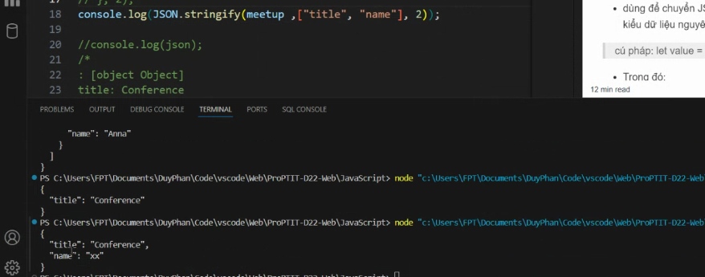
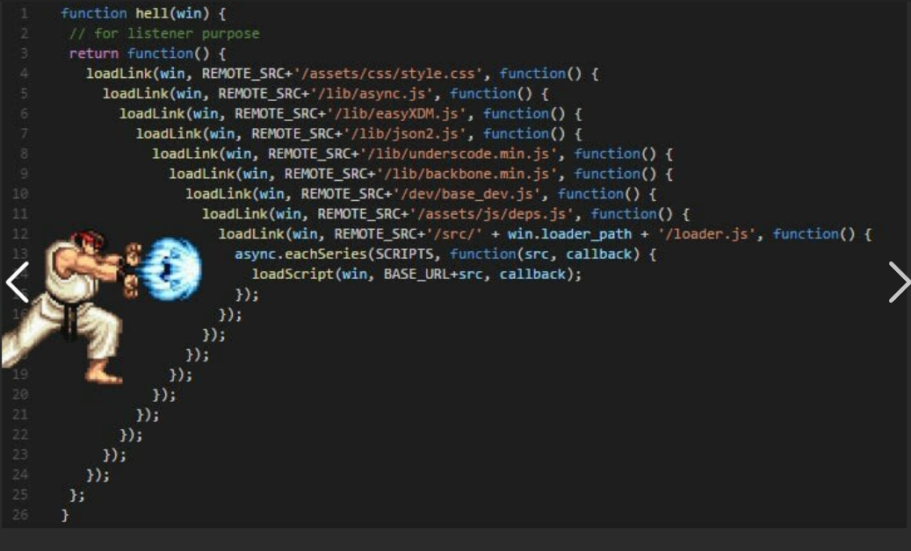
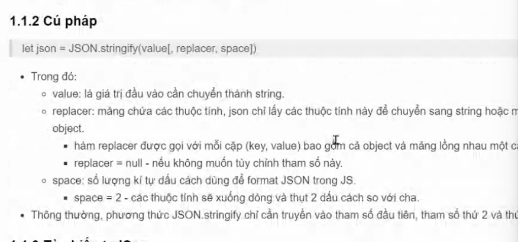
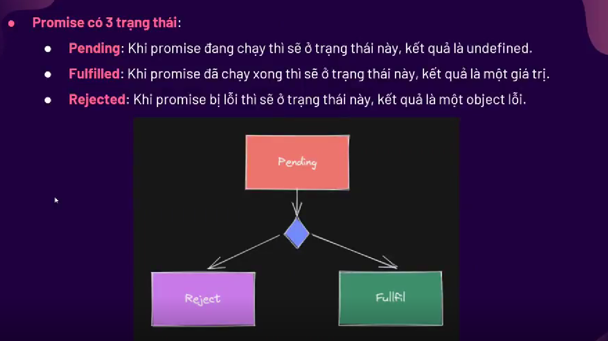

# Buổi 6: JSON và JS Async

## I. Tìm hiểu về JSON:

### 1. ĐN:
- JSON là viết tắt của JavaScript Object Notation
- JSON là một định dạng để lưu trữ và vận chuyển dữ liệu
- JSON thường được sử dụng khi dữ liệu được gửi từ máy chủ đến trang web
- JSON là "tự mô tả" và dễ hiểu
- VD: 1 mảng employes có 3 Object
  - ```json
        {
            "employees":[
                {"firstName":"John", "lastName":"Doe"},
                {"firstName":"Anna", "lastName":"Smith"},
                {"firstName":"Peter", "lastName":"Jones"}
            ]
        }
    ```

### 2. Nguyên tắc:
1. Dữ liệu là các cặp key/value
2. Cho phép các kiểu dữ liệu cơ bản: number, string, boolean, arr, obj, null.
   1. Number: `{"age":30}`
   2. String: `{"name":"John"}`
   3. Bool: `{"sale":true}`
   4. Null: `{"name":null}`
3. Không cho phép các KDL: function, date, undefined
4. Các cặp key/value được cách nhau bởi dấu phẩy. Cặp cuối cùng không có dấu phẩy
5. Dấu ngoặc móc để lưu Object
6. Dấu ngoặc vuông để lưu mảng
7. Vì có các cách lưu dữ liệu giống như JS => Chương trình của JS có thể dễ dàng chuyển đổi dữ liệu JSON thành dũ liệu JS

### 3. Key - Value:
1. Khai báo: 
   1. `"firstName":"John"`
   2. Lưu ý: Key ở trong JSON yêu cầu dấu "", JS thì không
2. Mảng:
    1. Khai báo:
        ```json
            {
                "employees":[
                    {"firstName":"John", "lastName":"Doe"},
                    {"firstName":"Anna", "lastName":"Smith"},
                    {"firstName":"Peter", "lastName":"Jones"}
                ]
            }
        ```
### 4. Chuyển đổi JSON thành đối tượng JS.

1. Chuyển đổi **chuỗi JSON** thành **đối tượng**: `var obj = JSON.parse(obj_JSONString)`
2. Chuyển đổi **đối tượng** thành 1 **chuỗi JSON**: 
   1. `var obj_JSONString = JSON.stringify(obj)`
   2. Hàm Stringify có thể truyền các tham số
   3. 


## II. JS Async:

### 1. ĐN:
1. Async:
   1. Async trong JavaScript là từ viết tắt của Asynchronous, nghĩa là không đồng bộ. Nó là một khái niệm quan trọng giúp JavaScript thực hiện các tác vụ một cách hiệu quả mà không bị chặn bởi các tác vụ khác, đặc biệt là các tác vụ kéo dài như đọc/ghi file, gửi request tới server, hay các hoạt động I/O khác.
2. Tại sao cần Async?
   1. Hiệu suất: Nếu JavaScript phải chờ một tác vụ chậm hoàn thành, toàn bộ chương trình sẽ bị dừng lại. Async cho phép chương trình tiếp tục thực hiện các công việc khác trong khi chờ đợi tác vụ chậm.
   2. Trải nghiệm người dùng: Các ứng dụng web sẽ trở nên mượt mà hơn khi không bị treo hoặc chậm phản hồi.
   3. Khả năng mở rộng: Async giúp JavaScript xử lý được nhiều tác vụ cùng một lúc.
3. Async hoạt động như thế nào?
   1. JavaScript sử dụng các cơ chế khác nhau để thực hiện Async, trong đó phổ biến nhất là:
      1. Callbacks: Đây là cách truyền thống nhất, nhưng có thể dẫn đến "callback hell" khi lồng quá nhiều callback vào nhau.
      2. Promises: Là một đối tượng đại diện cho kết quả (thành công hoặc thất bại) của một hoạt động bất đồng bộ. Promises cung cấp một cách rõ ràng hơn để xử lý các kết quả này.
      3. Async/Await: Là một cú pháp dựa trên Promises, giúp code Async trở nên dễ đọc và hiểu hơn, giống như code đồng bộ.

### 2. Callback Hell
1. Hàm Callback:
   1. Là 1 hàm được truyền dưới dạng đối số cho 1 hàm khác
   2. Hàm Callback có thể chạy sau khi các chức năng khác kết thúc
2. Callback Hell:
   1. 
   2. Là tình trạng là khi ta viết quá nhiều hàm lồng nhau. Hàm nọ phải chờ hàm kia thực thi xong.
   3. 


### 3. Promise
1. ĐN:
   1. Là 1 cách viết đơn giản hơn so với CallBack.
   2. Thay vì các hàm Callback chồng chéo vào nhau thì ta sử dụng các then,,....
   3. Có thể có nhiều then, catch
   4. Nếu then có return thì đối số của các then sau sẽ dựa vào return của then trước.
   5. Các then sẽ chờ then liền trước nó thực hiện.
2. Cú pháp:
   1. ```js
        //Tạo Promise mới
        var promise = new Promise((resolve, reject) => {
            resolve(); // Chạy vào đây nếu check ĐK thành công
            reject(); // Chạy vào đây nếu check ĐK thất bại
        })

        promise
            .then((success) => {
                // Nếu thành công thì đi vào đây
            }) 
            .then((success2) => {
                // Tk then trên chạy xong thì sẽ xuống tk then dưới
                // Nếu có return thì success2 nó sẽ là kết quả đc return ở trên
            }) 
            .then((success3) => {
                // Tk then trên chạy xong thì sẽ xuống tk then dưới
                // Nếu có return thì success3 nó sẽ là kết quả đc return ở trên
            }) 
            .catch((error) => {
                console.log(error)
            })
            .finally(() => {
                //console.log("Luc nao cung vao day")
            })
        ```
3. 3 trạng thái của Promise:
   1. 
   2. VD: Hàm setTImeout cho khởi tạo Promise, chưa chạy xong hàm thì nó in ra rồi.
4. Promise ALL:
   1. Tác dụng: Giúp các Promise được thực thi song song nhau, tổng thời gian chạy của các chương trình chỉ bằng thời gian chạy của Promise chạy lâu nhất.
   2. DD:
      1. Nếu chỉ 1 promise chạy lỗi thì sẽ chạy vào catch
   3. Ứng dụng: 
      1. Gửi nhiều Email đồng thời
      2. Lấy nhiều API độc lập.
   4. Cú pháp: 
      1. ```js
            Promise.all([promise1, promise2, promise3,...])
            .then((success1, 2,....) => {
                //Nếu tất cả Promise thành công thì vào đây
            })
            .catch((Errr) => {
                //Nếu chỉ cần 1 Promise lỗi thôi thì sẽ vào đây
            })
            .finally(() => {
                console.log("Luon vao day")
            })
        ```


## III. Async, Await:
1. ĐN:
   1. Là 1 tính năng, xây dựng dựa trên Promise, giúp ta làm việc với bất đồng bộ 1 cách dễ hiểu hơn
2. Async: Khai báo 1 hàm bất đồng bộ
   1. Code:
        ```js
            //Example
            async function myFunction() {
                return "Hello";
            }
            //Is the same as:
            function myFunction() {
                return Promise.resolve("Hello");
            }

            //Usage:
            myFunction().then(
                function(value) {
                    console.log(value)
                },
                function(error) {
                    console.log(error)
                }
            );
        ```
   2. Tự động biến 1 hàm thường thành 1 Promise
   3. Được đặt trước 1 hàm
3. Await: Tạm dừng việc thực hiện các hàm Async:
   1. Khi được đặt trước 1 Promise, nó sẽ chờ cho đến khi Promise kết thúc và trả về kết quả.
   2. Await chỉ có thể sử dụng trong function Async
   3. Ứng dụng: 
      1. Chẳng hạn như chờ tk Promise lấy xong dữ liệu đã.
      2. VD: Đặt trước phương thức đề Fetch APi, nó sẽ không thực hiện ngay Async mà chờ lấy đc data. (Nếu ko để thì nó sẽ chạy tiếp với promise = Pending)


## IV. Khi nào nên sử dụng:
1. fetch: ra trước.
   1. 