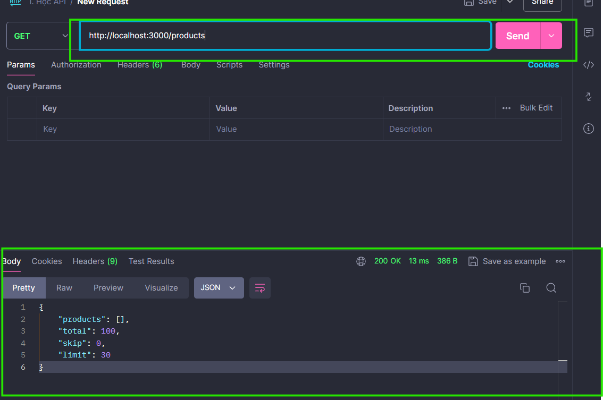

# Buổi 12: API là gì?

# I. API:
## 1. ĐN:
   1. API là viết tắt của Application Programming Interface.
   2. API Web là một giao diện lập trình ứng dụng cho Web.
   3. API trình duyệt có thể mở rộng chức năng của trình duyệt web.
   4. API máy chủ có thể mở rộng chức năng của máy chủ web.
## 2. API trình duyệt:
1. ĐN: (Browser API) là một tập hợp các giao diện lập trình ứng dụng cho phép các nhà phát triển web tương tác trực tiếp với các tính năng và khả năng của trình duyệt. Nhờ có các API này, các trang web có thể thực hiện nhiều tác vụ phức tạp hơn, từ việc truy cập vào vị trí địa lý của người dùng đến việc điều khiển các thiết bị ngoại vi.
2. Vai trò:
   - Tương tác nâng cao: Cho phép người dùng tương tác với trang web một cách tự nhiên hơn, ví dụ như sử dụng camera, microphone, hoặc các cảm biến khác trên thiết bị.
   - Tính năng phong phú: Mở rộng khả năng của các trang web, cho phép tạo ra các ứng dụng web giàu tính năng, gần giống với các ứng dụng native.
   - Hiệu suất tốt hơn: Nhiều API được tối ưu hóa để hoạt động hiệu quả trên trình duyệt, giúp các trang web chạy mượt mà hơn.
   - Tiết kiệm thời gian: Cung cấp các chức năng sẵn có, giúp các nhà phát triển tiết kiệm thời gian và công sức.
3. Các API trình duyệt nổi bật
- Geolocation API: Cho phép xác định vị trí địa lý của người dùng.
- Web Storage API: Cung cấp cách lưu trữ dữ liệu của người dùng ngay trên trình duyệt, bao gồm localStorage và sessionStorage.
- Canvas API: Cho phép vẽ đồ họa 2D trên trang web.
- Web Audio API: Cho phép xử lý âm thanh trực tiếp trong trình duyệt.
- WebRTC: Cho phép truyền tải âm thanh và video trực tiếp giữa các trình duyệt, không cần đến máy chủ trung gian.
- Fetch API: Là một giao diện hiện đại để lấy dữ liệu từ các API khác.
- Service Workers: Cho phép tạo ra các ứng dụng web hoạt động offline và nhận thông báo đẩy.
- WebAssembly: Cho phép chạy các mã nhị phân được biên dịch từ các ngôn ngữ khác (như C, C++) trực tiếp trong trình duyệt.
- Và nhiều API khác: Như PaymentRequest API, Notifications API, Vibration API, ...
4. Ứng dụng:
- Bản đồ trực tuyến: Sử dụng Geolocation API để xác định vị trí của người dùng và hiển thị bản đồ tương ứng.
- Trò chơi: Sử dụng Canvas API để vẽ đồ họa và Web Audio API để tạo âm thanh.
- Ứng dụng nhắn tin: Sử dụng WebRTC để thực hiện cuộc gọi video và âm thanh.
- Ứng dụng thương mại điện tử: Sử dụng PaymentRequest API để đơn giản hóa quá trình thanh toán.
## 3. API bên thứ 3
1. ĐN: Là API không được tích hợp sẵn trên web. Để sử dụng, ta phải tải code từ web.
2. VD: 
   1. YouTube API - Cho phép bạn hiển thị video trên một trang web.
   2. Twitter API - Cho phép bạn hiển thị Tweets trên một trang web.
   3. Facebook API - Cho phép bạn hiển thị thông tin Facebook trên một trang web. 

## 4. API Storage:
1. ĐN: API Storage: là một cú pháp đơn giản để lưu trữ và truy xuất dữ liệu trong trình duyệt. 
2. Object localStorage:
   1. Đối tượng localStorage :
      1. cung cấp quyền truy cập vào bộ lưu trữ cục bộ cho một trang Web cụ thể. Nó cho phép bạn lưu trữ, đọc, thêm, sửa đổi và xóa các mục dữ liệu cho miền đó.
      2. Dữ liệu được lưu trữ không có ngày hết hạn và sẽ không bị xóa khi đóng trình duyệt.
   2. Phương thức setItem(): Giúp lưu trữ 1 bộ dữ liệu trong bộ lưu trữ: 
      1. `localStorage.setItem("name", "John Doe");`
   3. Phương thức getItem()
      1. Phương thức localStorage.getItem() truy xuất một mục dữ liệu từ bộ lưu trữ.
      2. Nó lấy key làm tham số: `localStorage.getItem("name");`
   4. removeItem(): XÓa dữ liệu, tham số truyền vào là key:
      1. `localStorage.removeItem('key')`
   5. clear(): Xóa tất cả.
3. Sesstion Storage:
   1. Kho lưu trữ theo phiên. Lưu trữ dữ liệu có 1 phiên làm việc, khi tắt browser thì sẽ mất.
   2. Các phương thức làm việc tương tự local.

# II. Fetch API:
1. ĐN: 
   1. API Fetch cung cấp giao diện JavaScript để thực hiện các yêu cầu HTTP và xử lý các phản hồi.
   2. Fetch là sự thay thế hiện đại cho XMLHttpRequest: không giống như XMLHttpRequest, sử dụng Callback, Fetch dựa trên Promise.
   3. Phương thức Fetch: Gọi lên server thông qua 1 API để lấy dữ liệu
2. Code:
   ```java
      fetch("API URL")
      .then(response => response.json())
      .then(data => {
         //do SMT
      })
      .catch(error => {
         console.log(error)
      })
   ```
3. Giải thích: Hàm fetch trả về 1 Promise được lưu giá trị là 1 Response object đại diện cho phản hồi của Server. Ta có thể kiểm tra yêu cầu và xử lý => JSON hoặc text , bằng việc gọi phương thức trong phản hồi. (response.json() => Trả về cho tk then sau 1 cái data JSON.)


# III. REST API:

## 1. REST: 
1. ĐN:
   1. Nguyên lí REST và cấu trúc dữ liệu RESTful được biết đến rộng rãi trong giới lập trình web nói chung và lập trình ứng dụng nói riêng.
   2. Có thể nói bản thân REST không phải là một loại công nghệ. Nó là phương thức tạo API với nguyên lý tổ chức nhất định. Những nguyên lý này nhằm hướng dẫn lập trình viên tạo môi trường xử lý API request được toàn diện.
   3. ĐN: REST (REpresentational State Transfer) là một **dạng chuyển đổi cấu trúc dữ liệu, một kiểu kiến trúc để viết API**. Nó sử dụng phương thức HTTP đơn giản để tạo cho giao tiếp giữa các máy. Vì vậy, thay vì sử dụng một URL cho việc xử lý một số thông tin người dùng, REST gửi một yêu cầu HTTP như GET, POST, DELETE, vv đến một URL để xử lý dữ liệu.
## 2. Restful API:
1. RESTful API là một tiêu chuẩn dùng trong việc thiết kế các API cho các ứng dụng web để quản lý các resource. RESTful là một trong những kiểu thiết kế API được sử dụng phổ biến ngày nay để cho các ứng dụng (web, mobile…) khác nhau giao tiếp với nhau.
2. Chức năng quan trọng nhất của REST là quy định cách sử dụng các HTTP method (như GET, POST, PUT, DELETE…) và cách định dạng các URL cho ứng dụng web để quản các resource. RESTful không quy định logic code ứng dụng và không giới hạn bởi ngôn ngữ lập trình ứng dụng, bất kỳ ngôn ngữ hoặc framework nào cũng có thể sử dụng để thiết kế một RESTful API.

## 3. Restful Hoạt động như thế nào?
1. 
2. CRUD (Create, Read, Update, Delete):
3. REST hoạt động chủ yếu dựa vào giao thức HTTP. Các hoạt động cơ bản nêu trên sẽ sử dụng những phương thức HTTP riêng.
   1. GET (SELECT): Trả về một Resource hoặc một danh sách Resource.
   2. POST (CREATE): Tạo mới một Resource.
   3. PUT (UPDATE): Cập nhật thông tin cho Resource.
   4. DELETE (DELETE): Xoá một Resource.


# IV. JSON Server và Postman:

## 1. JSON Server:
1. ĐN: Là 1 server trả dữ liệu về dưới dạng JSON.
2. Sử dụng để Fake API:
   1. Là tạo 1 API giả để FE có thể test các chức năng với bộ dữ liệu tự tạo mà không cần chờ BE trả dữ liệu. (Các cặp key-value, trường dữ liệu đã có trước để test)
3. Cáì đặt:
   1. B1: `npm init` => Tạo package JSON
   2. B2: `npm i json-server` => Cài JSON Server.
   3. B3: Tạo 1 file database.json với nội dung mẫu
   4. B4: Thêm nội dung script vào file package.json: `"start": "json-server --watch database.json"`
   5. Chạy câu lệnh `npm start` => Tạo các link API cho database 

## 2. Postman:
1. ĐN:
   1. Postman là một nền tảng API để xây dựng và sử dụng API. 
   2. Thông thường, Postman sẽ được dùng cho API kiểu REST. Với Postman, ta có thể gọi Rest API mà không cần viết dòng code nào.
   3. Postman hỗ trợ tất cả các phương thức HTTP (GET, POST, PUT, PATCH, DELETE, …). Bên cạnh đó, nó còn cho phép lưu lại lịch sử các lần request, rất tiện cho việc sử dụng lại khi cần.
2. Cài đặt, sử dụng:
   1. Cài đặt và sử dụng Postman
      1. B1: Tải Postman và đăng kí tài khoản.
      2. B2: Chọn create Workspace, Add 1 request trong workspace.
   2. Phương thức GET.
      1. Để lấy một hoặc nhiều bản ghi.
      2. VD: Lấy ra danh sách các bài viết
      3. Cách làm: Copy cái link data vào.
      4. 
   3. Phương thức POST:
      1. Tạo bản ghi mới