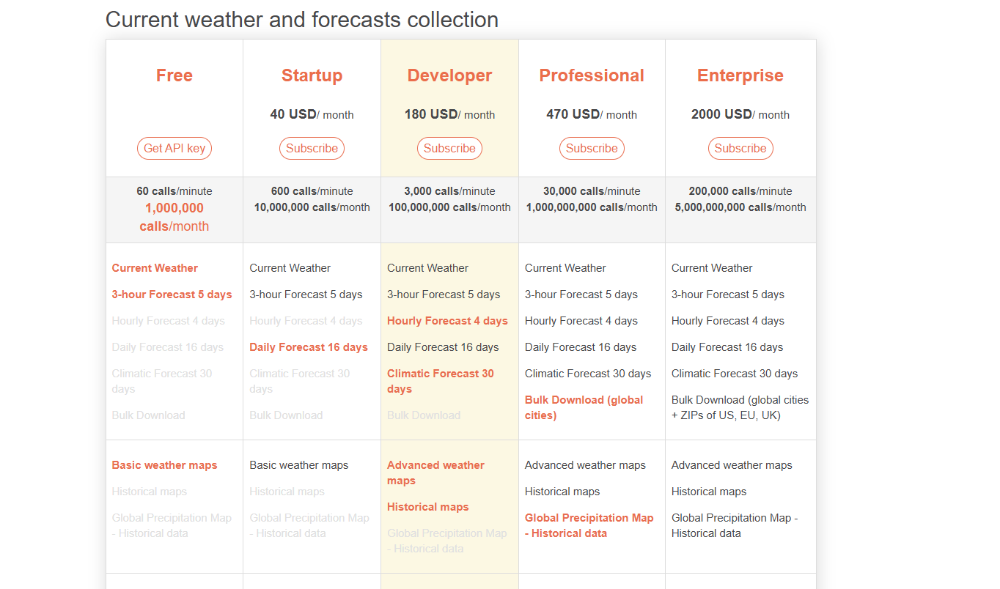

# III. Chuẩn bị bài tập cuối khóa: Weather APP.
FUll doc: `https://openweathermap.org/current`
1. Mô tả:
   1. 
2. Chức năng:
   1. Tìm 1 địa điểm. Nó sẽ hiển thị ra:
      1. Tên
      2. Thời gian
      3. THời tiết
      4. Đang là bình minh hay đêm muộn, bình minh hay giữa trưa.
      5. Độ ẩm
      6. Giờ
      7. Nhiệt độ
      8. Tình trạng thời tiết: Mưa, gió, sương,...
3. API:
   1. 
   2. Bản Free:
      1. 60 lượt Call mỗi phút, 1tr lượt gọi mỗi tháng, chắc ko hết đâu ....
      2. Key đã gen: `271b8214acf1154e7de714c03df3396f`
      3. API: `https://api.openweathermap.org/data/2.5/weather?lat={lat}&lon={lon}&appid={API key}`
         1. 
      4. Các thông số:
         1. Thông số
            - lat(bắt buộc): Vĩ độ. Nếu bạn cần bộ mã hóa địa lý để tự động chuyển đổi tên thành phố và mã zip sang địa lý tọa độ và ngược lại, vui lòng sử dụng Mã hóa địa lý của chúng tôi API
            - lon(bắt buộc): Kinh độ. Nếu bạn cần bộ mã hóa địa lý để tự động chuyển đổi tên thành phố và mã zip sang địa lý tọa độ và ngược lại, vui lòng sử dụng Mã hóa địa lý của chúng tôi API
            - appid(bắt buộc): Khóa API duy nhất của bạn (bạn luôn có thể tìm thấy khóa này trên trang tài khoản của mình trong tab "Khóa API")
            - mode (Tùy chọn): Định dạng phản hồi. Các giá trị có thể là và . Nếu bạn không sử dụng định dạng tham số là JSON theo mặc định. Tìm hiểu thêm xmlhtmlmode
            - units	(Tùy chọn): Đơn vị đo lường. , và các đơn vị có sẵn. Nếu bạn không sử dụng tham số, các đơn vị sẽ được áp dụng theo mặc định.Tìm hiểu thêm: standardmetricimperialunitsstandard
            - lang (Tùy chọn): Bạn có thể sử dụng tham số này để lấy đầu ra bằng ngôn ngữ của mình. Tìm hiểu thêm
      5. Các trường phản hồi (JSON): Các trường phản hồi API định dạng JSON
      - coord
        - coord.lon Kinh độ của vị trí
        - coord.lat Vĩ độ của vị trí
      - weather (Xem thêm thông tin Điều kiện thời tiết Mã)
        - weather.id Điều kiện thời tiết id
        - weather.main Nhóm các thông số thời tiết (Mưa, Tuyết, Mây, v.v.)
        - weather.description Điều kiện thời tiết trong nhóm. Vui lòng xem thêm tại đây. Bạn có thể nhận được đầu ra bằng ngôn ngữ của mình. Học nhiều hơn
        - weather.icon Id biểu tượng thời tiết
      - base Thông số nội bộ
      - main
        - main.temp Nhiệt độ. Đơn vị mặc định: Kelvin, Số liệu: Celsius, Imperial: Fahrenheit
          - main.feels_like Nhiệt độ. Thông số nhiệt độ này chiếm cho con người nhận thức về thời tiết. Đơn vị mặc định: Kelvin, Số liệu: Celsius, Imperial: Fahrenheit
          - main.pressure Áp suất khí quyển trên mực nước biển, hPa
          main.humidity Độ ẩm, %
          - main.temp_min Nhiệt độ tối thiểu tại thời điểm này. Điều này là tối thiểu hiện tại nhiệt độ quan sát được (trong các siêu đô thị lớn và khu vực đô thị). Vui lòng xem thêm thông tin tại đây. Đơn vị mặc định: Kelvin, Số liệu: Celsius, Imperial: Fahrenheit
          - main.temp_max Nhiệt độ tối đa tại thời điểm này. Đây là mức tối đa hiện tại nhiệt độ quan sát được (trong các siêu đô thị lớn và khu vực đô thị). Vui lòng xem thêm thông tin tại đây. Đơn vị mặc định: Kelvin, Số liệu: Celsius, Imperial: Fahrenheit
          - main.sea_level Áp suất khí quyển trên mực nước biển, hPa
          main.grnd_level Áp suất khí quyển trên mặt đất, hPa
      - visibility Khả năng hiển thị, đồng hồ. Giá trị tối đa của tầm nhìn là 10 km
      - wind
        - wind.speed Tốc độ gió. Đơn vị mặc định: mét / giây, Số liệu: mét / giây, Hoàng gia: dặm/giờ
        - wind.deg Hướng gió, độ (khí tượng)
        - wind.gust Gió giật. Đơn vị mặc định: mét / giây, Số liệu: mét / giây, Hoàng gia: dặm/giờ
      - clouds
        - clouds.all Mây, %
              - rain
        - 1h(nếu có)Lượng mưa, mm/h. Xin lưu ý mà chỉ mm / h là đơn vị của Đo lường có sẵn cho tham số này snow
        - 1h(nếu có) Lượng mưa, mm/h. Xin lưu ý rằng chỉ mm / h dưới dạng đơn vị đo lường có sẵn cho thông số này dt Thời gian tính toán dữ liệu, unix, UTC
      - sys
        - sys.type Thông số nội bộ
        - sys.id Thông số nội bộ
        - sys.message Thông số nội bộ
        - sys.country Mã quốc gia (GB, JP, v.v.)
        - sys.sunrise Giờ mặt trời mọc, unix, UTC
        - sys.sunset Giờ hoàng hôn, unix, UTC timezone Thay đổi trong vài giây từ UTC
      - id: ID thành phố. Xin lưu ý rằng bộ mã hóa địa lý tích hợp Chức năng đã không còn được dùng nữa. Tìm hiểu thêm tại đây
      - name Tên thành phố. Xin lưu ý rằng bộ mã hóa địa lý tích hợp Chức năng đã không còn được dùng nữa. Tìm hiểu thêm tại đây
      - cod Thông số nội bộ

   3. TÌm kiếm địa chỉ qua TêN:
      1. Full doc: `https://openweathermap.org/api/geocoding-api`
      2. `http://api.openweathermap.org/geo/1.0/direct?q={city name},{state code},{country code}&limit={limit}&appid={API key}`
         1. APi giúp tìm kiếm các thành phố có từ khóa cityname
         2. 
         3. VD: `http://api.openweathermap.org/geo/1.0/direct?q=London&limit=5&appid={API key}`: Tìm 2 tk có từ London ở cityname
      3. `http://api.openweathermap.org/geo/1.0/zip?zip={zip code},{country code}&appid={API key}`: 
         1. TÌm kiếm địa chỉ (gômf: zip, name, lat, lon, country) qua mã zip:
      4. `http://api.openweathermap.org/geo/1.0/reverse?lat={lat}&lon={lon}&limit={limit}&appid={API key}`:
         1. Trả về các địa chỉ thành phố dựa trên lat, lon