# I. NPM, NPX, YARN
## 1. NPM, YARN: 
- NPM và Yarn là các trình quản lý gói giúp quản lý các phụ thuộc của dự án. 

### a. NPM: Node Package Manager
1. ĐN:
   1. Là trình quản lý gói cho ngôn ngữ lập trình JavaScript. Đây là trình quản lý gói mặc định cho môi trường chạy JavaScript Node.js. 
   2. Gồm một comment-line Client, còn được gọi là npm, và một cơ sở dữ liệu trực tuyến về các gói công khai và riêng tư trả phí được gọi là npm registry

### b. YARN: Yet Another Resource Negotiator (Đàm phán tài nguyên ???)
1. ĐN:
   1. Là trình quản lý gói giống như npm. Nó được phát triển bởi Facebook và hiện là mã nguồn mở. Mục đích đằng sau việc phát triển yarn (vào thời điểm đó) là để khắc phục các vấn đề về hiệu suất và bảo mật với npm.

### c. Sự khác biệt: 
1. Cài đặt: 
   1. npm thì đc cài sẵn
   2. npm install yarn --global
2. Cài đặt gói:
   1. npm cài tuần tự
   2. yarn cài song song
3. Yarn cung cấp khả năng cài đặt nhanh hơn, hỗ trợ ngoại tuyến mạnh mẽ và quản lý không gian làm việc mạnh mẽ, khiến nó trở nên lý tưởng cho các dự án lớn. Tuy nhiên, NPM được áp dụng rộng rãi hơn, được cài đặt sẵn với Node.js và có các tính năng bảo mật và hiệu suất được cải thiện trong các phiên bản gần đây.
4. Lock File:
   1. npm: NPM tạo tệp 'package-lock.json'. Tệp package-lock.json phức tạp hơn một chút do phải cân bằng giữa tính xác định và tính đơn giản. Do tính phức tạp này, package-lock sẽ tạo cùng một thư mục node_modules cho các phiên bản npm khác nhau. Mỗi dependency sẽ có số phiên bản chính xác được liên kết với nó trong tệp package-lock.
   2. yarn: Trong file package.json cả **npm và yarn đều dựa vào file cấu hình này thực hiện theo vết các gói** phụ thuộc trong dự án, phiên bản các gói không phải lúc nào cũng chính xác. Thay vào đó, thường xác định một khoảng các phiên bản cho phép, bằng cách này cho phép chọn một phiên bản cụ thể nhưng **khi cài đặt npm thường chọn phiên bản mới nhất để khắc phục các lỗi phiên bản trước đó**. Về lý thuyết, các phiên bản mới sẽ không phá vỡ các kiến trúc trong phiên bản cũ, nhưng thực tế không phải lúc nào cũng vậy. Sử dụng npm để quản lý gói phần mềm **có thể dẫn đến trường hợp hai máy có cùng một file cấu hình package.json nhưng lại có các phiên bản của các gói khác nhau** và nảy sinh các lỗi “bug on my machine”. Để tránh việc phiên bản không trùng khớp, một phiên bản chính xác sẽ được đưa vào trong file lock để quản lý. **Mỗi khi một module được thêm vào, yarn sẽ tạo ra (nếu chưa có) hoặc cập nhật file lock**. Bằngản cách này, **yarn đảm bảo các máy khác nhau sẽ có cùng phiên bản chính xác** trong khi vẫn có một loạt các phiên bản cho phép được định nghĩa trong file package.json. Ý tưởng này cũng giống như composer.lock được sử dụng trong Composer, công cụ quản lý gói phần mềm cho PHP. Với npm, lệnh npm shrinkwrap cũng tạo ra một tập tin lock và npm install sẽ đọc tập tin lock này trước khi đọc đến package.json, nó giống với cách yarn thực hiện bằng yarn.lock. Sự khác biệt ở đây là yarn luôn luôn tạo ra và cập nhật yarn.lock trong khi npm chỉ làm việc này khi thực hiện npm shrinkwrap hoặc tồn tại file npm-shrinkwrap.json.
### d. CMD:
- 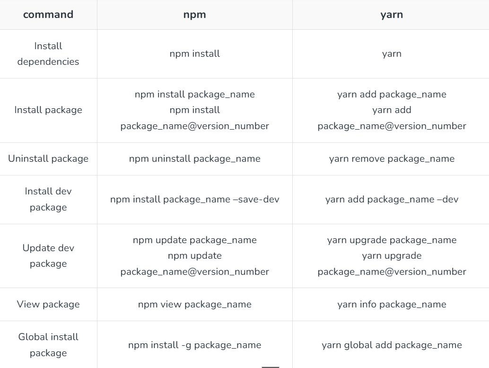
- 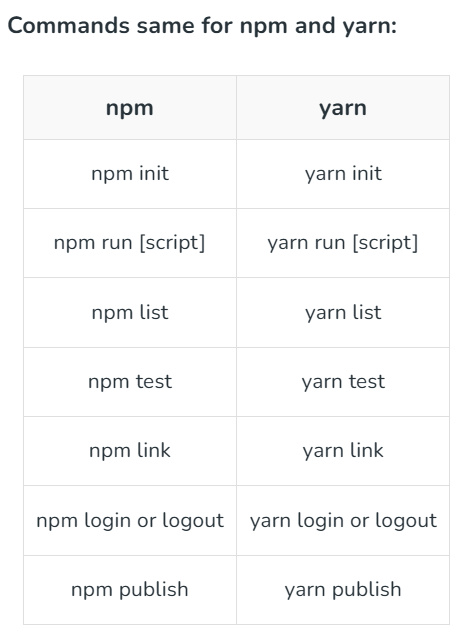
- Sự khác biệt: 
  - 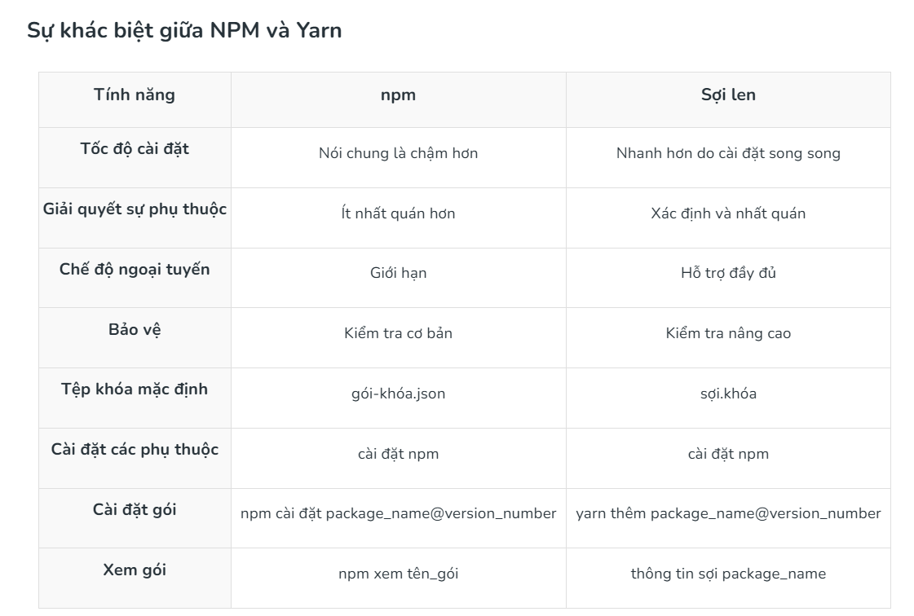


## 2. NPX:
1. ĐN:
   1. NPX, được trình làng từ Node.js 5.2.0. được **dùng để thực thi bất kỳ package nào có trên trang https://www.npmjs.com/** mà không cần cài đặt nó trước đó, bạn chỉ chạy nó thôi (tức nhiên nếu nó chạy được)
   2. npx cũng là một công cụ CLI có mục đích là giúp dễ dàng cài đặt và quản lý các phần phụ thuộc được lưu trữ trong sổ đăng ký npm.
   3. Giờ đây, rất dễ dàng để chạy bất kỳ loại tệp thực thi nào dựa trên Node.js mà thường cài đặt qua npm.
2. Tác dụng:
   1. Chạy một gói được cài đặt cục bộ một cách dễ dàng
   2. Thực thi các gói chưa được cài đặt trước đó
   3. VD: Thực thi lệnh tạo react-app: npx create-react-app tenduan. vì nó đã đc cài rồi nên cứ thực thi thôi
   

# II. ReactJS là gì?:
## 1. ĐN:

## 2. Lợi ích:
1. Những lợi ích tuyệt vời mà ReactJS mang lại cho lập trình viên và cho việc phát triển ứng dụng web, bao gồm:
   1. Hiệu suất cao: ReactJS sử dụng Virtual DOM để tối ưu hóa hiệu suất của ứng dụng. Virtual DOM cho phép ReactJS cập nhật các thay đổi trên trang web một cách nhanh chóng và hiệu quả hơn so với cách truyền thống, giúp tăng tốc độ và hiệu suất của ứng dụng.
   2. Tái sử dụng: ReactJS cho phép tái sử dụng các thành phần UI, giúp giảm thiểu thời gian và chi phí phát triển. Các thành phần UI có thể được sử dụng lại trong nhiều phần khác nhau của ứng dụng, giúp tăng tính linh hoạt và khả năng mở rộng của ứng dụng.
   3. => Phù hợp với Single Page App
   4. Dễ dàng quản lý trạng thái: ReactJS giúp quản lý trạng thái của ứng dụng một cách dễ dàng. Sử dụng State và Props, ReactJS cho phép các nhà phát triển quản lý trạng thái của các thành phần UI một cách chính xác và dễ dàng.
   5. Hỗ trợ đa nền tảng: ReactJS không chỉ được sử dụng để phát triển các ứng dụng web, mà còn được sử dụng để phát triển các ứng dụng di động với React Native. Sử dụng React Native, các nhà phát triển có thể xây dựng ứng dụng di động cho cả iOS và Android sử dụng cùng một mã nguồn.

## 3. Các tính năng nổi bật:
1. Components: **ReactJS cho phép phát triển ứng dụng web theo mô hình component**. Các component là các phần tử UI độc lập có thể được tái sử dụng trong nhiều phần khác nhau của ứng dụng.
2. Virtual DOM: ReactJS sử dụng Virtual DOM để tối ưu hóa hiệu suất của ứng dụng. Virtual DOM là một bản sao của DOM được lưu trữ trong bộ nhớ và được cập nhật một cách nhanh chóng khi có thay đổi, giúp tăng tốc độ và hiệu suất của ứng dụng.
3. JSX: JSX là một ngôn ngữ lập trình phân biệt được sử dụng trong ReactJS để mô tả các thành phần UI. JSX kết hợp HTML và JavaScript, giúp cho việc viết mã dễ hiểu và dễ bảo trì hơn.
4. State và Props: ReactJS cho phép quản lý trạng thái của các thành phần UI thông qua State và Props. State là trạng thái của một thành phần được quản lý bởi nó chính, trong khi Props là các giá trị được truyền vào từ bên ngoài để tùy chỉnh hoặc điều khiển hành vi của một thành phần.
5. (???) Hỗ trợ tốt cho SEO: ReactJS hỗ trợ tốt cho việc tối ưu hóa SEO. Với các thư viện như React Helmet, các nhà phát triển có thể quản lý các phần tử meta và title cho từng trang web, giúp tăng khả năng tìm kiếm và tăng cường trải nghiệm người dùng.
6. Hỗ trợ đa nền tảng: ReactJS không chỉ được sử dụng để phát triển ứng dụng web, mà còn được sử dụng để phát triển ứng dụng di động với React Native. Sử dụng React Native, các nhà phát triển có thể xây dựng ứng dụng di động cho cả iOS và Android sử dụng cùng một mã nguồn.
7. Redux: Redux là một thư viện quản lý trạng thái cho các ứng dụng ReactJS. Nó giúp quản lý trạng thái của ứng dụng một cách chính xác và dễ dàng, đồng thời giúp tăng tính linh hoạt và khả năng mở rộng của ứng dụng.

## 4. Cách sử dụng:
- Bước 1 - Cài đặt Node.js và npm: ReactJS được xây dựng trên nền tảng Node.js, do đó bạn cần cài đặt Node.js và npm để phát triển ứng dụng ReactJS.
- Bước 2 - Tạo một ứng dụng React: Bạn có thể tạo một ứng dụng React bằng cách sử dụng lệnh "create-react-app" trong Command Prompt hoặc Terminal.
- Bước 3 - Tạo các component: Tạo các component để xây dựng giao diện người dùng cho ứng dụng của bạn. Bạn có thể tạo component bằng cách sử dụng class hoặc hàm.
- Bước 4 - Xây dựng giao diện người dùng: Sử dụng JSX để xây dựng giao diện người dùng cho ứng dụng của bạn. JSX là một ngôn ngữ phân biệt được sử dụng trong ReactJS để mô tả các thành phần UI.
- Bước 5 - Quản lý trạng thái: Sử dụng State và Props để quản lý trạng thái của các thành phần UI. State là trạng thái của một thành phần được quản lý bởi nó chính, trong khi Props là các giá trị được truyền vào từ bên ngoài để tùy chỉnh hoặc điều khiển hành vi của một thành phần.
- Bước 6 - Kết nối với API: Sử dụng thư viện như Axios để kết nối với API và lấy dữ liệu từ server.
- Bước 7 - Build và triển khai ứng dụng: Sử dụng lệnh "npm run build" để build ứng dụng của bạn và triển khai nó trên môi trường sản phẩm.


# III. CLI, CLI Tools(Vite, Create React App):
## 1. ĐN:
### a. CLI: 
   1. CLI (Command-line Interface) hay giao diện dòng lệnh (cách thức các đối tượng tiếp xúc với nhau) là phương tiện hỗ trợ tương tác với các máy chủ mà người dùng (máy khách) đưa cho chương trình một dòng lệnh bằng cách sử dụng các văn bản hay dòng lệnh liên tiếp. CLI cho phép người dùng viết các lệnh trong cửa sổ terminal hoặc console để giao tiếp với hệ thống máy tính.
   2. CLI được đánh giá là giao diện cực kỳ thích hợp cho việc tính toán nhưng nó đòi hỏi sự chính xác tuyệt đối từ khâu nhập dữ liệu. Do vậy, tại CLI, bạn phải thành thạo mọi lệnh và cú pháp.
   3. (ng với GUI: Graphical User Interface)
### b. CLI Tools:
#### 1. Create React App: sử dụng Create React App để tự động hóa việc xây dựng ứng dụng của bạn. Bạn sẽ có mọi thứ cần để xây dựng ứng dụng ReactJS mà không phải config gì cả. Để bắt đầu, hãy chắc chắn rằng máy của bạn đã được cài NodeJS 4.x hoặc version cao hơn.
#### 2. Vite:
1. ĐN:
   1. Vite mang đến cách tiếp cận mới trong việc xây dựng các dự án web bằng cách tận dụng các module ES gốc trong trình duyệt và cung cấp tính năng Hot Module Replacement (HMR).
   2. Giả sử bạn đang xây dựng một ứng dụng web đơn giản với React. Trước khi có Vite, công cụ phổ biến như Webpackhoặc Create React App (CRA) được sử dụng nhiều. Tuy nhiên, **các công cụ này có thể chậm khi khởi động hoặc cập nhật code**.
2. Cách thức hoạt động:
   1. Nó tận dụng Rollup (là 1 modele bundler, kết hợp nhiều file JS nhỏ thành 1 vài lớn hơn, và nó còn loại bỏ mã ko cần, trùng => tối ưu) để thực hiện việc đóng gói mã cuối cùng, tạo ra các file nhỏ gọn và tối ưu, từ đó cải thiện hiệu suất tổng thể của ứng dụng.
   2. Vite xử lý mã nguồn trong quá trình phát triển. Thay vì gộp tất cả mã lại từ đầu, **Vite sử dụng ES Modules** – một tiêu chuẩn JavaScript được browser hỗ trợ – để **tải từng module riêng lẻ khi cần thiết**. Nói cách khác, nếu trang web của bạn sử dụng nhiều file JavaScript, Vite sẽ chỉ phân phát những file nào mà trình duyệt yêu cầu vào đúng thời điểm đó, thay vì tải toàn bộ ngay từ đầu.
   3. 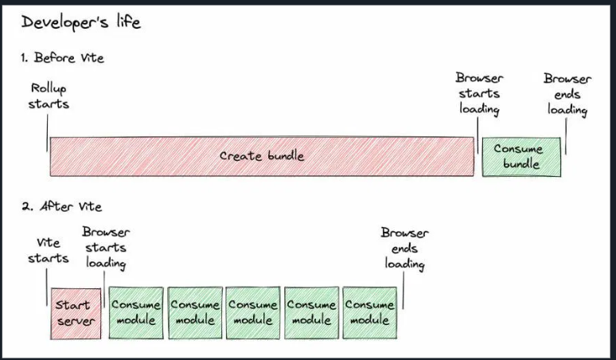
3. Lợi ích:
   1. Khởi động nhanh chóng: Vite cho phép bạn bắt đầu dự án gần như ngay lập tức, giúp bạn tiết kiệm thời gian.
   2. Cấu hình đơn giản: Vite được thiết kế để dễ dàng thiết lập, đặc biệt thân thiện với người mới bắt đầu, giúp bạn khởi tạo dự án mà không cần phải loay hoay với các cấu hình phức tạp.
   3. Hỗ trợ TypeScript: Vite tích hợp tốt với TypeScript, giúp bạn viết mã nguồn an toàn và dễ bảo trì hơn, đồng thời tận dụng đầy đủ các tính năng mạnh mẽ của TypeScript.
   4. Hiệu suất cao: nhờ sử dụng ES Modules gốc của trình duyệt và tính năng Hot Module Replacement (HMR), Vite mang đến trải nghiệm phát triển mượt mà, với phản hồi tức thì khi bạn thay đổi mã.
4. SO sánh:
   1. 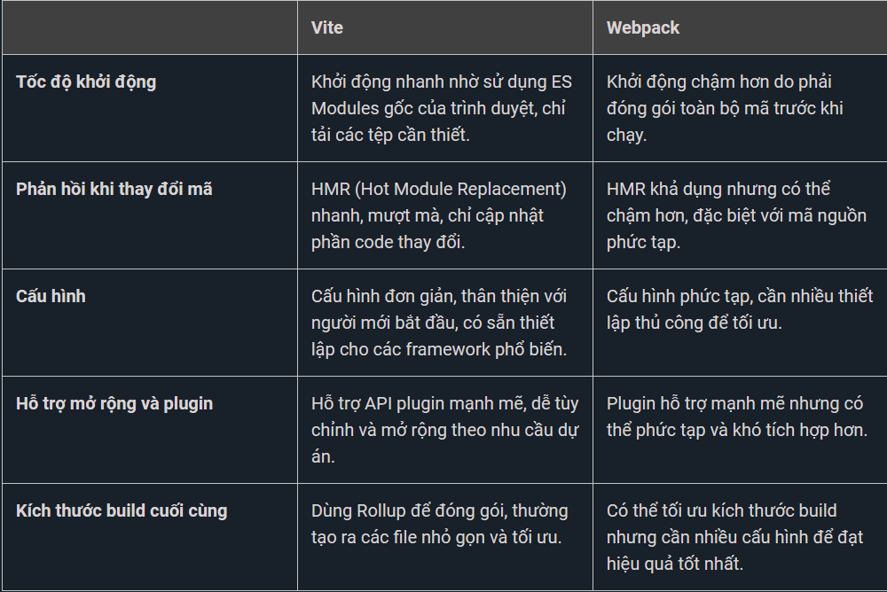


#### 3. Cài đặt:
1. Create React App:
   1. B1: npm install -g create-react-app (chỉ cần gọi 1 lần)
   2. B2: create-react-app first-app
      1. 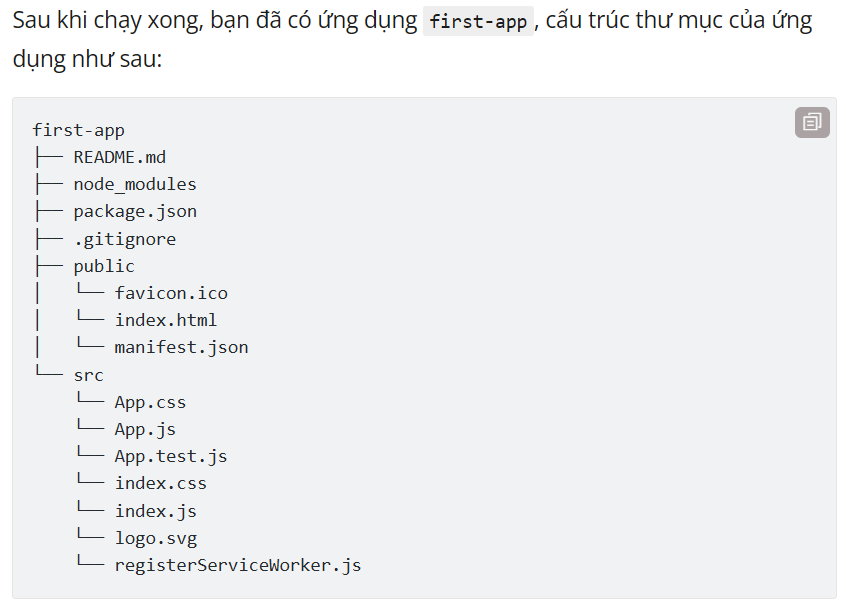
   3. B3: cd first-app; npm start
   4. Ta có thể đổi port trong package.json ở phần start : --port 3001
2. Vite
   1. npm create vite => TSX + SWC(TypeScript + SWC (Speedy Web Compiler) - một trình biên dịch thay thế cho Babel, giúp cải thiện hiệu suất phát triển và xây dựng dự án.)
   2. cd 
   3. npm install
   4. npm run dev
   5. (Có thể sửa port ở vite.config.ts)
      1. 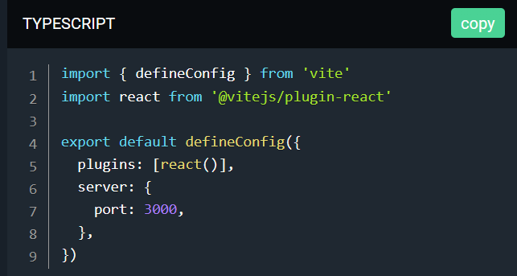
   6. Build, Preview:
      1. npm run build
      2. npm run preview

# IV. Tạo 1 dự án

# V. JSX:
## 1. ĐN:
- JSX là viết tắt của JavaScript XML.
- JSX cho phép chúng ta viết HTML trong React.
- JSX giúp viết và thêm HTML trong React dễ dàng hơn.
  
- => Đơn giản nó cho phép ta viết HTML trong JS
## Các quy tắc (Khác biệt với HTML:)
- 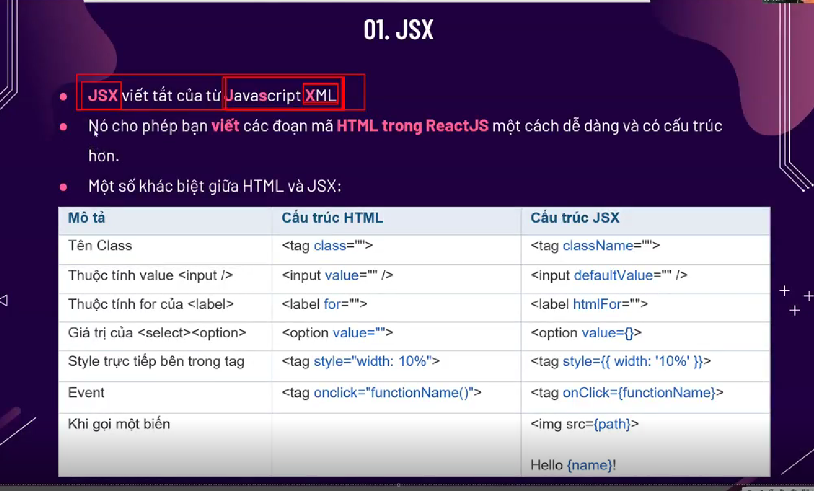

# VI. Component:
## 1. ĐN:
1. 
   - ReactJS là một thư viện JavaScript được Facebook phát triển để xây dựng giao diện người dùng (UI) tương tác và linh hoạt. Một trong những khái niệm cốt lõi nhất của ReactJS là "Component". 
   - Component là khối xây dựng cơ bản (fundamental building block) của một ứng dụng React, cho phép phân **chia giao diện thành các phần nhỏ**, **hoạt động độc lập** và **có thể tái sử dụng chúng nhiều lần**.
   - 
2. Các bước tạo Component:
   1. Tạo Component:
      1. src => Tạo Folder: Components
   2. Trong Folder Components tạo 1 folder mới theo tên của khối ta muốn tạo (VD: Header)
   3. Tạo 1 file index.js, viết 1 function tên là Header và export default
   4. import vào FIle nào mà bạn muốn sử dụng component đó
## 2. Các loại Component trong ReactJS:

### a. Function Component
- Function Component là một hàm JavaScript thường có tên là hàm render, nhận một đối số là props (nếu cần) và trả về một phần tử React (ví dụ: JSX) để hiển thị nội dung trên giao diện người dùng. Hàm này có thể nhận hoặc không nhân dữ liệu dưới dạng tham số.
-Function Component không có state và không sử dụng lifecycle methods.
- Lưu ý rằng một phần tử (Element) React không phải là một component, nhưng một component có thể chưa nhiều phần tử React.
- VD:
  - ```js
      // Functional component
      function Greeting(props) {
      return <div>Hello, {props.name}!</div>;
      }

      // Sử dụng functional component
      const App = () => {
      return <Greeting name="John" />;
      }
   ```
- Ưu điểm lớn của functional component là chúng đơn giản, dễ đọc, và thường đủ cho các trường hợp sử dụng đơn giản. 
- Ngoài ra, từ phiên bản React 16.8 trở đi, có sẵn Hooks, cho phép functional component sử dụng trạng thái và các tính năng trước đây chỉ có trong class component. Điều này làm tăng tính linh hoạt của functional component và giúp chúng có thể thay thế hoặc kết hợp chung với class component trong phát triển ứng dụng React.

### b. Class Component:
1. ĐN:
  - Class component được định nghĩa thông qua một class của JavaScript. 
  - Đối với class component, ta sử dụng class để định nghĩa component, và component này phải kế thừa từ class React.Component. 
  - Class components thường được sử dụng khi cần theo dõi trạng thái (state) của component và **sử dụng các lifecycle methods** để quản lý vòng đời của component.
2. VD:
   - ```js
         // Class component
      class Counter extends React.Component { //Là một class component kế thừa từ React.Component.
         //Trong hàm constructor, khởi tạo trạng thái (this.state) với giá trị ban đầu là count: 0.
         constructor(props) { //
            super(props);
            this.state = { count: 0 };
         }
         //Có một phương thức incrementCount để tăng giá trị của count khi nút được nhấn.
         incrementCount = () => {
            this.setState({ count: this.state.count + 1 });
         }
         //Hàm render trả về một phần tử React hiển thị giá trị count và một nút để tăng giá trị đó.
         render() {
            return (
               <div>
               Count: {this.state.count}
               <button onClick={this.incrementCount}>
                  Increment
               </button>
               </div>
            );
         }
      }

      // Sử dụng class component
      const App = () => {
         return <Counter />;
      }
   ```
3. Class components thường được sử dụng khi cần quản lý trạng thái phức tạp, sử dụng lifecycle methods, hoặc khi tích hợp với các tính năng mà functional components không thể đáp ứng trực tiếp.

## 3. Cách tổ chức Component:
1. Tái tạo, sử dụng: 
   1. Có thể truyền các thông tin cho 1 Component và sử dụng nhiều lần với từng thông tin riêng biệt:
   2. VD: 1 Component Book, có các thông tin: Title, Author, Cost, Description.....
   3. Các cách: có thể dùng qua Prop, reducer, kế thừa,..
2. Tổ chức Component:
   1. Tính tổ chức của React cho phép bạn xây dựng một cây thành phần phản ánh cấu trúc của ứng dụng. Điều này giúp quản lý trạng thái và dữ liệu, cũng như giúp theo dõi luồng dữ liệu trong ứng dụng một cách hiệu quả.
   2. Có nhiều cách tổ chức component như: Tổ chức theo chức năng, theo loại, theo mô hình, theo layout, theo cấp độ.
   3. VD:   
      1. 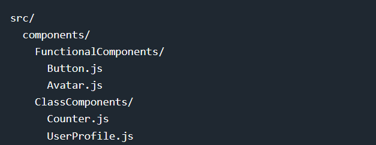
3. Lifecycle Mothod của Component:
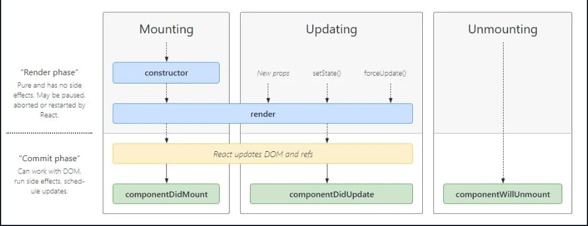
   1. Class Component cung cấp các phương thức tạo ra một vòng đời hoàn chỉnh cho Component gồm:
      - Khởi tạo (componentDidMount)
      - Thay đổi (ComponentDidUpdate)
      - Hủy bỏ (ComponentWillUnmount)
   2. Sử dụng LifeCycle Methods  giúp kiểm soát vòng đời của component và thực hiện các hành động như lấy dữ liệu từ API hoặc làm sạch tài nguyên.


## 4. Hooks:
1. 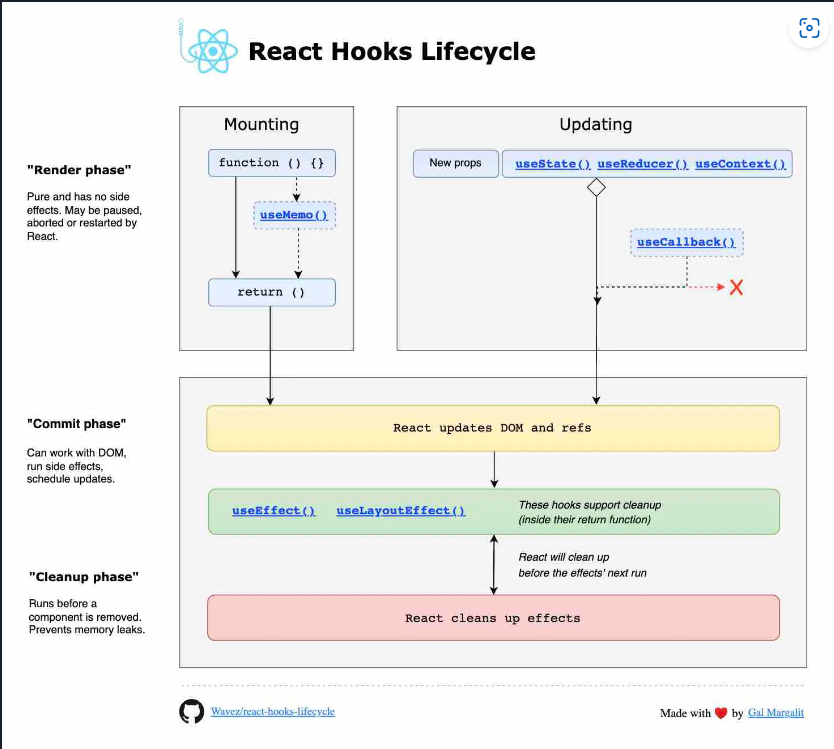
2. Hooks xuất hiện từ phiên bản React 16.8 trở đi như một tính năng hoàn toàn mới, giúp functional component có khả năng sử dụng trạng thái (state) và các tính năng của class component mà trước đây chỉ có thể sử dụng trong class component. Hooks giúp functional component trở nên  linh hoạt hơn, mà không cần chuyển đổi chúng thành class components.
3. Hooks giúp functional components trở nên dễ đọc, tái sử dụng và bảo trì hơn, đồng thời giữ lại tính chất đơn giản của chúng.


# VII. State và Props
1. Props: 
   1. lÀ **1 Object** được truyền vào trong 1 Component
   2. Cho phép chúng ta **giao tiếp giữa các Components** với nhau bằng cách truyền tham số qua lại giữa các Components:
   3. Khi 1 Components cha truyền cho Components con 1 Props thì Components con chỉ có thể độc và không có quyền chỉnh sửa nó bên cha
   4. Cách truyền: Như truyền tham số
   5. Kiểu dữ liệu: Tất cả
2. VD: 2 Tk content nó dùng chung 1 index.js (cùng HTML). => CÙng CSS. nhưng ta muốn nó có content bên trong khác nhau thì sao? => dùng prop truyền data từ component cha xuống component con.
- Sửa thì cứ lấy text ta truyền trong prop lưu vô