# I. Life cycle:
## 1. 
### 1. Giới thiệu:
- Trong React, các Components có vòng đời bao gồm các giai đoạn khác nhau. Mỗi pha có một tập hợp các lifecycle methods được gọi tại các điểm cụ thể trong vòng đời của component. Các phương pháp này cho phép bạn kiểm soát hành vi của thành phần và thực hiện các hành động cụ thể ở các giai đoạn khác nhau trong vòng đời của nó.
### 2. 3 giai đoạn chính:
   1. Mounting Phase: Lắp
      1. Giai đoạn lắp đặt bắt đầu khi một thành phần lần đầu tiên được tạo và chèn vào DOM. 
   2. Updating Phase: Cập nhật
      1. Giai đoạn cập nhật xảy ra khi props hoặc state của một thành phần thay đổi. 
   3. Unmounting Phase: Tháo gỡ
      1. Giai đoạn tháo gỡ xảy ra khi một thành phần được loại bỏ khỏi DOM.
### 3. Mounting Phase
   1. Giai đoạn lắp đặt đề cập đến khoảng thời gian khi một thành phần **đang được tạo và chèn vào DOM**.
   2. Trong giai đoạn này, một số **phương thức vòng đời** được React gọi để cho phép nhà phát triển cấu hình thành phần, thiết lập bất kỳ trình nghe trạng thái hoặc sự kiện cần thiết nào và thực hiện các tác vụ khởi tạo khác.
   3. Giai đoạn lắp đặt có ba phương pháp vòng đời chính được gọi theo thứ tự:
      1. **constructor()**:
         1. Được gọi khi thành phần được tạo lần đầu tiên
         2. Sử dụng nó để khởi tạo trạng thái của thành phần và liên kết các phương thức với phiên bản của cấu phần.
         3. 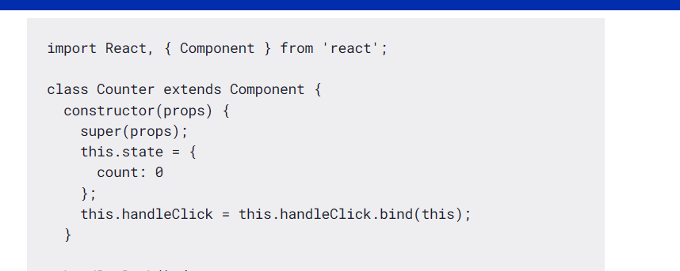
      2. **render()**:
         1. Chịu trách nhiệm **tạo biểu diễn DOM ảo** của thành phần **dựa trên các props, state hiện tại** của nó.
         2. Được gọi mỗi khi thành phần đc render (do state hoặc props bị thay đồi hoặc tk cha bị render lại)
         3. 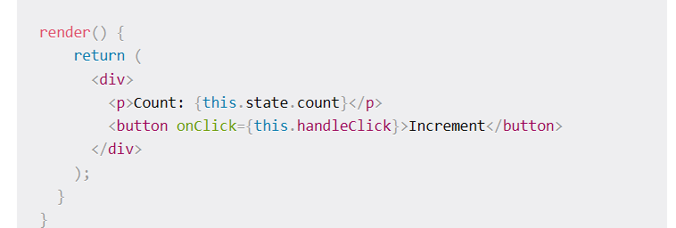
      3. **getDerivedStateFromProps()**:
         1. Trong giai đoạn lắp đặt, được gọi sau constructor(), trước render()
         2. Phương thức này được gọi cho mọi chu kỳ render và cung cấp cơ hội cập nhật state của thành phần dựa trên những thay đổi trong props trước khi render ban đầu.
         3. Ko hiêu lắm, nhưng khi add vào thì cái ko render data trong state luôn.
         4. 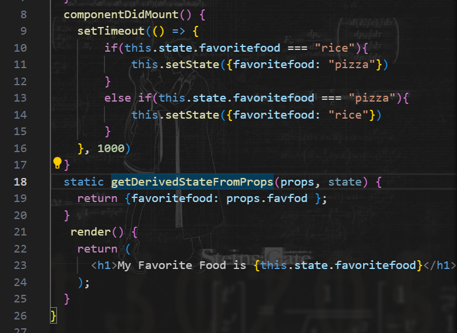
         5. 
      4. componentDidMount(): kiểu useEffect, hay dùng để call API. Nó sẽ chạy 1 lần
         1. 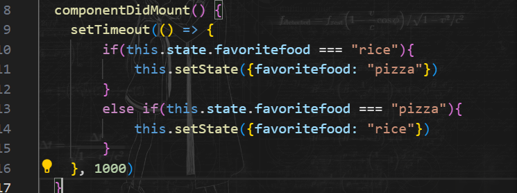
         2. 
      5. Phương thức này được gọi khi thành phần đã được gắn vào DOM. Nó thường được sử dụng để thiết lập bất kỳ trình nghe hoặc hẹn giờ sự kiện cần thiết nào, thực hiện mọi lệnh gọi API hoặc tìm nạp dữ liệu cần thiết và thực hiện các tác vụ khởi tạo khác yêu cầu quyền truy cập vào API DOM của trình duyệt
      6. 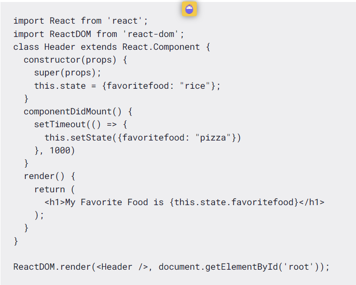
1. Updating Phase:
   1. shouldComponentUpdate():
      1. Phương thức được gọi **trước khi một thành phần được cập nhật**. Phải mất hai đối số: nextState và next Props. Phương thức này trả về giá trị boolean **xác định xem thành phần có nên cập nhật hay không**. Nếu phương thức này trả về true, component sẽ cập nhật và nếu trả về false, component sẽ không cập nhật.shouldComponentUpdate()
      2. 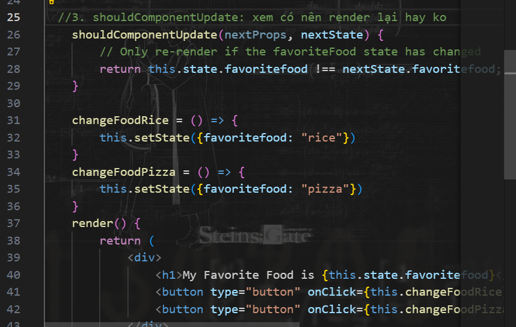
      3. Dùng để tránh render không cần thiết
   2. componentWillUpdate():
      1. componentWillUpdate() là một phương thức vòng đời trong React **được gọi ngay trước khi chu kỳ cập nhật của một thành phần bắt đầu**. Nó **nhận được prop và trạng thái tiếp theo** dưới dạng đối số và cho phép bạn thực hiện bất kỳ hành động cần thiết nào trước khi cập nhật thành phần.
      2. 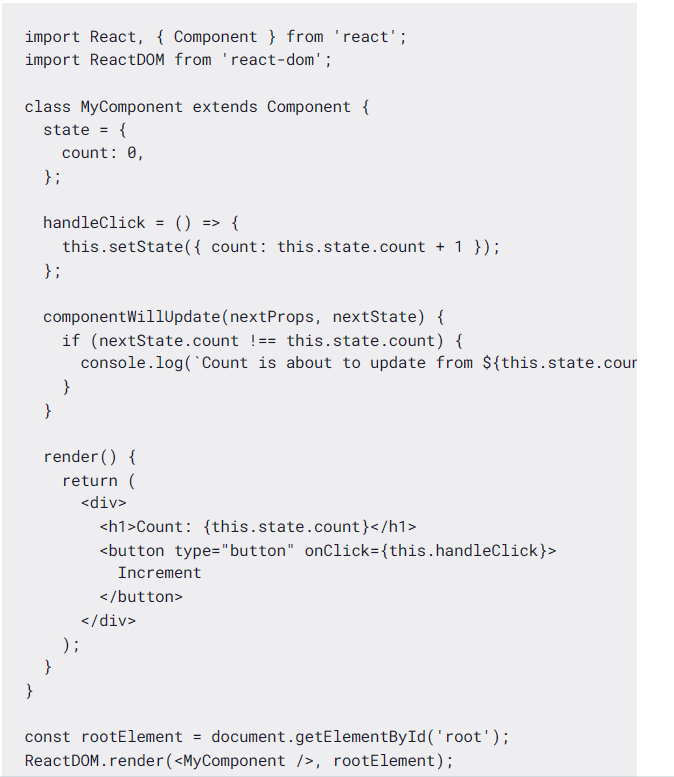
      3. VD trên thì cứ bấm click, render lại, trước khi render thì sẽ show ra dòng text được chỉ vào. Cái này nó nhận nextProps, nextState
   3. componentDidUpdate()
      1. Phương thức này là một phương thức vòng đời trong React được gọi sau khi một thành phần đã được cập nhật và kết xuất lại. Nó rất hữu ích để thực hiện các tác dụng phụ hoặc các hoạt động bổ sung khi đạo cụ hoặc trạng thái của thành phần đã thay đổi.
      2. 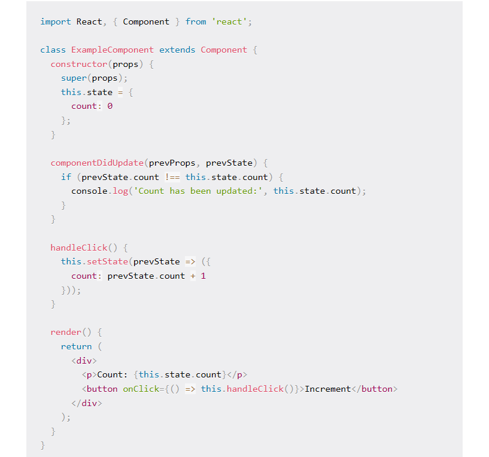
   4. getSnapshotBeforeUpdate():
      1. Phương thức này được **gọi ngay trước khi giao diện người dùng của thành phần được cập nhật**. Nó **cho phép thành phần nắm bắt một số thông tin về trạng thái hiện tại của giao diện người dùng**, chẳng hạn như vị trí cuộn trước khi nó thay đổi. Phương thức này **trả về một giá trị được truyền dưới dạng tham số thứ ba cho phương thức**
2. Giai đoạn tháo gỡ thành phần
   1. Giai đoạn tháo gỡ đề cập đến **giai đoạn vòng đời khi một thành phần đang bị xóa khỏi DOM** (Mô hình đối tượng tài liệu) và không còn được hiển thị hoặc truy cập được nữa.
   2. Trong giai đoạn này, React thực hiện một loạt các hoạt động dọn dẹp để đảm bảo rằng component và các tài nguyên liên quan của nó được xử lý đúng cách.
   3. Giai đoạn unmounting là giai đoạn cuối cùng trong vòng đời của một component React và xảy ra khi component đang được gỡ bỏ khỏi cây DOM.
   4. Điều này có thể xảy ra vì nhiều lý do, chẳng hạn như khi thành phần không còn cần thiết nữa, thành phần cha được hiển thị lại mà không bao gồm thành phần con hoặc khi ứng dụng đang điều hướng đến một trang hoặc chế độ xem khác.
   5. **componentWillUnmount**()
      1. Trong giai đoạn unmounting, React gọi các phương thức vòng đời sau theo thứ tự:
      2. componentWillUnmount(): Phương thức này được gọi ngay trước khi component được gỡ bỏ khỏi DOM. **Nó cho phép bạn thực hiện bất kỳ dọn dẹp cần thiết nào**, chẳng hạn như hủy hẹn giờ, xóa trình nghe sự kiện hoặc xóa bất kỳ cấu trúc dữ liệu nào đã được thiết lập trong giai đoạn lắp đặt.
      3. Sau khi được gọi, thành phần được xóa khỏi DOM và tất cả trạng thái và đạo cụ của nó bị phá hủy.componentWillUnmount()
      4. 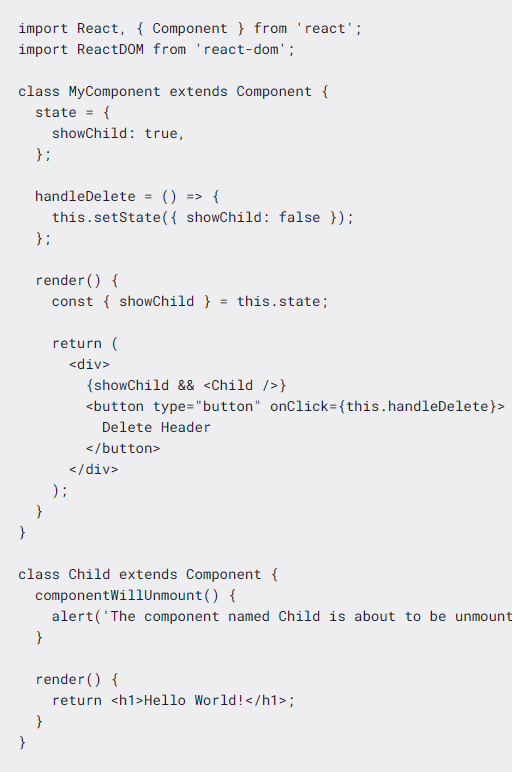
      5. Đây là một thành phần React render một thành phần sẽ được hiển thị có điều kiện dựa trên giá trị của state. 
### 4. Hooks LifeCycle:
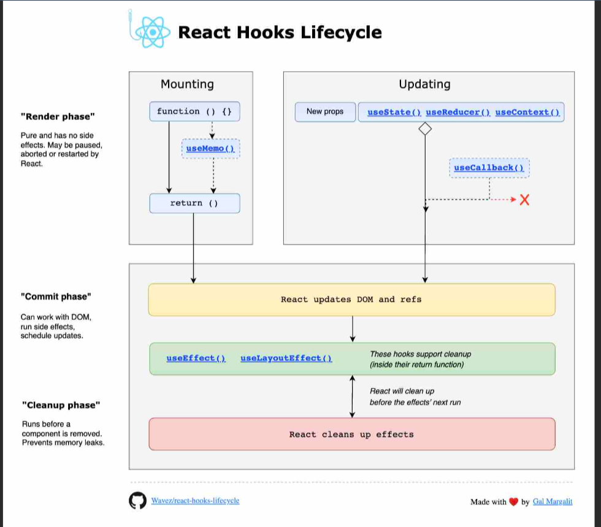
# II. useEffect  
1. ĐN:
   1. Hook cho phép thực hiện các tác dụng phụ (side effects) trong các thành phần của mình.useEffect
   2. Một số ví dụ về tác dụng phụ là: tìm nạp dữ liệu, cập nhật trực tiếp DOM và bộ hẹn giờ.
   3. useEffect  nhận hai đối số. Đối số thứ hai là tùy chọn.
   4. useEffect(<function>, <dependency>)
2. Các trường hợp: 
   1. Không truyền vào dependency:
      1. useEffect(<function>)
      2. Phương thức sẽ được chạy mỗi khi render lại
      3. Tuy nhiên, sẽ xảy ra 1 trường hợp: vòng lặp vô hạn. Nó xảy ra khi ta chỉnh sửa giá trị bằng setState trong useEffect, khiến Component bị render lại => useEffect lại khởi động => khiến Component bị render lại =>....
   2. Truyền Dependency cố định (KHông thay đổi):
      1. useEffect(<function>, [])
      2. Khi này thì nó sẽ chỉ gọi đúng 1 lần
   3. Truyền Dependency thay đổi:
      1. useEffect(<function>, <dependency>)
      2. Nó sẽ được gọi theo ý của ta khi truyền dependency:
3. cleanEffect:
   1. Một số hiệu ứng yêu cầu dọn dẹp để giảm rò rỉ bộ nhớ.
   2. Thời gian chờ, đăng ký, người nghe sự kiện và các hiệu ứng khác không còn cần thiết nên được xử lý.
   3. làm điều này bằng cách bao gồm một hàm trả về ở cuối Hook.useEffect
   4. 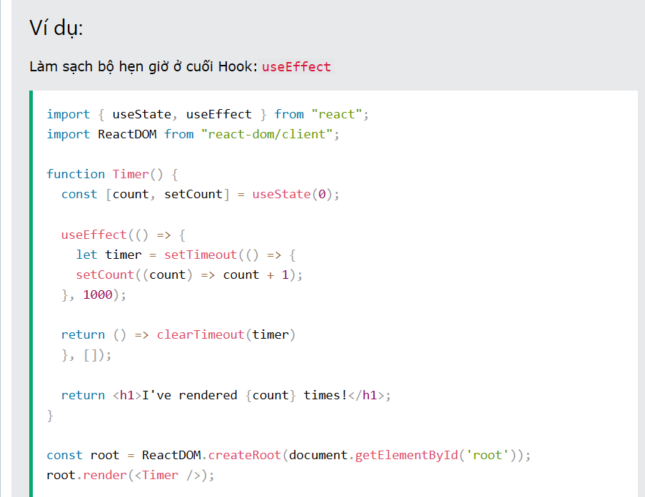

# III. useRef:
1. ĐN:
   1. Hook cho phép ta duy trì các giá trị giữa các lần render, được gọi thông qua : useRef
   2. Nó có thể được sử dụng để lưu trữ một giá trị Object có thể thay đổi mà không gây ra render lại khi cập nhật.
2. Không gây render lại như useState:
   1. Nếu ta cố gắng đếm số lần ứng dụng của chúng ta hiển thị bằng Hook, chúng ta sẽ bị mắc kẹt trong một vòng lặp vô hạn vì chính Hook này gây ra kết xuất lại.useState
   2. Để tránh điều này, chúng ta có thể sử dụng Hook.useRef
3. Truy cập vào các phần tử DOM:
   1. Sử dụng thuộc tính ref cho 1 phần tử, giá trị của nó chính là 1 biến đặt = useRef()
   2. => Ta có thể truy cập vào nó
   3. ```js
         import { useRef } from "react";
         import ReactDOM from "react-dom/client";

         function App() {
         const inputElement = useRef();

         const focusInput = () => {
            inputElement.current.focus();
         };

         return (
            <>
               <input type="text" ref={inputElement} />
               <button onClick={focusInput}>Focus Input</button>
            </>
         );
         }

         const root = ReactDOM.createRoot(document.getElementById('root'));
         root.render(<App />);
      ```

# IV. Axios là gì?:
1. ĐN:
   1. Axios là một thư viện HTTP Client dựa trên Promise, có thể chạy được trên cả trình duyệt và NodeJS (phía server). Ở phía trình duyệt, Axios sử dụng XMLHttpRequest (XHR) cung cấp một API cho việc gọi và xử lý request/ response lên server; ngược lại ở phía server thì Axios sử dụng native module http trong NodeJS để xử lý. 
   2. Việc sử dụng Axios cũng giúp ta tiết kiệm được nhiều thời gian viết code, source code trở nên ngắn gọn và dễ đọc hơn. Nhờ vậy, Axios đang là thư viện được sử dụng phổ biến trong các ứng dụng Web hiện nay.
2. Tính năng:
   1. Tạo request từ trình duyệt bằng XMLHttpRequest
   2. Tạo request từ NodeJS bằng http
   3. Hỗ trợ Promise API
   4. Cho phép tiền xử lý trước lúc gửi request và nhận response với tính năng Interceptor
   5. Chủ động biến đổi dữ liệu request và response, hỗ trợ mặc định kiểu JSON data
   6. Hỗ trợ hủy request chủ động bằng AbortController
   7. Hỗ trợ client chống lại tấn công kiểu XSRF
3. Cài đặt:
   1. npm i axios
4. Các phương thức request hỗ trợ:
   1. axios.request(config)
   2. axios.get(url[, config])
   3. axios.delete(url[, config])
   4. axios.head(url[, config])
   5. axios.options(url[, config])
   6. axios.post(url[, data[, config]])
   7. axios.put(url[, data[, config]])
   8. axios.patch(url[, data[, config]]) 
5. GET:
   1. VD: 
      1. ```js
            import axios from "axios"

            // Make a request for a user with a given ID
            axios.get('/user?ID=12345')
            .then(function (response) {
               // handle success
               console.log(response);
            })
            .catch(function (error) {
               // handle error
               console.log(error);
            })
            .finally(function () {
               // always executed
            });

            // Truyền quá param:, axios nó tự động enCode
            axios.get('/user', {
               params: {
                  ID: 12345
               }
            })
            .then(function (response) {
               console.log(response);
            })
            .catch(function (error) {
               console.log(error);
            })
            .finally(function () {
               // always executed
            });  

            // Want to use async/await? Add the `async` keyword to your outer function/method.
            async function getUser() {
            try {
               const response = await axios.get('/user?ID=12345');
               console.log(response);
            } catch (error) {
               console.error(error);
            }
            }
            
         ```