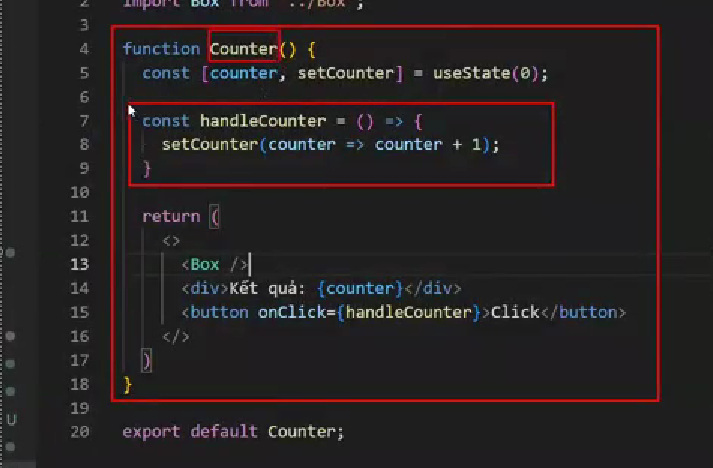

# I. React Router: 
1. ĐN: Là 1 thư viện React sử dụng để quản lý Routing trong các ứng dụng Web:
   1. VD: /blog, /admin, /auth/login,..
2. Cài đặt: npm i react-router-dom
3. Các Components của React-Router:
   1. BrowserRouter: Để kết nối ứng dụng của bạn với URL của trình duyệt (bọc BrowserRouter bên ngoài App)
   2. Routes: CUng cấp các tuyến đường để điều hướng các thành phần của ứng dụng React (bọc bên ngoài các Route)
   3. Route: Định nghĩa 1 Route, điều hướng đến 1 Component cụ thể
      1. Routes: Tương tự thẻ ul
      2. Route: TƯơng tự thẻ li
   4. Link: Cho phép chuyển đổi giữa các URL khác nhau mà không cần Load lại trang - tương ứng vơi thẻ `<a>` trong HTML
   5. Outlet: Xác định vị trí các Component trong Route đươc hiển thị (tương tự propss.children)
   6. NavLink: Tương tự Link, nhưng nếu URL trùng với NavLink thì sẽ thêm Class là active
   7. Navigate: sử dụng để chuyển hướng đến 1 trang nào đó
4. Các bước: 
   1. npm i react-router-dom
   2. Bọc App bằng BrowserRouter
   3. Tạo Component con
   4. Tạo Các Route đến Component:
      1. Trang chủ để path là : "/:
      2. Các trang khác sẽ đề tên
      3. Ta có thể tạo 1 trang 404 notfound để khi Link lỗi sẽ chuyển hướng đến đó: `<Route path="*" element={<Error404/>}/>`
   5. Áp dụng các thẻ Link để chuyển hướng trang: 
      1. 
      2. Khi ta CSS, thì coi nó là 1 thẻ a
   6. Outlet: Xác định vị trí COmponent trong Route đang hiển thị (trong Component cha) 
      1. 
      2. 
   7. NavLink: Nhúng cho Link 1 Class là active, ta có thể CSS cho nó
5. Nested Routes: Tạo các Route Lồng nhau: 
6. Index Routes: 
   1. Sử dụng để hiển thị Component ở Route con ra ngoài Route cha
   2. VD:   
      1. /blog: Cha
      2. /blog/post
      3. /blog/categories
      4. /blog/tags
   3. => Tạo các Route con bên trong thẻ Route cha
7. Dynamic Routes:
   1. Sử dụng những Route riêng cho những trang cần Custom
   2. VD: BLog: Mỗi Post có 1 Route riêng với từng ID:
8. Hooks của React Router:
   1. useParams: Lấy tham số trên param
   2. useNavigate: Dùng để điều hướng đến 1 đường dẫn khác, hoặc trở về các trang trước đó đã truy cập
      1. VD: Sau khi đăng nhập xong, chuyển hướng đến Trang chủ
9. Protected Routes:
   1. Giả sử ứng dụng có 2 phần: public, private:
      1. Phần public thì ai cũng có thể truy cập được như trang chủ, blog,...
      2. Phần private (VD: Trang quản trị) => Cần đăng nhập mới xem được
   2. Tạo trang Login
10. Route Objects:
    1. Hook useRoutes dùng để xác định các tuyến đường dưới dạng các Object thuần JS thay cho `Routes` và `Route`
    2. React-router-dom có hõ trợ 

# II. useReducer: 
1. ĐN: 
   1. Giống như 1 phiên bản cao hơn của useState: 
   2. **Sử dụng trong tường hợp Component có state phức tạp**
2. Cú pháp: `const[state, dispatch] = useReducer(reducer, initialState)`
   1. dispatch là hàm ta đặt tên để set giá trị
3. Các bước sử dụng useReducet:
   1. B1: Khởi tạo useReducer và xác định giá trị khởi tạo
   2. B2: Xây dựng hàm reducer(state, action)
   3. Xác định những Action 
   4. Sử dụng Dispatch để kích hoạt 1 Action
4. VD:
   1. Sử dụng useState
   2. Sử dụng useReducer
# III. useMemo
1. ĐN:  
   1. useMemo sử dụng để ghi nhớ kết quả, tránh sử dụng lại logic không cần thiết (logic này cho ra kết qua như lần trước)
   2. Component sẽ không render lại khi nó không có gì thay đổi
   3. Ứng dụng với các Component phức tạp, nếu liên tục render thì sẽ gây lag
2. Cú pháp: const valName = useMemo(callback, dependency):
   1. callback: Là 1 hàm được gọi lại , sẽ chạy ở lần render đầu tiên
   2. dependecy: Là sự phụ thuộc, khi dependency thay đổi thù useMemo cập nhật giá trị
   3. => Khác với useCallback là nó không lưu hàm, nó lưu giá trị và cập nhật giá trị
# IV. useCallBack
1. ĐN: 
   1. Sử dụng để giúp tránh việc thực hiện 1 hàm không cần thiết:
   2. Giúp tạo 1 vùng nhớ để lưu hàm Callback và chỉ tạo lại nói mỗi khi dependency thay đổi => Tối ưu bộ nhớ
2. Cú pháp:
   1. const functionName = useCallback(callback, dependency)
   2. callback là hàm cần thực hiện
   3. dependency là điều khiên để có thực hiện lặp hay ko
3. VD: 
   1. 
# V. useContext:

1. ĐN: useContext giúp ta đơn giản hóa việc truyền dữ liệu từ Component cha xuống các Component con mà không cần sử dụng đến Props(Sử dụng việc truyền Props qua trung gian):
2. Các Bước: 
   1. B1: Tạo 1 bối cảnh ở Component A (Để tạo ra phạm vi và sử dụng được data trong phạm vi đó, ví dụ là Component A thì tất cả Component con đều sử dụng được):
      1. 
   2. Cung cấp bối cảnh để bọc toàn bộ các Component cần để sử dụng Data:
      1. 
3. VD:

# VI. useSkeleton
