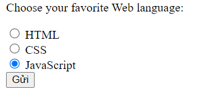
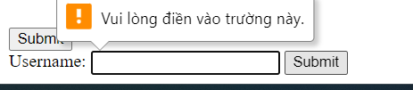

# BUỔI 2: CÁC KIẾN THỨC CƠ BẢN VỀ HTML(TIẾP).

## I. HTML Form:

### 1. ĐN:
- HTML Form được sử dụng để thu thập Input người dùng nhập vào và gửi về cho server xử lý
- 

1. Thẻ Form:

    - 
      ```html
          <form>
          .
              form elements
          .
          </form>
      ```
   - Trong thẻ Form sẽ chứa những thẻ input khác nhau, như:  text fields, checkboxes, radio buttons, submit buttons,...

2. Thẻ Input:
   - Element Input thường đc sử dụng ở trong Element Form. Để trình bày ra các cách nhập liệu, tùy thuộc vào thuộc tính :`type`
   - Các số giá trị của thuộc tính `type`:
     - `<input type ="text">` : Nhập 1 đoạn văn bản trong 1 dòng
     - `<input type ="radio">` : Hinee thị 1 radio button, chọn 1 
     - `<input type ="checkbox">` : Hiển thị 1 checkbox, đc chọn nhiều.
     - `<input type ="submit">` : Hiển thị 1 nút SubMit,
     - `<input type ="button">` : Hiển thị 1 nút có thể click<input type="button">
     - `<input type="color">`:
     - `<input type="date">`
     - `<input type="datetime-local">`
     - `<input type="email">`
     - `<input type="file">`
     - `<input type="hidden">`
     - `<input type="image">`
     - `<input type="month">`
     - `<input type="number">`
     - `<input type="password">`
     - `<input type="range">`
     - `<input type="reset">`
     - `<input type="search">`
     - `<input type="tel">`
     - `<input type="text">`
     - `<input type="time">`
     - `<input type="url">`
     - `<input type="week">`
   - VD: 
     - 
     - 
3. Thẻ Label
- Là 1 thẻ để gán nhánx, giúp người dùng hiểu hơn về biểu mẫu.
- Muốn liên kết Label với Inout, nó phải for vào ID tk Input.
- Tác dụng: Khi click vào Label, nó sẽ chuyển con trỏ nhập vào Input liên kết.
- 

### 2. Chi tiết các thẻ Input

#### a. Radio Button:
- Cho chọn 1 trong các lựa chọn
- 
- 
- Lưu ý : Nếu muốn chỉ chọn 1 trong các lựa chọn thì cùng name là đc.
#### b. CheckBox:
- 
- 

## II. Form Attribute:

### 1. action
1. ĐN: Xác định hành động khi biểu mấu đc gửi. Thường thì sẽ đc gửi đến 1 tâpj tin trong máy chủ qua 1 link
2. VD:
   - 
   - 
   - 

### 2. target
- tương tự như thẻ a
- 
### 3. method
- Thuộc tính này chỉ định giao thức HTTP sẽ đc sử dụng khi gửi dữ liệu form
- 2 phương thức chính: Get - Post
- Get: 
  - Nó sẽ nối dữ liệu nhập vào biểu mẫu vào sau URL, theo cặp : name - value
  - Ko nên sử dụng nó cho các dữ liệu bảo mật, VD: Pass
  - Độ dài URL bị giới hạn (2048kt)
  - Sử dụng cho VD: Trang tìm kiến của GG,...
  - 
- Post:
  - Ko nối vào URL
  - Ko giới hạn

### 4. autocomplete:
- Khi cho autocomplete = on, nó sẽ tự động gợi ý nhập liệu dựa trên những j ta đã nhập trước đó, = off là ngược lại
- Mặc định trình duyệt ban đầu là on

### 5. The Novalidate Attribute
- Khi dùng attribute này, ko cần phải nhập chính xác dữ liệu khi gửi đi. VD: email thì có thể nhập định dạng văn bản thông thường,...
- Ko bật: 
- Bật: 


## III. Form Element

### 1. `<input>`
### 2. `<label>`
### 3. `<select>`
- Cho người dùng 1 drop-down list
- 2 thuộc tính gồm: multiple (cho phép ng dùng chọn nhiều mục) và size (chỉ định số giá trị hiển thị ra ViewPort)
- Có các thẻ `<option>` để thêm các lựa chọn. Nếu muốn nó làm giá trị mặc định hiển thị: => thêm thuộc tính `selected`
- 

### 4. `<textarea>`
- 
- 
- Attribute:
  - row, col

### 5. Button:

## IV. Input Attribute:

### 1. Readonly:
- Khiến cho input này chỉ có thể đọc, không thể nhập. Tuy nhiên vẫn có thể copy

### 2. Disable: 
- Khiến cho input không thể nhập, copy hay tab

### 3. size:
- tăng kích thước width của input nhập liệu

### 4. maxlength:
- Xác định số kí tự tối đa được nhập vào.

### 5. Max, min:
- Xác định giá trị tối thiêu, tối đa mà người dùng đc chọn;
- Chỉ sử dụng cho các type: number, range, date, datetime-local, month, time and week.
- VD:
  - 
  - 

### 6. Multiple :
- Cho phép ng dùng chọn nhiều lựa chọn
- Các type sử dụng: email, file
- 
- 

### 7. partern:
- Bắt người dùng nhập đúng với định dạng yêu cầu, giả sử như PIN thì không có kí tự chẳng hạn
- VD:
  - 
  - 

### 8. required:
- Bắt ngươid dùng phải nhập input này để có thể submit
- VD: 
  - 
  - 


## V. Table:

### 1. Các thẻ
1. Thẻ <table>
2. Thẻ <thead>: Các đầu mục của Table
3. thẻ <th>: Thẻ chữa nội dụng cho 1 đầu mục (tiêu đề)
4. Thẻ <tbody>: Phần thân bảng:
5. Thẻ <tr>: table row: chứa nội dung của 1 hàng
6. Thẻ <td>: Dữ liệu của 1 ô bảng
7. Thẻ <tfoot>: Footer của bảng
### 2. Thuộc tính:
1. Colspan: Tạo ô mở rộng trên nhiều côt (ý là gộp cột)
2. rowspan: Tạo ô mở rộng trên nhiều hàng

### 3. Note:
- Bảng sẽ không mặc định có Border. Phải tự CSS.
- 
- Border Collapse: Tránh viền bị trùng nhau. 
### 4. VD:

- ```html
      <table >
          <caption>List Family</caption>
          <thead>
              <tr>
                  <th>STT</th>
                  <th>Family</th>
                  <th>Name</th>
              </tr>
          </thead>

          <tbody>
              <tr>
                  <td rowspan="4">1</td>
                  <td rowspan="4">Family A</td>
                  <td>Tran Xuan Son</td>
              </tr>
              <tr>
                  <td>Tran Xuan Son 's Father</td>
              </tr>
              <tr>
                  <td>Tran Xuan Son 's Mother</td>
              </tr>
              <tr>
                  <td>Tran Xuan Son 's Brother</td>
              </tr>
              
              <tr>
                  <td rowspan="3">2</td>
                  <td rowspan="3">Family B</td>
                  <td>Tran Xuan </td>
              </tr>
              <tr>
                  <td>Tran Xuan  's Father</td>
              </tr>
              <tr>
                  <td>Tran Xuan  's Mother</td>
              </tr>
              <tr>
          </tbody>
      </table>
    ```
- 

## VI. Semantic Elements:


### 1. ĐN:
1. Semantic element : là những phần tử mô tả rõ ràng ý nghĩa về cấu trúc của phần tử đó đối với các trình duyệt và lập trình viên. Nói một cách dễ hiểu hơn có nghĩa là chỉ cần đọc tên các element này là chúng ta có thể hiểu được nội dung bên trong element này nói về cái gì.

   1. Ví dụ về một vài semantic element trong HTML bao gồm: `<a>, <form>, <table>, , <h1> -> <h6>`,...
2. Ngược lại, có semantic element thì sẽ tồn tại non-semantic element. Vậy non-semantic element có nghĩa là gì? Hiểu theo một cách đơn giản nhất có nghĩa là những phần tử này không có mô tả rõ ràng về nội dung bên trong nó. Nếu chưa đọc nội dung mà chỉ nhìn vào bản thân element đó thì chúng ta sẽ không thể biết trước được nội dung của element này nói về cái gì
   1. Ví dụ: `div, <span>`

### 2. 1 số Semantic Element:

#### a. section:
- Element `<section>` đại diện cho một phần chung có trong tài liệu hoặc ứng dụng.
- Cụ thể hơn, một section là một nhóm các nội dung có cùng chủ đề.

- Ví dụ: trang chủ của một trang web có thể được chia thành các section như giới thiệu, nội dung, thông tin liên lạc, góp ý…
  - 
  - 

#### b. article
- Element `<article>` được sử dụng cho các nội dung độc lập và chứa nội dung của riêng nó. Nội dung bên trong `<article>` có ý nghĩa riêng biệt và có thể độc lập với các nội dung khác của trang web.
- Một số nơi có thể sử dụng `<article>`: Bài viết trên một Forum. Bài viết trên một Blog. Bài viết trên một tờ báo.

- VD:
  - 
  - 

#### c. MQH giữa Section và Article:
- Giữa `<section> và <article>` có cấu trúc khá giống nhau. Vậy thì dựa vào chức năng của 2 element này, 1 câu hỏi đặt ra là `<article> `nằm trong `<section>` hay ngược lại?

- Trong chuẩn HTML5, element `<article>` xác định một **khối các nội dung hoàn chỉnh** của **nhiều phần tử liên quan liên kết với nhau**.
- Element `<section>` được sử dụng để tạo ra một **nhóm các phần tử liên quan đến nhau**.

- Vậy chúng ta có cần phải dựa vào chức năng các element để quyết định xem element nào phải nằm bên trong element nào hay không? Không!

  - Trên mạng Internet, Có thể tìm thấy rất nhiều các trang web sử dụng element `<section>` để chứa các `<article>` và ngược lại.
  - Bên cạnh đó cũng thấy nhiều trang web sử dụng `<section>` chứa `<section>` và `<article>` chứa `<article>`.
  - VD về một trang báo mạng: Trong khu vực thể thao bao gồm nhiều bài viết thể thao, trong mỗi bài viết thể thao lại có một khu vực nói về kỹ thuật.

#### d. header
- Element `<header>` xác định phần đầu của một trang tài liệu hay phần đầu của một đoạn. Nó được sử dụng như một containter chứa nội dung giới thiệu hoặc mở đầu.
- Có thể sử dụng một hoặc nhiều phần tử `<header>` trong một tài liệu.
Trong ví dụ dưới đây sử dụng một thẻ `<header>` bên trong một bài viết:

- VD:
  - 
  - 

#### e. footer
- 
- 

#### f. Tại sao sử dụng các Semantic element trong HTML5?
- Trong HTML4 và các bản cũ hơn, các lập trình viên thường phải tạo tên các thuộc tính riêng để thiết kế các phần như: header, top, bottom, footer, menu, navigation, main, container, content, article, sidebar, topnav…

- Điều này khiến **công cụ tìm kiếm không thể xác định nội dung có bên trong trang web chính xác**.

- Trong HTML5, các element như: `<header> <footer> <nav> <section> <article>` làm cho mọi thứ trở nên dễ dàng hơn rất nhiều.

- Dưới đây là danh sách các semantic mới trong HTML5:
  - `<article>`	Xác định một bài viết/bài báo
  - `<aside>`	Xác định nội dung nằm bên cạnh nội dung của trang
  - `<details>`	Xác định các chi tiết mà người dùng có thể xem hoặc ẩn
  - `<figcaption>`	Chú thích cho thẻ `<figure>`
  - `<figure>`	Đánh dấu nội dung ảnh trong tài liệu
  - `<footer>`	Xác định phần cuối của một trang tài liệu hay một đoạn
  - `<header>`	Xác định phần đầu của một trang tài liệu hay một đoạn.
  - `<main>`	Chỉ định các nội dung chính của một tài liệu
  - `<mark>`	Xác định vùng đánh dấu/làm nổi bật văn bản
  - `<nav>`	Xác định một khu vực chứa các link điều hướng
  - `<section>`	Xác định một phần trong tài liệu
  - `<summary>`	Hiển thị tiêu đề cho phần tử `<details>`
  - `<time>`	Xác định ngày/giờ
  

#### g. Khác nhau giữa sematic và non-semantic:
- Semantic: Có ngữ nghĩa, non-semantic: Không có ngữ nghĩa
- Khi code, nếu sử dụng các thẻ div quá nhiều khiến code của ta không "sạch", Khó để hiểu được ý nghĩa của từng phần
- Vậy nên HTML 5 có thể sử dụng những thẻ semantic, giúp cho những phần container có ý nghĩa, đễ đọc hơn, logic hơn.