# Buổi 3. CSS(Buổi 1)

## I. Khái niệm, Cú pháp, selectors

### 1. Khái niệm:

#### a. ĐN
- Là ngôn ngữ chúng ta sử dụng để định dạng trang Web.
- CSS là viết tắt của Cascading Style Sheets
- CSS mô tả cách các thành phần HTML được hiển thị trên màn hình, giấy hoặc trong các phương tiện truyền thông khác
- CSS tiết kiệm rất nhiều công sức. Nó có thể kiểm soát bố cục của nhiều trang web cùng một lúc
Các bảng định kiểu bên ngoài được lưu trữ trong các tệp CSS


#### b. Tại sao nên sử dụng CSS?
- CSS được sử dụng để xác định kiểu cho các trang web của bạn, bao gồm thiết kế, bố cục và các biến thể hiển thị cho các thiết bị và kích thước màn hình khác nhau.

#### c. Ví dụ về CSS
```css
body {
  background-color: lightblue;
}

h1 {
  color: white;
  text-align: center;
}

p {
  font-family: verdana;
  font-size: 20px;
}
```

#### d. CSS đã giải quyết một vấn đề lớn
- HTML KHÔNG BAO GIỜ có ý định chứa các thẻ để định dạng trang web!\
- HTML được tạo ra để mô tả nội dung của một trang web, như:
    ```html
    <h1>Đây là một tiêu đề</h1>

    <p>Đây là một đoạn văn.</p>
    ```
- Khi các thẻ như `<font>` và thuộc tính màu được thêm vào đặc tả HTML 3.2, nó đã bắt đầu một cơn ác mộng cho các nhà phát triển web. Việc phát triển các trang web lớn, nơi phông chữ và thông tin màu sắc được thêm vào từng trang, đã trở thành một quá trình dài và tốn kém.
- Để giải quyết vấn đề này, World Wide Web Consortium (W3C) đã tạo ra CSS.

- CSS giúp tiết kiệm rất nhiều công sức!: Định nghĩa kiểu thường được lưu trong các tệp .css bên ngoài. Với tệp bảng định kiểu bên ngoài, bạn có thể thay đổi giao diện của toàn bộ trang web chỉ bằng cách thay đổi một tệp!


### 2. Cú pháp:
#### a. Tổng quát:
- 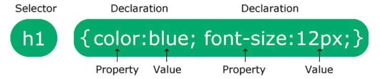
- Trong đó:
  - Bộ chọn trỏ tới phần tử HTML mà bạn muốn định dạng.
  - Khối khai báo chứa một hoặc nhiều khai báo được phân tách bằng dấu chấm phẩy.
  - Mỗi khai báo bao gồm tên thuộc tính CSS và giá trị, được phân tách bằng dấu hai chấm.
  - Nhiều khai báo CSS được phân tách bằng dấu chấm phẩy và các khối khai báo được bao quanh bởi dấu ngoặc nhọn.

### 3. Bộ chọn trong CSS (Selector):

#### a. ĐN: 
- Là cách để CSS nhận diện phần tử mà ta muốn nó định dạng cho
#### b. 5 loại:
- Bộ chọn đơn giản (chọn các phần tử dựa trên tên, id, lớp)
- Bộ chọn kết hợp (chọn các phần tử dựa trên mối quan hệ cụ thể giữa chúng)
- Bộ chọn lớp giả (chọn các phần tử dựa trên trạng thái nhất định)
- Bộ chọn phần tử giả (chọn và định dạng một phần của phần tử)
- Bộ chọn thuộc tính (chọn các phần tử dựa trên thuộc tính hoặc giá trị thuộc tính)


#### c. Các bộ chọn cơ bản:

##### 1. Bộ chọn phần tử CSS
- Là bộ chọn dành cho các thẻ Element. Nó sẽ chọn tất cả các thẻ mà có Element được chỉ định đến.
    ```css
        p {
            text-align: center;
            color: red;
        }
    ```
- Theo VD trên: p là thẻ `<p>`. định dạng bên trong là cho chữ căn lề giữa, màu đỏ. => Tất cả những thẻ p đều có định dạng trên.

##### 2. Bộ chọn id CSS
- Bộ chọn theo ID.
- VD: 
    ```html
        <style>
            #heading_hw{
                color: red;
                text-align: center;
                border: 3px black solid;
            }
        </style>    
        
        <h1 id="heading_hw">Hello World</h1>
    ```
    <style>
        #heading_hw{
            color: red;
            text-align: center;
            border: 3px black solid;
        }
    </style>    
    
    <h1 id="heading_hw">Hello World</h1>

##### 3. Bộ chọn lớp:
- Bộ chọn theo class.
- Sử dụng bộ chọn này cũng có thể cho CSS đến nhiều class khác nhau
- VD: 
    ```html
        <style>
            .heading_hw_text{
                color: green;
                text-align: center;
                border: 3px black solid;
            }
            .heading_hw_border{
                border: 3px black solid;
            }
        </style>    
        
        <h1 class="heading_hw_text heading_hw_border">Hello World</h1>
    ```
    <style>
        .heading_hw_text{
            color: green;
            text-align: center;
            border: 3px black solid;
        }
        .heading_hw_border{
            border: 3px black solid;
        }
    </style>    
    
    <h1 class="heading_hw_text heading_hw_border">Hello World</h1>


##### 4. Bộ chọn chung CSS
- Bộ chọn chung (*) chọn tất cả các phần tử HTML trên trang.
- Ví dụ: Quy tắc CSS bên dưới sẽ ảnh hưởng đến mọi phần tử HTML trên trang: 
    ```css
    * {
    text-align: center;
    color: blue;
    }
    ```

##### 5. Bộ chọn nhóm:
- Có thể nhóm nhiều thẻ lại với nhau khi muốn chúng có cùng 1 số định dạng chung nào đó
- Sử dụng bộ chọn này cũng có thể cho CSS đến nhiều class khác nhau
- VD: 
    ```css
        h1, h2, p {
            text-align: center;
            color: red;
        }
    ```

#### d. Bộ chọn kết hợp (chọn các phần tử dựa trên mối quan hệ cụ thể giữa chúng)
#### e. Bộ chọn lớp giả (chọn các phần tử dựa trên trạng thái nhất định)
#### f. Bộ chọn phần tử giả (chọn và định dạng một phần của phần tử)
#### g. Bộ chọn thuộc tính (chọn các phần tử dựa trên thuộc tính hoặc giá trị thuộc tính)


### 4. Specificity và !Important


## II. 3 kiểu chèn CSS:


### 1. Chèn CSS từ file bên ngoài (External)
- Code CSS từ 1 file riêng, và đc kết nối qua HTML bằng thẻ `link`
- Lợi ịch: Có thể giúp thay đổi CSS cả 1 trang Web với nhiều file CSS khác nhau.
- VD:
    ```html
        <!DOCTYPE html>
        <html>
        <head>
            <link rel="stylesheet" href="mystyle.css">
        </head>
        <body>
            <h1>This is a heading</h1>
            <p>This is a paragraph.</p>
        </body>
        </html>
    ``` 

### 2. Chèn CSS nội bộ (Internal)
- Sử dụng thẻ Style
- VD:
    ```html
        <style>
            .heading_hw_text{
                color: green;
                text-align: center;
                border: 3px black solid;
            }
            .heading_hw_border{
                border: 3px black solid;
            }
        </style>    
        
        <h1 class="heading_hw_text heading_hw_border">Hello World</h1>
    ```

### 3. CSS Inline:
- Là CSS ngay khi khai báo thẻ bằng thuộc tính `style`
- hạn chế dùng vì sẽ không thể tối ưu đc nhiều cái. Chỉ dùng khi muốn nó có 1 cái CSS cố định
- VD:
    ```css
        <!DOCTYPE html>
        <html>
        <body>
            <h1 style="color:blue;text-align:center;">This is a heading</h1>
            <p style="color:red;">This is a paragraph.</p>
        </body>
        </html>
    ```


### 4. Mức độ ưu tiên:
- Mức độ ưu tiên CSS của các kiểu chèn CSS:
  - 1.Kiểu nội tuyến (bên trong một phần tử HTML)
  - 2.Các bảng định kiểu bên ngoài và bên trong (ở phần đầu)
  - 3.Trình duyệt mặc định
### 5. Độ ưu tiên:
- https://fullstack.edu.vn/blog/css-selectors-cheatsheet-details.html

## III. Colors, Backgrounds, Height, Width

### 1. Color: 
- Gán băng giá trị cố định : VD: red, greeen, `#ffff`
- Bảng màu: HEX, RGB,...


### 2. BackGround:
#### a.background-color: Xác định màu nền
- opacity: Chỉ định độ mờ đục/trong suốt của một phần tử. Nó có thể lấy giá trị từ 0,0 - 1,0. Giá trị càng thấp thì càng trong suốt.
#### b.background-image: chỉ định một hình ảnh để sử dụng làm nền của một phần tử.
- Theo mặc định, hình ảnh sẽ được lặp lại để bao phủ toàn bộ phần tử.
- VD:
    ```css
        body {
        background-image: url("bgdesert.jpg");
        }
    ```
#### c.background-repeat
- Cho ảnh nó sẽ lặp lại hay là ko. Nếu để no-repeat thì nó sẽ ảnh sẽ ko lặp.
  - Vd kiểu nếu kích thước phân tử nó to hơn thì sx bị lặp lại => Cần để no-repeat nếu ko muốn thể
#### d.background-attachment
#### e.background-position
#### f.background-clip
#### c.background-size:
- nếu để 100% auto thì nó sẽ fit background theo 1 chiều, phần còn lại sẽ bị tràn(có thể thế) (dùng khi để backgr-img)
- Các thuộc tính của background:
  - https://www.w3schools.com/cssref/playdemo.php?filename=playcss_background-size&preval=cover
  - background: contain: Nếu ảnh nó to, thì nó sẽ fit ảnh sao cho element chứa vừa cái ảnh(kiểu fit theo chiều dài của ảnh)
  - background: cover:Nếu ảnh nó to, thì nó sẽ fit ảnh sao cho cạnh (kiểu fit theo chiều dài của ảnh)

### 3. Width, height: thiết lập chiều rộng, dài cho Element:
- Theo kích cỡ
- Theo %
- Lưu ý boxsizing.
## IV: BoxModel, Borders, Padding, Margins:

### 1. BoxModel:
- Tất cả Element có thể coi là 1 hộp
- Gồm: Lề, viền, phần đệm,nội dung (Margin, Border, Padding, Content)
- 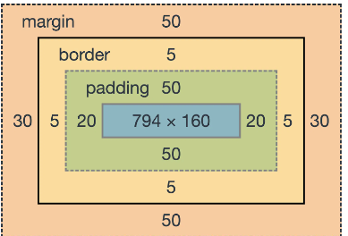
0. Các thuộc tính liên quan đến box:
   - boxsizing: Khi set width, height thì mặc định nó là của content-box.
     - Do mặc định của trình duyệt là boxsizing: content-box
     - Nếu muốn đổi thì là box-sizing: border-box
1. Border:
   1. Tên thuộc tính: border-style
   2. Kiểu border: 
      - dotted- Xác định đường viền chấm bi
      - dashed- Xác định đường viền đứt nét
      - solid- Xác định đường viền liền
      - double- Xác định đường viền kép
      - groove- Xác định đường viền có rãnh 3D. Hiệu ứng phụ thuộc vào giá trị border-color
      - ridge- Xác định đường viền có gờ 3D. Hiệu ứng phụ thuộc vào giá trị border-color
      - inset- Xác định đường viền chèn 3D. Hiệu ứng phụ thuộc vào giá trị border-color
      - outset- Xác định đường viền 3D. Hiệu ứng phụ thuộc vào giá trị border-color
      - none- Không xác định đường viền
      - hidden- Xác định đường viền ẩn
   3. VD: `border: 5px solid black`
2. Padding:
   - gồm: padding, padding-top, padding-bottom, padding-top, padding-right, padding-left
3. Margin: Tương tự
   - Nếu 2 tk có margin kề nhau, thì tk nào có margin lớn hơn thì sẽ ưu tiên tk đó (VD:)
     - 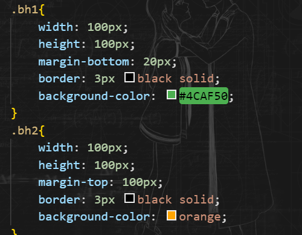
     - 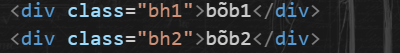
     - 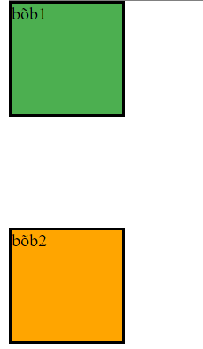
### 2. VD:
    ```html
        <!DOCTYPE html>
        <html lang="en">
        <head>
            <meta charset="UTF-8">
            <meta name="viewport" content="width=device-width, initial-scale=1.0">
            <title>Document</title>
        </head>
        <body>
            <style>
                @import url('https://fonts.googleapis.com/css2?family=Roboto:ital,wght@0,100;0,300;0,400;0,500;0,700;0,900;1,100;1,300;1,400;1,500;1,700;1,900&display=swap');
                .box_model_ex{
                    border: 5px solid black;
                    padding: 10px;
                    margin: 20px;
                }
                .box_model_ex2{
                    background-color:violet;
                    border: 5px dotted blue;
                    padding: 50px;
                    margin: 20px;
                    background-clip: content-box;
                }
                .box_model_ex3{
                    background-image:  url("study/Ảnh chụp màn hình 2024-04-28 154604.png");
                    border: 5px dotted blue;
                    padding: 50px;
                    margin: 20px;
                    background-origin: content-box;
                }
                .box_model_ex4{
                /* ex: width , height */
                box-sizing: border-box;
                background: #bda1c6;
                color: black; /*màu chữ*/
                padding: 20px;
                height: 100px;
                width: 50vw;
                min-width: 200px;
                }
                .box_model_ex5{
                /* ex: text, font, align */
                background: #9fc4b9;
                border: 5px dotted;
                text-align: center;
                text-transform: uppercase;
                font-family: 'Roboto', sans-serif;
                }
            </style>
            <div class="box_model_ex">
                NoiDUng1
            </div>
            <div class = "box_model_ex">
                NoiDUng The div2
            </div>
            <div class = "box_model_ex2">
                NoiDUng The div3
            </div>
            <div class = "box_model_ex3">
                NoiDUng The div4
            </div>
            <div class = "box_model_ex4">
                VD: WIdth. Height
            </div>
            <div class = "box_model_ex5">
                VD: Text, font, align
            </div>
            <h2>
                <ul>
                    <li><i class="fa-brands fa-facebook">xxx</i></li>
                    <li><i class="fa-brands fa-facebook">xxx</i></li>
                </ul>
            </h2>
        </body>
        </html>
    ```


## V. Text, Fonts, Icons, List, Table

### 1. Text:
1. Text-color:
   - Sử dụng để set màu cho text. 
   - Các loại màu set : tương tự như background-color:
     - tên màu
     - HEX
     - RGB
2. Text Alignment:
   1. text-align: Sử dụng để set căn lề ngang của text. 
      1. Property: center, left, right, justify(2 bên)
      2. VD:
         1. <style>
                .box{
                    width: 300px;
                    height: 500px;
                    text-align: justify;
                }
            </style>

            <h1>1. Text</h1>
            <div>
                <h2 style="text-align: left;">Text_Left</h2>
                <h2 style="text-align: right;">Text_Right</h2>
                <h2 style="text-align: center;">Text_Center</h2>

                <div class="box">Lorem, ipsum dolor sit amet consectetur adipisicing elit.
                    <br> Minus exercitationem, perspiciatis ipsa maiores ut, pariatur nam saepe, 
                    <br> reprehenderit commodi voluptates suscipit sunt molestiae. 
                    <br>Maiores amet, adipisci architecto sit quos voluptatibus!
                </div>
            </div>
      3. Text-align-last: tương tự nhưng chỉ dùng cho dòng cuối
   2. text-direction: giống căn lề
   3. unicode-bidi: bidi-override; : đảo ngược text của 1 đoạn
   4. Vertical-align: căn lề theo chiều dọc.
      1. mặc định: như bthg
      2. top: căn lên trên
      3. bottom: xuống dưới
      4. sub: tương tự như dấu mũ
      5. sup: tương tự như chỉ số
      6. VD: 
         1. <style>
                img.a {
                    vertical-align: baseline;
                }
                
                img.b {
                    vertical-align: text-top;
                }
                
                img.c {
                    vertical-align: text-bottom;
                }
                
                img.d {
                    vertical-align: sub;
                }
                
                img.e {
                    vertical-align: super;
                }
            </style>
            <div style="border: 3px black solid;">
            <h1>2. The vertical-align Property</h1>
            
            <h2>vertical-align: baseline (default):</h2>
            <p>An  image with a default alignment.</p> 
            
            <h2>vertical-align: text-top:</h2>
            <p>An  image with a text-top alignment.</p> 
            
            <h2>vertical-align: text-bottom:</h2>
            <p>An  image with a text-bottom alignment.</p>
            
            <h2>vertical-align: sub:</h2>
            <p>An  image with a sub alignment.</p> 
            
            <h2>vertical-align: sup:</h2>
            <p>An  image with a super alignment.</p>
            </div>
3. Text-decoration: Để thêm những định dạng cho text:
   1. Text-decoration-line: Thêm 1 dòng kẻ trên text
      1. overline: Dòng kẻ trên đầu
      2. line-through: Dòng kẻ cắt ngang qua chữ
      3. underline: Dòng kẻ bên dưới.
      4. Có thể kết hợp các property trên.
   2. Text-decoration-color: Màu cho các Text-decoration.
   3. Text-decoration-style: Dạng của Text-decoration:
      1. solid: Kẻ thẳng
      2. dotted
      3. dashed
      4. wavy
   4. text-decoration-thickness: Độ dày của line : px
   5. VD: <style>
            h1 {
            text-decoration: underline;
            }

            h2 {
            text-decoration: underline red;
            }

            h3 {
            text-decoration: underline red double;
            }

            p {
            text-decoration: underline red double 5px;
            }
        </style>
        <body>
            <h1>Heading 1</h1>
            <h2>Heading 2</h2>
            <h3>Heading 3</h3>
            <p>A paragraph.</p>
        </body>
4. Text-transformation: upper-case, lower-case
5. Text-spacing: 
   1. text-indent: khoảng cách đầu dòng của đoạn văn. (px)
   2. letter-spacing: khoảng cách giữa các kí tự (px)
   3. line-height: khoảng cách giưax các dòng ()
   4. word-spacing: khoảng cách giữa các từ (px)
6. Text-shadow: 
### 2. Fonts:
1. 5 loại Font:
   1. Phông chữ Serif có nét nhỏ ở rìa mỗi chữ cái. Chúng tạo cảm giác trang trọng và thanh lịch.
Phông chữ Sans-serif có đường nét rõ ràng (không có nét nhỏ nào kèm theo). Chúng tạo nên vẻ hiện đại và tối giản.
   1. Phông chữ Monospace - ở đây tất cả các chữ cái đều có cùng chiều rộng cố định. Chúng tạo ra vẻ ngoài cơ học. 
   2. Phông chữ viết tay mô phỏng chữ viết tay của con người.
   3. Phông chữ Fantasy là phông chữ trang trí/vui tươi.
   4. 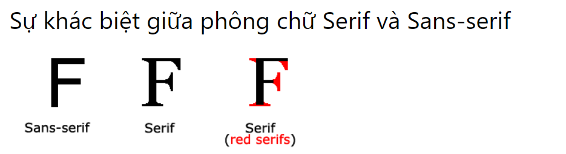
2. Thuộc tính font-family: `font-family + tên font + (font backup)+ kiểu chữ`
   - font-backup đc sử dụng nếu trình duyệt ko hỗ trợ font chính
   - VD:
3. Nhúng font chữ trong gg font
   1. Cách sử dụng Google Fonts
   - Chỉ cần thêm liên kết bảng định kiểu đặc biệt vào phần <head> rồi tham chiếu đến phông chữ trong CSS.

   - Ví dụ: sử dụng phông chữ có tên "Sofia" từ Google Fonts:
    ```html
        <head>
        <link rel="stylesheet" href="https://fonts.googleapis.com/css?family=Sofia">
        <style>
            body {
            font-family: "Sofia", sans-serif;
            }
        </style>
        </head>
    ```
   - Kết quả: 
4. font-size: Kích cỡ chữ
5. font-style: Bold, italic, ...
6. font-weight: Độ dày của chứ
### 3. Icon:
- Cách đơn giản nhất để thêm biểu tượng vào trang HTML của bạn là sử dụng thư viện biểu tượng, chẳng hạn như Font Awesome..
- Tất cả các biểu tượng trong thư viện biểu tượng bên dưới đều là các vector có thể thay đổi kích thước và tùy chỉnh bằng CSS (kích thước, màu sắc, v.v.)

- Ví dụ:
    ```html
        <!DOCTYPE html>
        <html>
        <head>
            <script src="https://kit.fontawesome.com/a076d05399.js" crossorigin="anonymous"></script>
        </head>
        <body>

            <i class="fas fa-cloud"></i>
            <i class="fas fa-heart"></i>
            <i class="fas fa-car"></i>
            <i class="fas fa-file"></i>
            <i class="fas fa-bars"></i>

        </body>
        </html>
    ```
- 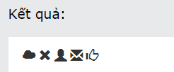

### 4. Link:
- Là việc tạo kiểu cho các Link.
- Liên kết có 4 trạng thái: 
  - a:link - một liên kết bình thường, không được truy cập
  - a:visited - một liên kết mà người dùng đã truy cập
  - a:hover - một liên kết khi người dùng di chuột qua nó
  - a:active - một liên kết ngay khi nó được nhấp vào

- VD:
    ```html
        /* unvisited link */
        a:link {
        color: red;
        }

        /* visited link */
        a:visited {
        color: green;
        }

        /* mouse over link */
        a:hover {
        color: hotpink;
        }

        /* selected link */
        a:active {
        color: blue;
        }
    ```
- Xóa gạch chân khỏi liên kết: text-decoration: none;  nếu muốn bật lên thì thay none bằng underline

### 5. Table:
- Table cũng có những thuộc tính cơ bản như width, height, text-align, border, . Các thẻ con như td, th cũng có những thuộc tính tương tự


## VI. Display (inline, block, inline-block, none) phân biệt display: none với visibility: hidden
- Để điều chỉnh cách thức hiển thị của 1 element
- Thuông thường, display của element được đặt mặc định là inline hoặc block.
- Nếu ta muốn điều chỉnh cách thức hiển thị để có thể custom giao diện thì thay giá trị của thuộc tính display thành các giá trị sau :
  - display: block;	Thành phần hiển thị như một khối, khi sử dụng giá trị block thành phần sẽ đứng một hàng độc lập so với thành phần trước và sau nó.
    - *display: block; (Chiều rộng kéo dài từ trái sang phải, luôn bắt đầu ở một hàng mới. Cho phép đặt chiều rộng và chiều cao, cho phép đặt margin, padding cho bên trên và bên dưới)*
  - display: inline;	Thành phần sẽ hiển thị như một nội tuyến (inline, không ngắt dòng), đây là dạng mặc định.
    -  *display: inline; (không đặt được chiều rộng và chiều cao, không thêm được margin và padding cho bên trên và bên dưới)*
  - display: inline-block;	Thành phần sẽ hiển thị như một khối, nhưng là một khối nội tuyến.   
    - - *display: inline-block; (Chiều rộng mặc định bằng chiều rộng của element, không bắt đầu ở một hàng mới. Cho phép đặt chiều rộng và chiều cao, cho phép đặt margin, padding cho bên trên và bên dưới)*
  - display: inline-table;	Thành phần sẽ hiển thị như một khối nội tuyến, đối xử tương tự `<table>`, không ngắt dòng trước và sau thành phần.
  - display: list-item;	Thành phần sẽ hiển thị như một khối và một nội tuyến cho các điểm đánh dấu danh sách.
  - display: none;	Thành phần không hiển thị.
    - *display: none; (Ẩn đi hoàn toàn)*
  - display: run-in;	Thành phần sẽ hiển thị như một khối hoặc một nội tuyến, tùy thuộc vào bối cảnh.
  - display: table;	Thành phần sẽ đối xử như một table, ngắt dòng trước và sau thành phần.
  - display: table-cell;	Thành phần sẽ đối xử như một ô trong table.
  - display: table-column;	Thành phần sẽ đối xử như một cột trong table.
  - display: table-column-group;	Thành phần sẽ đối xử như một nhóm cột (`<colgroup>`) trong table.
  - display: table-footer-group;	Thành phần sẽ đối xử như một nhóm footer (`<tfoot>`) trong table.
  - display: table-header-group;	Thành phần sẽ đối xử như một nhóm header (`<thead>`) trong table.
  - display: table-row;	Thành phần sẽ đối xử như một hàng trong table.
  - display: table-row-group;	Thành phần sẽ đối xử như một nhóm hàng trong table.
  - display: inherit;	Xác định thừa hưởng thuộc tính từ thành phần cha (thành phần bao ngoài).

- VD:
  - Khi để yên giá trị display mặc định của h1 (inline:)
    - 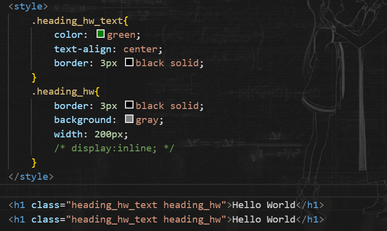
    - 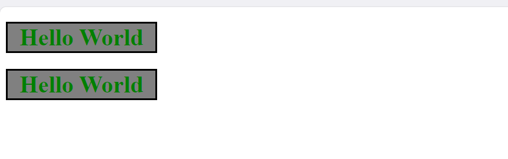
  - Khi thay đổi thành block
    - 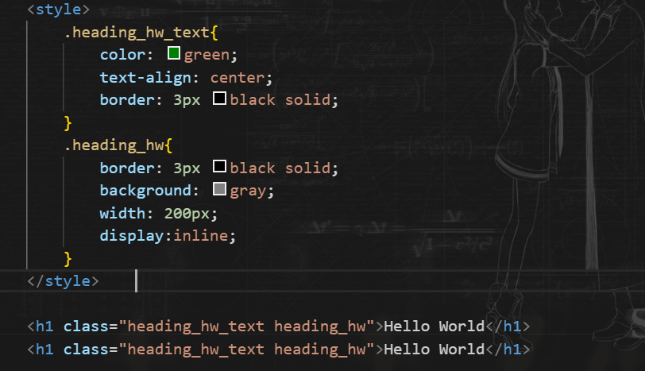
    - 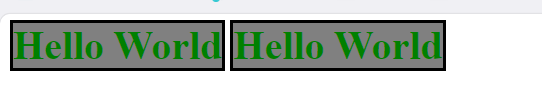

### 2. So sánh display-none và visibility-hidden:
- Display-none là khiến cho element biến mất, và vị trí sẽ bị chiếm dụng bởi những element còn lại
- visibility-hidden là khiến cho element ẩn đi, vị trí vẫn giữ nguyên


## VII. Position:

1. ĐN:
   1. thuôc tính position là để xác định vị trí mà ta muốn element hiển thị
2. Các gia trị:
   1. position: static: Vị trí mặc định của các phần tử, các thuộc tính top,left, right, buttom ko có hiệu lực
   2. position: relative: VỊ trí tương đối so với vị trí mặc định. Và có thể set được các thuộc tính top,left, right, buttom
      1. vd:
         1. 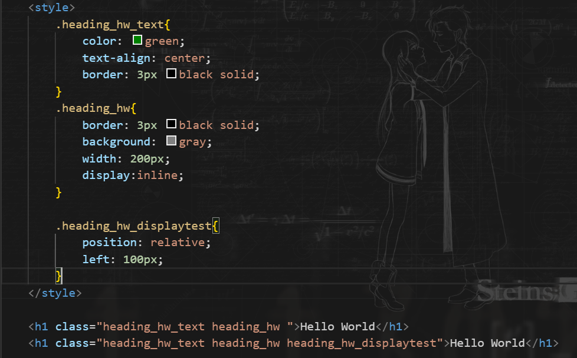    
         2. 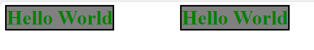
   3. position: absolute: Vị trí tuyệt đối so với box cha hoặc cửa sổ trình duyệt
      1. VD: 
         1. 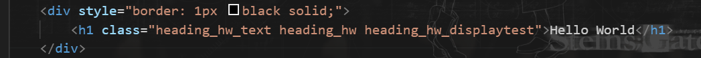
         2. 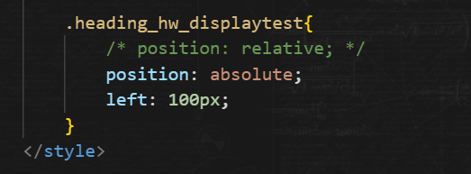
         3. 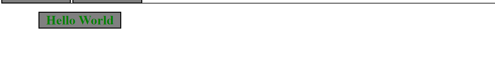
   4. Fixed: Luôn đi theo ViewPort
   5. Sticky: Trước khi scroll thì nó là relative, khi scroll qua thì là fixed

## VIII. Z-index, Overflow, Opacity

### 1. Z-index:
- Thuộc tính này có tác dụng xác định thứ tự xếp chồng của các element. Sử dụng phối hợp với thuộc tính posiotion
- VD:
  - 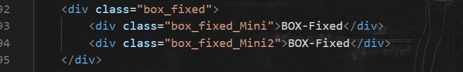
  - z-id mặc định: nó sẽ hiện theo thứ tự nhập
  - 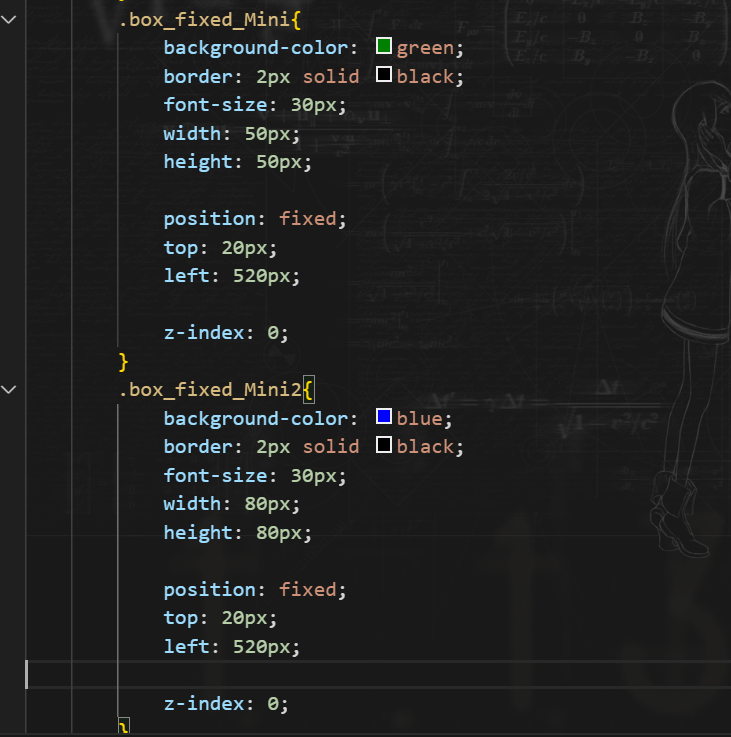
  - 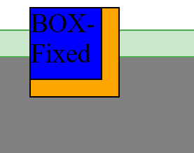
  - thay đổi z-id:
  - 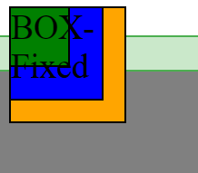

### 2. Overflow:
- Thuộc tính này để kiểm soát content
- Giá trị:
  - visible :Mặc định. Tràn không bị cắt. Nội dung hiển thị bên ngoài hộp của phần tử
  - hidden :Tràn được cắt, và phần còn lại của nội dung sẽ vô hình
  - scroll :Tràn được cắt và một thanh cuộn được thêm vào để xem phần còn lại của nội dung
  - auto :Tương tự như , Nhưng nó chỉ thêm thanh cuộn khi cần thiếtscroll

### 3. Opacity: Ở trên