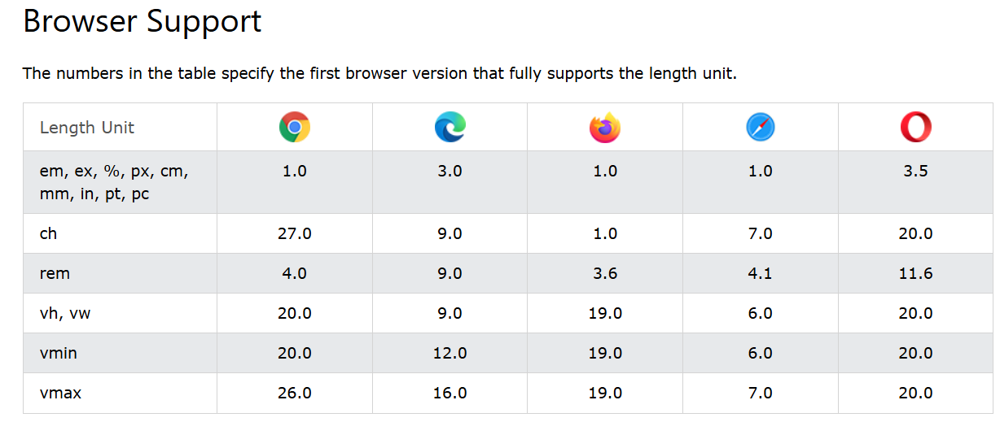
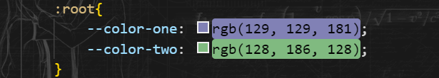
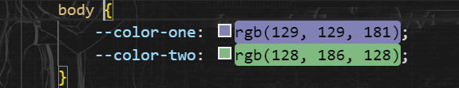
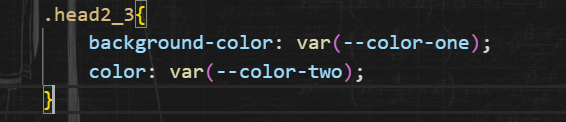

# Buổi 4. CSS CƠ BẢN (TIẾT 2)

## I. Bộ chọn tổ hợp

### 1. ĐN:
1. Là bộ chọn chứa nhiều các bộ chọn đơn giản.
2. Các loại bộ chọn:
   1. Bộ chọn hậu duệ (descendant selector - space)
   2. Bộ chọn con (child selector - >)
   3. Bộ chọn chị em liền kề (adjacent sibling selector - +)
   4. Bộ chọn anh chị em chung (general sibling selector - ~)


### 2. Bộ chọn hậu duệ (descendant selector - space)
1. Là bộ chọn tất cả những Element HẬU DUỆ(con-cháu-...) theo thứ tự được lựa chọn
   1. Cú pháp: 
    ```css
        div p {
        background-color: yellow;
        }
    ```

### 3. Bộ chọn con (child selector - >)
1. Là bộ chọn CON TRỰC TIẾP, ko có cháu chắt j cả.
2. Cú pháp: 
    ```css
        div > p {
        background-color: yellow;
        }
    ```
### 4. Bộ chọn chị em liền kề (adjacent sibling selector - +)

1. Là bộ chọn Element kề, ngay sau, gần nhất với Element đc chọn.
2. Cú pháp: 
    ```css
        div + p {
        background-color: yellow;
        }
    ```
### 5. Bộ chọn anh chị em chung (general sibling selector - ~)
1. Chọn tất cả phần tử tag2 cùng cấp với tag1, ở sau.
2. Cú pháp: 
    ```css
        tag1 ~ tag2 {
        background-color: yellow;
        }
    ```


## II. Pseudo-class selector: Bộ chọn lớp giả

### 1. Pseudo-class: ĐN
1. ĐN: Pseudo-class định nghịa 1 trạng thái đặc biệt của 1 element.
   - VD: Style 1 element khi ta hover vào nó.
   - 
2. Cú pháp: 
    ```css
        selector:pseudo-class {
            property: value;
        }
    ```

### 2. 1 Số Pseudo-class phổ biến

1. `:link`: Khi chưa nhấn vào link, css sẽ theo tk này.
2. `:visited`: Khi ta đã nhấn vào link it nhất 1 lần.
   1. 2 thẻ trên chỉ dùng cho thẻ a
3. `:hover`: Khi ta chỉ chuột vào thì nó sẽ css
4. `:active`: Click vào thì hiển thị
5. `:first-child`: Thiết lập cho element đầu tiên
6. `:last-child`: THiết lập cho element cuối
7. `:nth-child(n)`: Css cho phần tử n, nó có thể là chẵn, lẻ, 1 biểu thức


## III. Pseudo-Element: Bộ chọn phần tử giả

### 1. ĐN:
- Sử dụng để tạo 1 phần tử giả và CSS cho nó mà ko cần tạo phần tử thật

### 2. Cú pháp:
-   ```css
        selector::pseudo-element {
        property: value;
        }
    ```

### 3. Các Pseudo-Element phổ biến
1. `::before`: Chèn 1 nội dung nào đó trước nội dung của 1 element (VD: ảnh , text, icon,,....)
2. `::after`: Chèn 1 nội dung sau 1 element
3. `::first-letter`: Chữ cái đầu của đoạn
4. `::first-line`: Dòng đầu của đoạn
5. `::marker`: Chọn điểm đánh dấu của mục (ul,ol)
6. `::selection`: css cho bôi đen


## IV. Attribute Selector: Bộ chọn thuộc tính

1. ĐN: Là bộ chọn sử dụng cho các thuộc tính
2. Cú pháp:
   1. 
    ```css: Css cho các attribute nào mà = value
        a[target="value"] {
        background-color: yellow;
        }
    ```
   2. 
    ```css: Css cho các attribute nào CÓ GT = value
        a[target~="value"] {
        background-color: yellow;
        }
    ```

## V. Relative & Units:

### 1. Units: Đơn vị tuyệt đối

1. ĐN: là các đơn vị đo CỐ ĐỊNH trong CSS.
2. 1 số đơn vị:
   1. cm
   2. mm
   3. in: inch = 2.54cm
   4. px (1px = 1/96 inch)
   5. pt (1pt = 1/72 inch)
   6. pc (1pc = 12 pt) 

### 2. Relative: đơn vị tương đối.

1. ĐN: là các đơn vị đo Tương đối trong CSS.
2. 1 số đơn vị:
   1. %: Tỉ lệ so với phần tử cha
   2. rem : 1rem Gía trị tương đối với font-size của phần tử gốc (thẻ html)
   3. em: 1em có giá trị tương đối với font-size của phần tử cha có đn font-size
   4. vw: 1vw = 1% chiều rộng của số tình duyệt
   5. vh: 1vh = 1% chiều cao của số tình duyệt
   6. pc (1pc = 12 pt) 
3. Các Đv đc trình duyệt hỗ trợ:
   1. 


## VI. !important, Math Functions, CSS function attr(), Variables, Box Sizing

### 1. !important:
1. ĐN: để thay đổi thứ tự ưu tiên CSS. Nếu đặt từ khóa này thì độ ưu tiên sẽ ở mức cao nhất.
2. VD:
    ```html
        <style>
            p{
                color:blue !important;
            }
            p{
                color:green;
            }
        </style>

        <h1>1. Important:</h1>
        <p>hello</p>
    ```
    <style>
        p{
            color:blue !important;
        }
        p{
            color:green;
        }
    </style>

    <h1>1. Important:</h1>
    <p>hello</p>


### 2. MathFunction:
1. calc(): Hàm tính toán: Nhận vào 1 giá trị, có thể là kết quả của 1 biểu thức.
   1. VD:
            ```html
                <head>
                <style>
                #div1 {
                position: absolute;
                left: 50px;
                width: calc(100% - 100px);
                border: 1px solid black;
                background-color: yellow;
                padding: 5px;
                }
                </style>
                </head>
                <body>

                <h1>The calc() Function</h1>

                <p>Create a div that stretches across the window, with a 50px gap between both sides of the div and the edges of the window:</p>

                <div id="div1">Some text...</div>

                </body>
            ```
        <head>
        <style>
        #div1 {
        position: absolute;
        left: 50px;
        width: calc(100% - 100px);
        border: 1px solid black;
        background-color: yellow;
        padding: 5px;
        }
        </style>
        </head>
        <body>

        <h1>The calc() Function</h1>
        <div id="div1">Some text...</div>

        </body>

2. max, min

- VD:
        ```html
            <head>
            <style>
            #div1 {
            background-color: yellow;
            height: 100px;
            width: min(50%, 300px);
            }
            </style>
            </head>
            <body>

            <h1>The min() Function</h1>

            <p>Use min() to set the width of #div1 to whichever value is smallest, 50% or 300px:</p>

            <div id="div1">Some text...</div>

            <p>Resize the browser window to see the effect.</p>

            </body>
        ```
    <head>
    <style>
    #div1 {
    background-color: yellow;
    height: 100px;
    width: min(50%, 300px);
    }
    </style>
    </head>
    <body>

    <h1>The min() Function</h1>

    <p>50% or 300px:</p>

    <div id="div1">Some text...</div>

    <p>Resize the browser window to see the effect.</p>

    </body>


### 3. Variable:
1. khai báo biến:
   1. Khai báo biến toàn cục:
      1. 
      2. 
   2. Truy cập:
      1. 