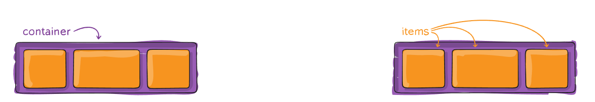
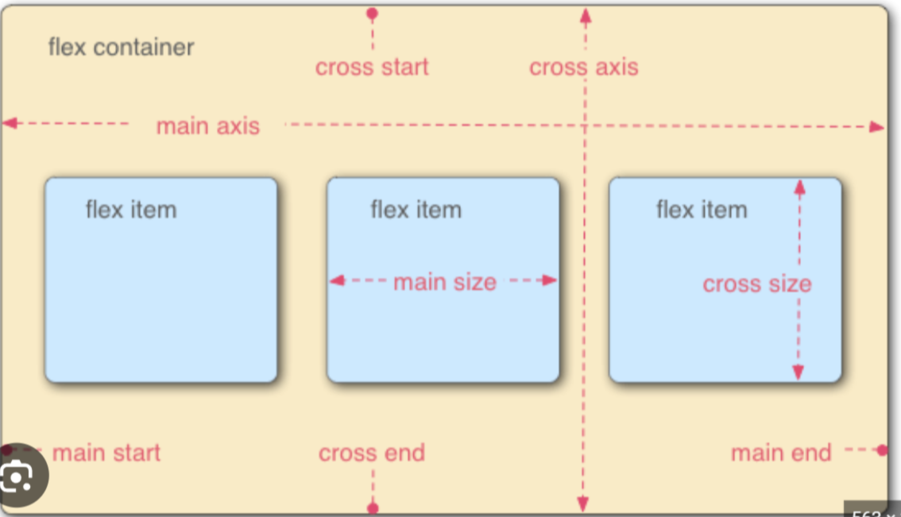
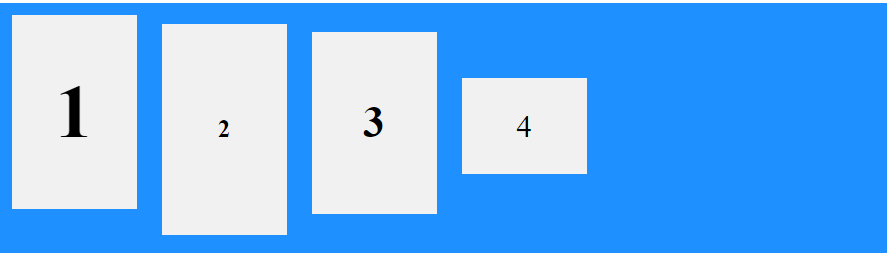
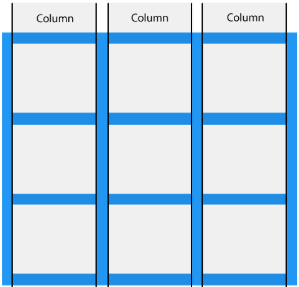
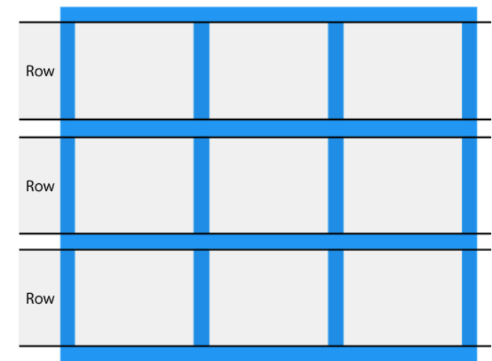
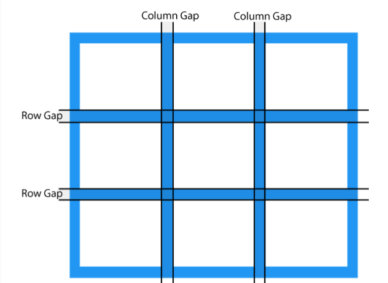
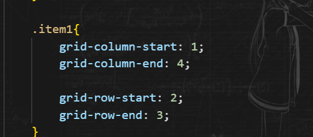
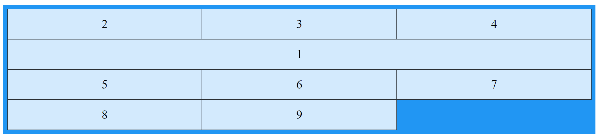
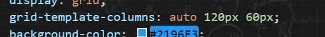
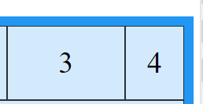

# Buổi 5.


## I. CSS FlexBox.

### 1. Định nghĩa, Cú pháp, Cấu trúc:
1. Là 1 bố cục có khả năng: 
   1. Tự cân đối kích thước.
   2. Có thể thay đổi chiều rộng, chiều cao.
   3. Thay đổi thứ tự.
2. 2 Thành phần: 
   1. 
   2. Container: để chứa các phần tử
   3. các Items:
3. Cú pháp:
    ```css
        .container{
            display: flex;
        }
    ```
4. Cấu trúc:
   1. 

### 2. Các thuộc tính:

#### 1. flex-direction:
1. ĐN: Xác định hướng của các Items
2. Property:
   1. columns: Theo chiều dọc
   2. rows: Chiều ngang
   3. columns-reverse: Theo chiều dọc, nhưng theo thứ tự ngược lại
   4. rows-reverse: Theo chiều ngang, nhưng theo thứ tự ngược lại 

#### 2. flex-wrap:
1. ĐN: Xác định xem các Items có nên xuống dòng hay không.
2. property:
   1. nowrap: Mặc định: Tất cả các Item đều nằm trên 1 dòng.
   2. wrap: Các Items nếu kích cỡ bị quá thì sẽ xuống dòng.
   3. wrap-reverse: Các Items nếu kích cỡ bị quá thì sẽ xuống dòng, và bị đảo thứ tự

#### 3. justify-content:
1. ĐN: Căn lề theo chiều main-axis (chiều ngang)
2. property:
   1. center: Căn lề giữa
   2. flex-start: Căn lề trái
   3. flex-end: Căn lề phải
   4. space-between: 2 items đầu và cuối sát lề
   5. space-around: như space-between: 2 items đầu và cuối sát lề, nhưng cách lề = 1/2 width của item
   6. space evenly: kc giữa lề - item = kc giữa 2 item
   

#### 4. align-item:
1. ĐN: Căn lề theo chiều cross-axis (chiều dọc)
2. property:
   1. center: Căn lề giữa
   2. flex-start: Căn lề trên
   3. flex-end: Căn lề dưới (nhưng ko phải item lộn ngược từ dưới lên)
   4. stretch: Chiều dài của item sẽ kéo dài để lấp đầy item, nhưng ưu tiên height nếu đc cài đặt.
   5. baseline: Căn chỉnh theo đường kẻ ngang
      1. 

#### 5. Align-content:
1. ĐN: Căn lề
2. Khác nhau giữa align-content và align-item:
   1. https://blog.lehuuvietanh.com/content-vs-items-css/
   2. ta tưởng tượng có 1 khối bao quanh nó.
   3. align-content sẽ căn chỉnh cả khối wrapper(khối chứa tất cả item)
   4. align-item sẽ căn chỉnh chính item ở trong khối wrapper đó 
   5. ta thấy align-item giống justify-content
   6. Lưu ý: align-content chỉ hoạt động khi container có thuộc tính flex-wrap có giá trị khác no-wrap (tức là wrap và wrap-reverse)

#### 6. Order: 
1. ĐN: Sắp xếp lại vị trí của các Items
2. Cú pháp:
    ```css
        selector{
            order: giá trị /*Mặc định là 0*/;
        }
    ```


## II. Grid Layout

### 1. ĐN: 
1. Grid Layout CSS cung cấp một hệ thống bố cục dựa trên lưới, với các hàng và cột, giúp thiết kế các trang web dễ dàng hơn mà không cần phải sử dụng float và Position
2. Cấu trúc: 1 container và các grid-item

### 2. Cú pháp:
1. Set Grid:

   ```css
      .container {
         display: grid;
      }
      .container {
         display: inline-grid;
      }
   ```

### 3. Cấu trúc:
1. Cột (Col)
   1. 
2. Hàng (Flow)
   1. 
3. Khoảng trống (Gap)
   1. 
   2. Có thẻ điều chỉnh gap qua các property: column-gap, row-gap, gap

### 4. GridLine
1. Để set vị trí bắt đầu và kết thúc trong bảng của 1 Item
2. VD: 
   1. 
   2. 

### 5. Property:

1. grid:	Viết nhanh của các thuộc tính bên dưới :
   1. grid-template-rows
   2. grid-template-columns
   3. grid-template-areas
   4. grid-auto-rows
   5. grid-auto-columns
   6. grid-auto-flow

2. grid-area: Set vị trí, kích cỡ cho 1 ô
   1. VD: `grid-area: 2 / 1 / span 2 / span 3;`: Item này bdau ở dòng 2, cột 1; Kéo dài 2 dòng 3 cột
   2. grid-row-end
   3. grid-row-start
   4. grid-columns-start
   5. grid-columns-end
3. grid-column	
4.  grid-column-gap
5.  grid-gap
6.  grid-row
7.  grid-row-gap

### 6. GridContainer.
1. Các property:
   1. grid-template-columns: Set kích cỡ của các columns. Nếu không set thì mặc định là auto.
      1. 
      2. 
   2. grid-template-rows: tương tự columns
   3. justify-content và align-content.