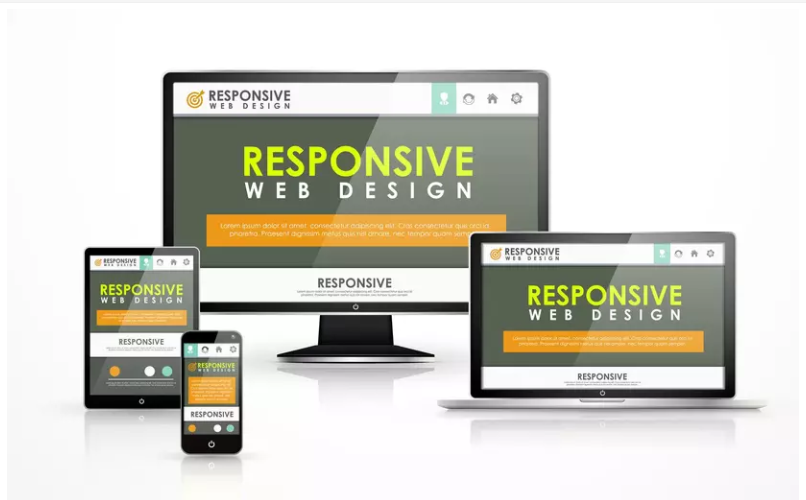
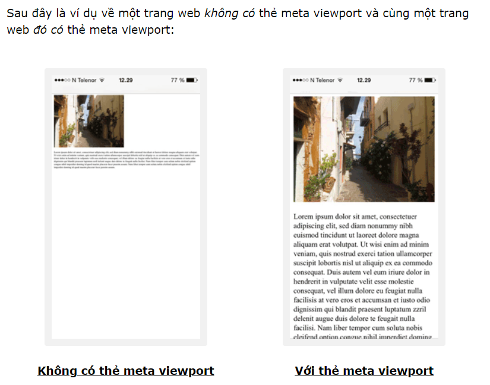
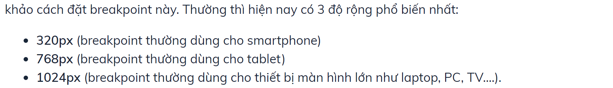
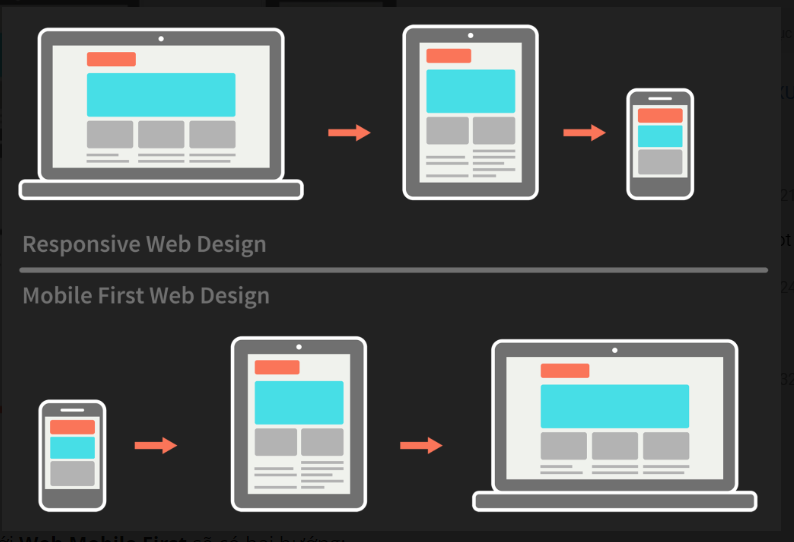
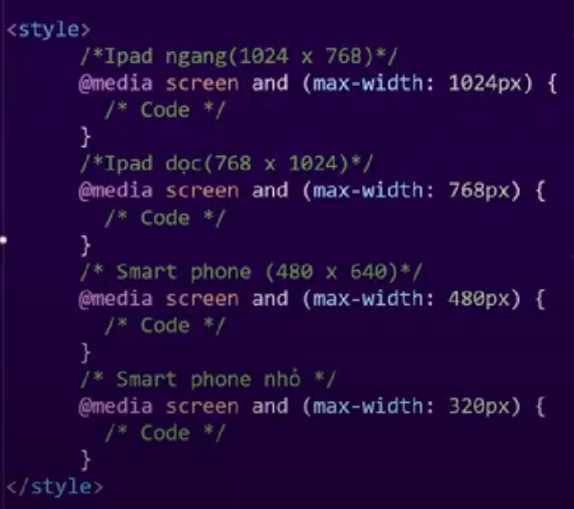
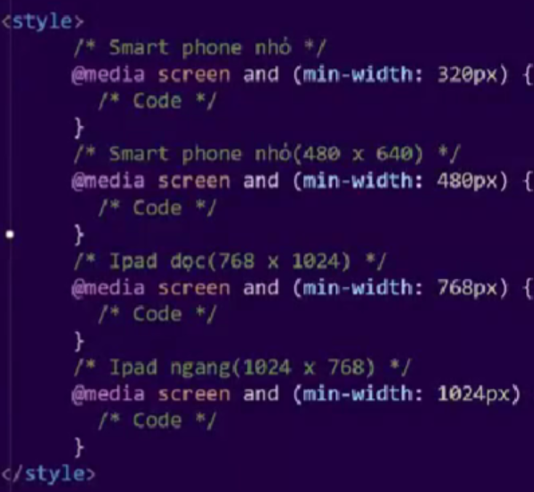

# Buổi 6. CSS Buổi 5 -  Responsive

## I. Responsive.

### 1. ĐN: Resposive Web Design là gì?

- Là để chỉ 1 Website có khả năng tương thích với mọi kích thước của sổ trình duyệt, với mọi thiết bị.
- Thiết kế mang lại trải nghiệm tốt nhất cho tất cả người dùng.
- Cách thức Responsive: Media Query.

### 2. View Port:
- View Port là khu vực người dùng có thể nhìn thấy trên trang web.

1. Thiết lập view port: Sử dụng thẻ `<meta>`
- `<meta name="viewport" content="width=device-width, initial-scale=1.0">`
- Trong đó:
  - width=device-width: Thiết lập chiều rộng của trang theo chiều rộng và màn hình của thiết bị. device-width: có thể thay đổi tùy vào thiết bị
  - initial-scale=1.0" Thiết lập mức thu phóng ban đầu khi trình duyệt tải trang lần đầu tiên.
  - 

### 3. Grid View.
1. ĐN: Là cách chia 1 Hàng thành 12 cột, để sử dụng set kích cỡ cho các Element.
2. Điều kiên: Để Box-sizng: border-box.
3. Các kích cỡ của các cột:
   1. .col-1 {width: 8.33%;}: 1/12
   2. .col-2 {width: 16.66%;}: 1/6
   3. .col-3 {width: 25%;}: 1/4
   4. .col-4 {width: 33.33%;}: 1/3
   5. .col-5 {width: 41.66%;}: 5/12
   6. .col-6 {width: 50%;}: 1/2
   7. .col-7 {width: 58.33%;}: 7/12
   8. .col-8 {width: 66.66%;}: 2/3
   9. .col-9 {width: 75%;}
   10. .col-10 {width: 83.33%;}
   11. .col-11 {width: 91.66%;}
   12. .col-12 {width: 100%;}
4.  Ta có thể sử dụng Bootstrap để có thể set sẵn các cột.
### 4. Break Point: 
- Nguồn: `https://codelearn.io/sharing/ap-dung-css-breakpoint-hieu-qua`
1. ĐN: CSS Breakpoint là **những điểm (phạm vi giới hạn)** mà tại đó nội dung của **website sẽ co dãn một cách linh hoạt** phụ thuộc vào chiều rộng của thiết bị nhằm đem đến cho người xem một trải nghiệm tuyệt vời và hoàn hảo nhất. Và nếu không có những phạm vi này thì cả người thiết kế giao diện lẫn lập trình viên đều không thể biết được chính xác cách hiển thị nội dung của trang web tới người dùng, và điều tệ hại nhất mà bạn có thể nghĩ tới là sẽ xuất hiện hàng tá những trường hợp tràn chữ, lỗi font, tràn layout, khó đọc, v.v…  khi dùng điện thoại để lướt Internet.
2. Các cách đật Breakpoint:
   1. Đặt theo thiết bị: Mỗi thiết bị sẽ có 1 kích cỡ và ta đặt brp theo nó. Tuy nhiên hiện tại đã có quá nhiều thiết bị với kích cỡ khác nhau.
      1. 3 Độ rộng phổ biến nhất:
      2. 
   2. Đặt dựa trên nội dung:
      1. Phụ thuộc vào nội dung của trang web mà bạn có, thay vì dựa vào độ rộng của thiết bị người dùng sở hữu. 
      2. Phương pháp này cho phép bạn đơn giản hóa việc thêm breakpoint tại nơi mà một nội dung nào đó cần sự thay đổi layout. Điều này sẽ giúp bạn hạn chế vấn đề phải làm việc với một danh sách các media query “siêu to khổng lồ” như cách đầu, cũng như giúp media query của bạn dễ quản lý và đơn giản hơn.
      3. Cách sử dụng: max-width (khi dùng với PC First) và min-width (Khi dùng với Mobile First)
   3. Đặt breakpoint dựa trên một số framework nổi tiếng
   - Mỗi một framework sẽ có những quy ước cụ thể về các cách đặt breakpoint khác nhau, chẳng hạn với Bootstrap sẽ có breakpoint tại 576px, 768px, 992px và 1200px. Còn Foundation thường sẽ có những breakpoint tại 40em và 60em. Còn với Bulma, breakpoint sẽ được set tại độ phân giải 768px, 769px, 1024px, 1216px và 1408px. Điểm chung giữa chúng là đều dùng cách tiếp cận mobile-first.

## II. Media Query.

### 1. ĐN:
- Media Query là một kỹ thuật CSS được giới thiệu trong CSS3.

- Nó sử dụng `@media` để bao gồm một khối thuộc tính CSS chỉ khi một điều kiện nhất định là đúng.
    
### 2. Cú pháp:
    ```css
       @media mediaType and (mediaFeatures) {
            //Code.
        }
    ```
- Trong đó: 
  - mediaType: Gồm các thuộc tính thường sử dụng sau:
    - all: Dùng cho mọi thiết bị
    - print: Dùng cho máy in
    - screen: Dùng cho máy tính và các thiết bị di động
  - mediaFeature: Gồm các thuộc tính hay sử dụng sau:
    - max-width: Chiều rộng tối đa của viewport
    - min-width: Chiều rộng tối thiểu của viewport
    - ta set giá trị cho max-width và min-width bằng px.

### 3. Các giá trị liên quan: 



#### a. PC First:
   1. Là khái niệm để chỉ việc lập trình giao diện tử màn hình lớn đến nhỏ.
   2. Để làm việc với mô hình này ta sử dụng `max-width`
   3. Các media query điển hình:
      1. 

#### b. Mobile First:
  1. Là khái niệm để chỉ việc lập trình giao diện tử màn hình nhỏ đến lớn.
   2. Để làm việc với mô hình này ta sử dụng `min-width`
   3. Các media query điển hình:
      1. 

#### c. 


## III. Flexible media
- Flexible Media trong CSS liên quan đến việc thiết kế các phần tử media (như hình ảnh, video, iframe) có thể thay đổi kích thước linh hoạt để phù hợp với các kích thước màn hình khác nhau. Điều này đặc biệt quan trọng trong thiết kế web đáp ứng (responsive design) để đảm bảo nội dung hiển thị tốt trên mọi thiết bị.
1. Sử dụng thuộc tính max-width:
Thiết lập max-width: 100% cho các phần tử media để đảm bảo chúng không vượt quá kích thước của container chứa chúng.
   ```css
   >img, video, iframe {
      max-width: 100%;
      height: auto;
   }
   ```
- Ví dụ này sẽ làm cho hình ảnh, video, và iframe co dãn linh hoạt trong phạm vi kích thước của container mà không bị vượt quá kích thước thực tế của chúng.
2. Sử dụng thuộc tính object-fit:
object-fit được sử dụng để xác định cách các phần tử media (hình ảnh, video) được điều chỉnh kích thước và cắt xén trong container của chúng.
   ```css
   img, video {
      width: 100%;
      height: auto;
      object-fit: cover; /* Các tùy chọn: fill, contain, cover, none, scale-down */
   }
   ````
Với object-fit: cover, hình ảnh hoặc video sẽ bao phủ toàn bộ container, có thể bị cắt xén nếu cần thiết để giữ tỷ lệ khung hình.

3. Responsive Iframes:

Để làm cho iframe linh hoạt, bạn có thể sử dụng kỹ thuật kết hợp với padding-top và position: relative.
````
.iframe-container {
    position: relative;
    width: 100%;
    padding-top: 56.25%; /* Tỷ lệ 16:9 (9/16 = 0.5625) */
}
.iframe-container iframe {
    position: absolute;
    top: 0;
    left: 0;
    width: 100%;
    height: 100%;
    border: 0;
}
````
Ví dụ này đảm bảo iframe luôn giữ tỷ lệ khung hình 16:9 và thay đổi kích thước theo container của nó.

4. Picture Element và Source Set:

Sử dụng thẻ <picture> và thuộc tính srcset để cung cấp các phiên bản hình ảnh khác nhau cho các kích thước màn hình khác nhau.
````
<picture>
    <source srcset="image-large.jpg" media="(min-width: 800px)">
    <source srcset="image-medium.jpg" media="(min-width: 400px)">
    
</picture>
````
Trình duyệt sẽ chọn phiên bản hình ảnh phù hợp nhất dựa trên độ phân giải màn hình.