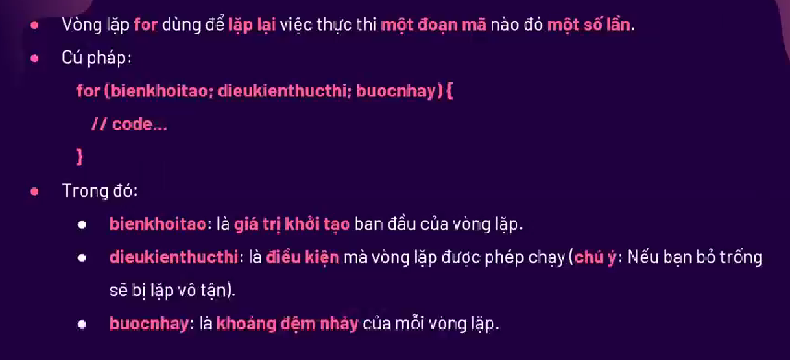

# BUỔI 7. JAVA SCRIPT CƠ BẢN


## NOTE:
- Hoisting: Là cách mà JS chuyển việc khai báo tất cả các biến, hàm lên trên đầu
  - Vd: Nếu ta console a, rồi mới khai báo a = 5 => nó sẽ cho a là undefined (vì ta chưa khởi tạo giá trị cho a)
  - Nhưng với hàm, ta sẽ là ng khai báo cho nó, nên JS chuyển hàm cà ta khai báo cho hàm lên đầu.
## I. Khai báo dữ liệu
### 1. Cấu trúc trong JavaScript
#### 1. Định nghĩa:
1. JavaScript: Là 1 ngôn ngữ lập trình kịch bản dựa trên các đối tượng có sẵn, hoặc do lập trình viên tự định nghĩa
2. Lịch sử:
   1. Trước đây, JS sử dụng chủ yếu để nâng cao sự tương tác giữa người dùng với trang web (VD: popup, slider,...) hoặc xác thực dữ liệu các form.
   2. H đây, JS còn sử dụng rọng rãi trong phát triển ứng dụng, game trên điên thoại hay các ứng dụng dành cho server.
      1. Web App: ReactJS, VueJS, AngularJS,..
      2. Mobile APP: React Native
      3. Server APP: NodeJS, ExpressJS
      4. Graphic: two.js, three,js
      5. AI: brain.js
      6. Và còn nhiều lĩnh vực khác mà JS có thể làm đc
#### 2. Chèn JS
- C1: sử dụng trực tiệp các Attribute: 
  - <`button type="button" onclick="document.getElementById('hien-thi-thoi-gian-ra').innerHTML = Date()"> Nhấn vào để xem thời gian</>`
- C2: Chèn Internal:
  - Sử dụng cặp thẻ `<script></script>`
- C3: Chèn External:
  - `<script src="file.js"></script>`


### 2. Biến
1. Khai báo biến :
   1. Khai báo bằng toán tử var:
      1. `var tenBien = giatri`
      2. 1 số lưu ý:
         1. Tên biến có phân biệt chữ hoa, chữ thường
         2. Bắt đầu phải là chữ cái hoặc bằng kí tự '_'
   2. Khai báo biến tạm thời bằng let
      1. `let tenBien = giatri`
      2. Biến khai báo bằng let chỉ được sử dụng trong phạm vi khối được khai báo (khác với var, var có thể sử dụng ở ngoài phạm vi khai báo):
         1. 
   3. Khai báo hẳng bằng const:
      1. `const tenHang = giatri`
      2. 

### 3. Các loại toán tử

1. Toán tử số học:
   1. Là toán tử dùng để thực hiện các phép toán số học:
   2. Danh sách các toán tử số học:
      1. 
   3. Lưu ý: Toán tử + nếu mà là số với chuỗi là nối chuỗi
      1. Còn với -, *, /:
         1. Nếu chuỗi là chuỗi số thì nó sẽ convert về số
         2. nếu là chuỗi kí tự: ra NaN
   4. Lưu ý: toán tử ++, --:
      1. ++a là tăng trước rồi lấy giá trị sau
      2. a++ là lấy giá trị rồi mới tăng
2. Toán tử gán:
   1. Danh sách các toán tử gán :
      1. 
3. Toán tử so sánh:
   1. Là toán tử 2 ngôi để so sánh giá trị của toán hạng với nhau.
   2. Danh sách toán tử:
      1. 
   3. Toán tử `===` và `!==`: So sánh cả giá trị và kiểu dữ liệu
4. Toán tử logic:
   1. Danh sách toán tử: 
      1. `&&`
      2. `||`
      3. `!`


### 4. Kiểu dữ liệu:


#### 1. Kiểu dữ liệu nguyên thủy:

##### a. Boolean: 
##### b. Number:
##### c. String
- Note: Cách để nhập được dấu ' cho câu:
  - Sử dụng 1 dấu \ ở trước dấu ' (VD: ` 'PC \'s SonTran' `)
  - Sử dụng dấu để chứa xâu khác loại (VD: ` "PC \'s SonTran" `) 
##### e. undefined
- Biến mà không gán giá trị thì mặc đinh sẽ là undefined
##### f. null: Không có gì 
##### g: symbol: Khi khai báo, thì biến có tính độc nhất
- Dù có KDL, Giá trị thì vẫn là khác nhau.
##### h. VD:

#### 2. Kiểu dữ liệu phức tạp:

##### a. Function: 
- Code trong function chỉ chạy khi gọi đến nó.

##### b. Object:
- Lưu hầu hết các dạng dữ liệu trong JS.
- Object bao gồm: Các cặp key-value, khai báo cách nhau bằng dấu ',', key có thể là 1 function

##### c. Arr: 
- `Key` đc đánh tự động, tự tăng (0, 1 ,2, 3,...)


#### 3. Cách kiểm tra kiểu dữ liệu
- Sử dụng typeof


## II. Các đối tượng trong JavaScript(String, Number, Object,...)

### 1. Làm việc với String
#### a. Khai báo:
- Đặt biến, KDL String: ` var fullName = 'Son Tran'`
- Đặt biến, KDL Object: ` var fullName2 = new String('Son Tran')`

#### b. Các phương thức:

- 1.length
- 2.find index
- 3.slice
- 4.replace
- 5.upper-lower case
- 6.trim
- 7.split
- 8.charAt(id)


### 2. Làm việc với Number

#### b. Các phương thức:
- isFixed()
- isNaN(a)
- toString()


### 3. Làm việc với Object

#### a. Khai báo:
1. 
2. Khai báo các cặp key-value:
   1. key: khai báo như tên biến. Nhưng nếu tên mà ta muốn đặt vi phạm quy tắc đặt tên: sử dụng dấu ` "" ` để khai báo key

#### b. Xuất:
1. 
2. Lưu ý: Khi muốn xuất ra 1 key, mà key là 1 xâu: sử dụng : `obj['key']`

#### c. Xóa:
1. 

#### d. THêm:
1. 

#### e. Constructor: Kiểu kiểu constructor của Java
- Là 1 hàm giúp ta khởi tạo 1 Object như ta muốn. Các Object tạo từ hàm này có cùng các thuộc tính.
  

#### f. Object Method:


### 4. ARRAY:

1. forEach():
   1. 
   2. Đối số của forEach là 1 function, có 3 tham số: currentItem, id, array. Với id là vị trí của currentItem trong array
   3. 
   4. Ko trả về j
2. every:
   1. 
   2. Kiểm tra `tất cả` các phần tử của 1 mảng mà nó phải thỏa mãn 1 điều kiện j đó.
   3. Đối số của every là 1 function, có 3 tham số: currentItem, id, array. Với id là vị trí của currentItem trong array
   4. Có trả về true-false.
3. some:
   1. 
   2. Kiểm tra `chỉ cần 1 `phần tử của 1 mảng thỏa mãn đk j đó:
   3. Đối số của some là 1 function, có 3 tham số: currentItem, id, array. Với id là vị trí của currentItem trong array
4. find:
   1. 
   2. Tìm trong mảng có gt cần tìm ko. Có thì trả về phần tử đó, nếu ko cso thì trả về undefined. Chỉ tìm đc 1 phânnf tử đầu tiên nó tìm thấy
5. fillter:
   1. 
   2. Như find nhưng trả về nhiều.
6. map():
   1. 
   2. duyệt qua các phần tử như forEach. Nhưng sẽ trả về 1 mảng. Mà mảng đó thì do ta quyết và sử dụng return để trả ra.
7. reduce()
   1. 
   2. như map nhưng thay vì tra về mảng, nó trả về giá trị
   3. Đối số: là 1 hàm có 3 tham số: 
      1. total: Giá trị trả lại trc đó của reduce. VD: Nếu tính tổng 1 mảng thì giá trị ban đấu (innnitialValue = 0, nó gán cho total) Cứ mỗi lần cộng 1 phânf tử vào total, nó sẽ cập nhật ngay
      2. innnitialValue: Ko bắt buộc, khỏi tạo 1 giá trị ban đầu, thế thôi. Nếu ko kbao thì mặc định nó ssd phần tử đầu


### 4.Date Object: Thời gian

1. Đối tượng Date:
   ```js
      var date = new Date(); //=> Sau khi tạo đối tượng này, ta có thể sử dụng các phương thức ở trong class Date để xử lý thời gian
      var date2 = Date()
   ```
2. Xuất:
   ```js
      console.log(typeof date)
      console.log("Date 2 khi gọi kiểu function thì nó chỉ là 1 String: ", typeof date2)
      console.log(date)
      console.log(date2)

      console.log(date.getFullYear())
      console.log(date.getMonth()) // 0 -> 11 => Phải +1 
      console.log(date.getDay())
      console.log(date.getHours())
      console.log(date.getMinutes())
      console.log(date.getSeconds())
   ```


## III. Cấu trúc rẽ nhánh, toán tử 3 ngôi
- Hầu hết đều giống như C++.
1. Câu lệnh if
   ```js
      if(condition){
         //code
      }
      else if(condition){

      }
      else{

      }
   ```
   1. condition: true - false
      1. false khi:
         1. NULL, xâu Rỗng, 0
      2. true khi
         1. Số khác 0
2. Toán tử 3 ngôi:
- Ta có thể rút gọn câu lệnh if-else thành câu lệnh rẽ nhánh 

3. Switch- case
   ```js
      switch (var){
         case value_1:
            //code
         case value_1:
            //code // Nếu ko có break thì nó sẽ chạy hết các case
         case value_1:
            //code
            break // Nếu có break thì nó chỉ chạy hết case này
         case value_1:
            //code
            break
         default:
            //code
            break;
      }
   ```
## IV. Vòng lặp
1. Vòng lặp for


2. Vòng lặp for-in:
   1. Duyệt qua tất cả các KEY của 1 Object, String, Array
   2. Cú pháp:
         ```js
            for(key in object){
               // Code
            }
         ```
   3. Trong đó:
      1. key: là tên biến
      2. objectL Object, vòng này sẽ duyệt tất cả các key trong Object 

3. Vòng lặp for-in:
   1. Duyệt qua tất cả các Phần tử của 1 String, Array (KO DÙNG CHO OBJECT)
   2. Cú pháp:
         ```js
            for(var of object){
               // Code
            }
         ```
   3. Trong đó:
      1. var: là tên biến
      2. iterable: mảng hoặc string, vòng này sẽ duyệt tất cả các giá trị trong mảng
4. while: Như C++
5. do-while: Như C++
## V. Làm việc với hàm

### 1. Định nghĩa:
- Hàm là 1 khối mã, để làm 1 công việc cụ thể.

### 2. 2 loại hàm:
1. Hàm built-in: Hàm đã được xây dựng sẵn, chỉ gọi ra dùng.
   1. Alert: Tạo ra 1 popup thông báo.
   2. Console
   3. Confirm
   4. prompt
   5. Set timeout
   6. Set interval
   7. VD:
      ```js
         var fullName = 'Son Tran'

         // 2. console: cái này nó sẽ thao tác trên console, giúp ta debug trong quá trình học
         console.log('Day la 1 dong log') // In ra 1 dòng log: Mở tab console là thấy dòng text này
         console.log(fullName)

         console.warn('Day la canh bao')
         console.error('Day la loi')

         // 3. confirm:
         //confirm('Xac Nhan bn du tuoi') // Tạo 1 hộp thoại xác nhận, bên trong nhập 1 message

         //4.prompt: cũng là 1 thông báo nhưng có thêm ô để điền
         //prompt('Xac Nhan bn du tuoi')

         // 5. Set timeout: sau 1 khoang thơi gian thì làm cái j đó(ở trong funtion) - 1 lần
         // setTimeout(function() {

         // }, time) // time là thời gian count

         // setTimeout(function() {
         //     alert('THongbao')
         // }, 3000)

         //6. setInterval: như setTime out nhưng nó lặp lại liên tục
         setInterval(function() {
            console.log('Test setInterval ' + Math.random())
         }, 3000)

         // Luu y:
            //1. Math.random(): tra vể 1 chuối random
      ```
2. Hàm tự định nghĩa:

### 3. Hàm tự định nghĩa:
1. Cú pháp:
   ```js
      function tenHam(tso1, tso2,...){
         //code
      }
      //GỌi hàm:
      tenHam(doiso1, doiso2)
   ```
2. Lưu ý:
   1. Nếu gọi trùng tên hàm khi ta gọi hàm thì việc gọi hàm này tính là chạy hàm cuối cùng.
   2. Nếu 1 biến đc đinh nghĩa ở trong hàm thì biến đó là local (KỂ CẢ BIẾN VAR)
   3. Nếu hàm A nằm trong hàm B thì cũng như trên
3. Đối tượng argument
   1. Chỉ dùng đc ở trong hàm. Nó là 1 mảng, chứa tất cả các đối số được truyền vào.
   2. Từ khóa return: Trả về giá trị cho hàm. (Có thể trả về Object luôn)
   3. 4

### 4. Các cách viết hàm:
1. Hàm định nghĩa: (Declaration Function)
   1. Có tính hoisting(có thể gọi trước khi khai báo)
   2. cú pháp:
   3. ```js
         funtion tenHam(tso1, tso2){
            //Code
         }
      ```
2. Hàm Biểu thức: (Expression Function)
   1. Ko có tính hoisting(có thể gọi trước khi khai báo)
   2. cú pháp:
   3. ```js
         var tenHam = function(tso1, tso2){
            //Code
         }
      ```
3. Hàm mũi tên (Arrow Function)
   1. KO Có tính hoisting(có thể gọi trước khi khai báo)
   2. cú pháp:
   3. ```js
         var tenHam = (tso1, tso2) => {
            //Code
         }
      ```
   4. Lưu ý: Arrow Function ko có Arrgument, Để lấy các đối số đã truyền ở dạng 1 mảng thì ta sử dụng cú pháp spread :
      1. sử dụng từ khóa ... + 1tubatki thì argument lúc này là cái 1tubatki đó.
      2. 


## VI. Callback

### 1. ĐN:
1. ĐN:
- Là 1 hàm truyền dưới dạng đối số của 1 hàm khác.
- Hàm callback có thể gọi ngay sau khi các chức năng khác kết thúc
2. Tác dụng:
- Javascript hỗ trợ lập trình hướng sự kiện và **bất đồng bộ** nên callback function đóng vai trò rất quan trọng. Ta sẽ truyền callback function vào các hàm xử lý sự kiện và hàm xử lý bất đồng bộ đó.
- Sử dụng trong các trường hợp:
  - Các hàm cần phải chờ kết quả của hàm trước để tiếp tục thực hiện. (Do tk JS nó bất đồng bộ nên 1 số th nó sẽ nhảy qua luôn.)
1. ĐK: Là hàm khi đc truyền qua đối số khi gọi 1 hàm khác
   1. Là hàm
   2. Đc truyền qua đối số.
   3. Đc gọi lại trong hàm nhận đối số 

### 2. Promise:
- Để giải quyết vấn đề `CallBack Hell` (Muốn chơ1 hàm này phải chờ 1 hàm khác thực hiện và liên tục thế ....)
- Là 1 cách viêt hàm đơn giản hơn, mỗi hàm nằm trên 1 dòng.
1. Cú pháp: 
```js
   var promise = new Promise((resolve, reject) => {
      //resolve() // Nếu thành cồng thì sẽ chạy vào resolve
      // reject() // Nếu thất bại
   })
   promise
      .then((success1)) => {
         //Nếu thành công
         return x;
      }
      .then((success2)) => { //(success2) = x
         //Nếu thành công
         return y;
      }
      .then((success3)) => { //(success3) = y
         //Nếu thành công
         return z;
      }

      .catch(err){
         // Nếu thất bại chạy vô đây
      }
      .finally(){
         // Luôn chạy vô đây.
      }

```

### 3. Promise ALL.
1. Giúp cáco Promise thực thi song song. Tổng thời gian chạy của các Promise bằng Promise lớn nhất
2. Lưu ý: Nếu  1 trong số các promise bị reject thì chương trình chạy vào catch ngay. 
   1. 1 vài ứng dụng: 
      1. Gửi nhièu Email cùng 1 lúc(Thay cho việc dùng 1 vòng lặp)
      2. Lấy nhiều API: Nếu muốn lấy nhiều API độc lập thì nên sd, sẽ giảm đc tg
3. VD: Nếu làm như sau, ta sẽ mất tổng 3 + 5 + 7s
   1. 
   2. Thay vif thế ta sử dụng chúng //:
      1. 