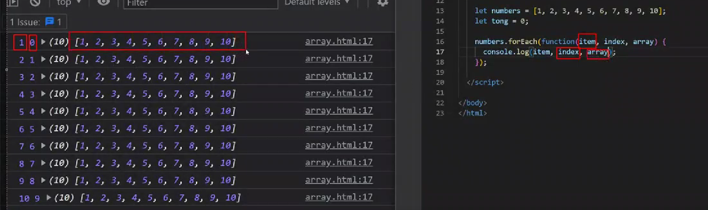

# Buổi 8. Array.

## I. Định nghĩa:
1. Array là 1 kiểu dữ liệu để chứa các phần tử.
2. KDL của Arr là Object.
3. Khởi tạo: `var cars = ["Saab", "Volvo", "BMW"];` hoặc: `var cars = new Array("Saab", "Volvo", "BMW");`
4. Lấy ra 1 giá trị :`console.log(cars[0])`

## II. Các phương thức:
1. Ktra số phần tử: `console.log(cars.length)`
2. push(): Thêm phần tử vào đuôi của Arr
3. pop(): Xóa phần tử ở đuôi của Arr. Nếu mảng không còn phần tử thì trả về undefined
4. shift(): Tương tự nhưng ngược với POP()
5. unshift(): Ngược với Push()
6. splice(a, b): Xóa các phần tử từ a - > b
   1. Nếu ta muốn chèn hoặc thay thế thì :
      1. `splice(a, b, "STR")`. Nêu smuốn chèn thì b = 0, ko thì sẽ là bỏ tất từ a -> b rồi chèn xâu vào
7. a.concat(b): Nối xâu a với xâu b rồi lưu vào xâu a.
8. slice(a, b): Cắt 1 vài element của mảng, lưu vào mảng mới
9. reverse():
   1.  VD:
        ```js
            const fruits = ["Banana", "Orange", "Apple", "Mango"];
            fruits.reverse(); //Mango,Apple,Orange,Banana
        ```
10. join(): Là phương thức để toString xâu
11. indexOf: Trả ra vị trí:, Nếu ko tìm thấy thì trả về -1
    ```js
        const fruits = ["Banana", "Orange", "Apple", "Mango"];
        let index = fruits.indexOf("Apple"); // 2

        const fruits = ["Banana", "Orange", "Apple", "Mango", "Apple"];
        let index = fruits.indexOf("Apple", 3); //4
    ```
12. includes
    ```js
        const fruits = ["Banana", "Orange", "Apple", "Mango"];
        fruits.includes("Mango"); //true

        const fruits = ["Banana", "Orange", "Apple", "Mango"];
        fruits.includes("Banana", 3); // false
    ```

## III. Array Method
1. for each(): 
   1. Duyệt qua mỗi phần tử của mảng, rồi thực hiện 1 hành động
   2. Đối số của forEach là 1 function, có 3 tham số: currentItem, id, array. Với id là vị trí của currentItem trong array:
   3. 
2. every:
   1. Duyệt qua tất cả phần tử của mảng , để kiểm tra 1 điều kiện j đó. Trả về True False
   2. Đối số của every là 1 function, có 3 tham số: currentItem, id, array. Với id là vị trí của currentItem trong array
   3. Có trả về true-false.
3. some:
   1. Kiểm tra `chỉ cần 1 `phần tử của 1 mảng thỏa mãn đk j đó:
   2. Đối số của some là 1 function, có 3 tham số: currentItem, id, array. Với id là vị trí của currentItem trong array
   3. Có trả về true-false.
4. find:
   1. Tìm trong mảng có gt cần tìm ko. Có thì trả về phần tử đó, nếu ko cso thì trả về undefined. Chỉ tìm đc 1 phânnf tử đầu tiên nó tìm thấy
5. fillter:
   1. Như find nhưng trả về nhiều.
6. map:
   1. Duyệt qua các phần tử như forEach. Nhưng sẽ trả về 1 mảng. Mà mảng đó thì do ta quyết và sử dụng return để trả ra.
7. reduce()
   1. như map nhưng thay vì tra về mảng, nó trả về giá trị
   2. Đối số: là 1 hàm có 3 tham số: 
      1. total: Giá trị trả lại trc đó của reduce. VD: Nếu tính tổng 1 mảng thì giá trị ban đấu (innnitialValue = 0, nó gán cho total) Cứ mỗi lần cộng 1 phânf tử vào total, nó sẽ cập nhật ngay
      2. innnitialValue: Ko bắt buộc, khỏi tạo 1 giá trị ban đầu, thế thôi. Nếu ko kbao thì mặc định nó ssd phần tử đầu
8. group