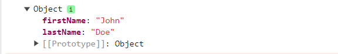
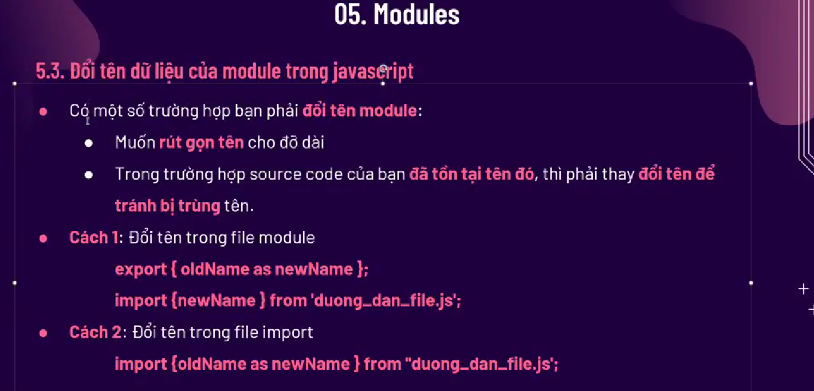

# Buổi 9 _ JS6

## I. JS6.
1. ĐN: JavaScript ES6 (ECMAScript 6) là phiên bản mới nhất của ngôn ngữ JavaScript và là phiên bản JavaScript mạnh mẽ nhất. ES6 bao gồm nhiều tính năng mới và thay đổi cú pháp giúp viết và hiểu mã JavaScript dễ dàng hơn. Hướng dẫn này sẽ hướng dẫn bạn các tính năng mới và thay đổi cú pháp của ES6, đồng thời hướng dẫn bạn cách sử dụng chúng trong mã của riêng bạn.
2. ĐĐ: 
   1. ES6 giúp viết và hiểu mã JavaScript dễ dàng hơn. 
   2. ES6 cung cấp các tính năng mới và thay đổi cú pháp giúp JavaScript mạnh mẽ và biểu cảm hơn. 
   3. ES6 là phiên bản mới nhất của JavaScript và được hỗ trợ rộng rãi bởi các trình duyệt hiện đại.

## II. Let và Const
1. Từ khóa let và const là hai trong số những bổ sung quan trọng nhất cho JavaScript trong ES6. Chúng cho phép ta khai báo các biến nằm trong phạm vi khối, câu lệnh hoặc biểu thức mà chúng được sử dụng. Điều này có nghĩa là các biến được khai báo bằng let hoặc const không thể được truy cập bên ngoài phạm vi mà chúng được khai báo.
2. Sự khác biệt chính giữa let và const là các biến được khai báo bằng let có thể được gán lại, trong khi các biến được khai báo bằng const không thể được gán lại. Điều này có nghĩa là nếu ta khai báo một biến bằng const, ta phải gán giá trị cho biến đó tại thời điểm nó được khai báo.

## III. Arrow Function
1. Là 1 trong 3 cách khai báo function, Nó cho phép ta có thể khai báo nhanh 1 hàm
2. Khai báo:
    ```js
        let f1 = (x, y) => {
            return x + y;
        }
        let f1 = (x, y) => x + y; //SỬ dụng khi hàm chỉ có 1 câu lệnh, và chỉ có 1 giá trị trar về => Bỏ đc return. 
        //Tương đương với:
        let f1 = function(x, y){
            return x + y;
        }

    ```
3. Từ khóa this:
   1. Với các hàm thông thường, từ khóa this là đại diện cho tk Object mà định nghĩa cái function
   2. Với tk Arrow Function, từ khóa this thường là đại diện cho tk Object mà gọi đến cái function

## IV. Template literals:
1. Khai báo: Nó ở trong dấu `` (ko phải dấu nháy đơn đâu) . Cách này giúp ta có thể tạo 1 chuỗi xuống dòng.
2. Nội suy biến và biểu thức thành chuỗi:
   1. Cú pháp: `${...}` 
   2. VD: 
        ```js
            let firstName = "John";
            let lastName = "Doe";
            let text = `Welcome ${firstName}, ${lastName}!`;


            let price = 10;
            let VAT = 0.25;
            let total = `Total: ${(price * (1 + VAT)).toFixed(2)}`;
        ```
   3. Ngoài ra, còn được sử dụng để tạo content cho các mẫu HTML:
        ```js
            let header = "Template Strings";
            let tags = ["template strings", "javascript", "es6"];

            let html = `<h2>${header}</h2><ul>`;
            for (const x of tags) {
            html += `<li>${x}</li>`;
            }

            html += `</ul>`;
        ```

## V. Destructuring
1. Object Destructuring :Tháo các properties của Object và gán cho 1 Object khác
   1. Cú pháp: `let {key A, keyB} = object; hoặc: let [firstName, lastName] = person;` 
   2. VD: 
        ```js
            const person = {
                firstName: "John",
                lastName: "Doe",
                age: 50
            };

            // Destructuring
            let {firstName, lastName} = person;
            console.log({firstName, lastName})
            console.log(firstName)
            console.log(lastName)
        ```
        - 
   3. Có thể tạo thêm các Key khác:
        ```js
            const person = {
                firstName: "John",
                lastName: "Doe",
                age: 50
            };

            // Destructuring
            let {firstName, lastName, country = "VN"} = person;
            console.log({firstName, lastName, country = "VN"})
        ```
   4. Có thể đặt tên cho các key.
        ```js
            const person = {
                firstName: "John",
                lastName: "Doe",
                age: 50
            };

            // Destructuring
            let {firstName : firstN, lastName, country = "VN"} = person;
            console.log({firstN, lastName, country = "VN"})
        ```


2. Array  Destructing
   1. Cú pháp: `let [firstName, lastName] = person;` 
   2. VD: 
        ```js
            const fruits = ["Bananas", "Oranges", "Apples", "Mangos"];

            // Destructuring

            /
            let [fruit1, fruit2] = fruits;
            let {[0]:fruitOne ,[1]:fruitTwo} = fruits; // Ko đc đặt trung tên key vs tk destruc trên
        ```
   3. Map Destructing
        ```js
            // Create a Map
            const fruits2 = new Map([
                ["apples", 500],
                ["bananas", 300],
                ["oranges", 200]
            ]);

            // Destructing
            let text = "";
            for (const [key, value] of fruits) {
                text += key + " is " + value;
            }
        ```
   4. Có thể đặt tên cho các key.
        ```js
            const person = {
                firstName: "John",
                lastName: "Doe",
                age: 50
            };

            // Destructuring
            let {firstName : firstN, lastName, country = "VN"} = person;
            console.log({firstN, lastName, country = "VN"})
        ```

## VI. Module:
1. ĐN:
- Các mô-đun JavaScript cho phép ta chia code JS thành các tệp riêng biệt.
- Điều này làm cho nó dễ dàng hơn để bảo trì các chức năng riêng rẽ
- Các mô-đun được nhập từ các tệp bên ngoài với câu lệnh .import và export
- Các mô-đun cũng dựa vào thẻ `<script>.type="module"`, và src chỉ cần nhập 1 tk js chính là đc.
2. Default Export:
- Là tạo 1 dữ liệu export mặc định, nếu import mà không đc cái dữ liệu(hoặc là nó ko tồn tại trong module) => Nó sẽ gọi đến dèault export
3. Đổi tên các hàm, biến.
   1. 
4. Nếu muốn export nhiều:
   1. `module.export() {tất cả các hàm, biến}`

## VII: Exports() và Require():
1. Exports(): Là ngày 

## VIII. Spread Operator:
1. ĐN:
   1. Spread Operator JavaScript (...) mở rộng một lần lặp (giống như một mảng) thành nhiều phần tử hơn.
   2. Điều này cho phép ta nhanh chóng sao chép tất cả hoặc các phần của một mảng hiện có sang một mảng khác mảng:
2. Cách sử dụng:
   1. Ghép mảng:
        ```js
            const numbersOne = [1, 2, 3];
            const numbersTwo = [4, 5, 6];
            const numbersCombined = [...numbersOne, ...numbersTwo]; // 1, 2, 3, 4, 5, 6
        ```
   2. Tách thành 1 mảng mới:
        ```js
            const numbers = [1, 2, 3, 4, 5, 6];

            const [one, two, ...rest] = numbers; // one: 1, two: 2, rest:3, 4, 5, 6
            const [mot, hai, ba, ...conlai] = numbers;// mot: 1, hai: 2, ba: 3, rest: 4, 5, 6
        ```
   3. Sử dụng với đối tượng:
        ```js
            const ob1 = {
                v1: '1111',
                v2: '2222',
                v3: '3333'
            }

            const ob2 = {
                v3: '9999',
                v4: '4444',
                v5: '5555'
            }

            const ob = {...ob1, ...ob2} //ob: v1: 1111, v2: 2222, v3: 9999, v4: 4444, v5: 5555
        ```