# State và Props:
- Là những thứ có thể giúp component của ta có thể tái sử dụng.

# I. Life cycle:
## 1. 
1. Trong React, các Components có vòng đời bao gồm các giai đoạn khác nhau. Mỗi pha có một tập hợp các lifecycle methods được gọi tại các điểm cụ thể trong vòng đời của component. Các phương pháp này cho phép bạn kiểm soát hành vi của thành phần và thực hiện các hành động cụ thể ở các giai đoạn khác nhau trong vòng đời của nó.
2. 3 giai đoạn chính:
   1. Mounting Phase: Lắp
      1. Giai đoạn lắp đặt bắt đầu khi một thành phần lần đầu tiên được tạo và chèn vào DOM. 
   2. Updating Phase: Cập nhật
      1. Giai đoạn cập nhật xảy ra khi props hoặc state của một thành phần thay đổi. 
   3. Unmounting Phase: Tháo gỡ
      1. Giai đoạn tháo gỡ xảy ra khi một thành phần được loại bỏ khỏi DOM.
3. Mounting Phase
   1. Giai đoạn lắp đặt đề cập đến khoảng thời gian khi một thành phần đang được tạo và chèn vào DOM.
   2. Trong giai đoạn này, một số phương thức vòng đời được React gọi để cho phép nhà phát triển cấu hình thành phần, thiết lập bất kỳ trình nghe trạng thái hoặc sự kiện cần thiết nào và thực hiện các tác vụ khởi tạo khác.
   3. Giai đoạn lắp đặt có ba phương pháp vòng đời chính được gọi theo thứ tự:
      1. constructor():
         1. Được gọi khi thành phần được tạo lần đầu tiên
         2. Sử dụng nó để khởi tạo trạng thái của thành phần và liên kết các phương thức với phiên bản của cấu phần.
         3. 
      2. render:
         1. Chịu trách nhiệm tạo biểu diễn DOM ảo của thành phần dựa trên các props, state hiện tại của nó.
         2. Được gọi mỗi khi thành phần đc render (do state hoặc props bị thay đồi hoặc tk cha bị render lại)
         3. 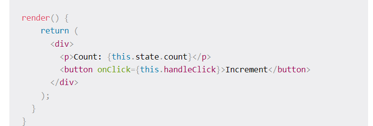
      3. getDerivedStateFromProps()
   4. componentDidMount(): kiểu useEffect
      1. Phương thức này được gọi khi thành phần đã được gắn vào DOM. Nó thường được sử dụng để thiết lập bất kỳ trình nghe hoặc hẹn giờ sự kiện cần thiết nào, thực hiện mọi lệnh gọi API hoặc tìm nạp dữ liệu cần thiết và thực hiện các tác vụ khởi tạo khác yêu cầu quyền truy cập vào API DOM của trình duyệt
      2. 
4. Updating Phase:
   1. shouldComponentUpdate():
      1. Phương thức được gọi **trước khi một thành phần được cập nhật**. Phải mất hai đối số: nextState và next Props. Phương thức này trả về giá trị boolean xác định xem thành phần có nên cập nhật hay không. Nếu phương thức này trả về true, component sẽ cập nhật và nếu trả về false, component sẽ không cập nhật.shouldComponentUpdate()
      2. 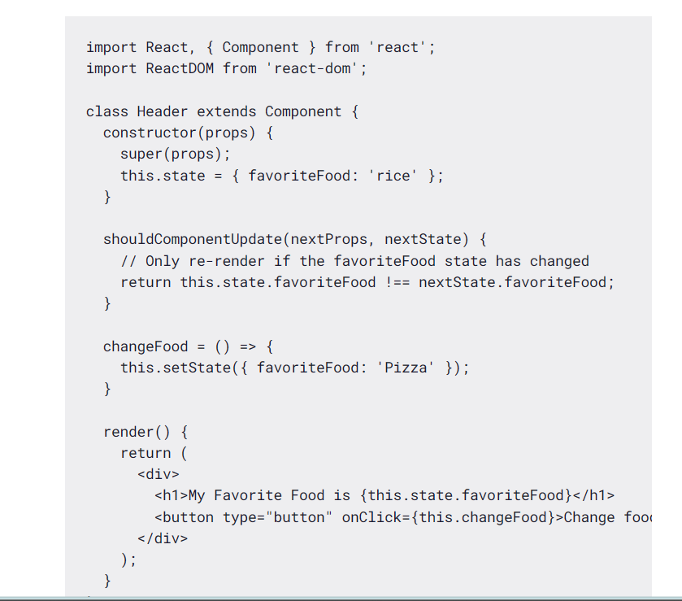
      3. Đoạn mã trên xác định một thành phần hiển thị thực phẩm yêu thích của người dùng và cho phép người dùng thay đổi nó bằng cách nhấp vào nút. Phương pháp được thực hiện để chỉ hiển thị lại thành phần nếu trạng thái đã thay đổi, đây là một cách tốt để tối ưu hóa hiệu suất.
   2. componentDidUpdate():
      1. Phương thức này là một phương thức vòng đời trong React **được gọi sau khi một thành phần đã được cập nhật và render lại**. Nó rất hữu ích để thực hiện các tác dụng phụ hoặc các hoạt động bổ sung khi đạo cụ hoặc trạng thái của thành phần đã thay đổi.
      2. 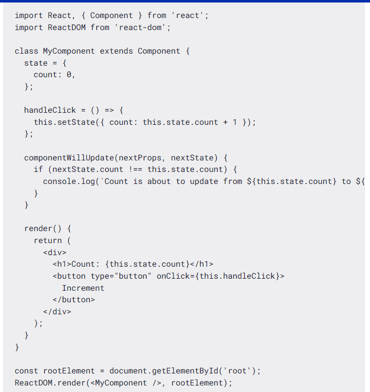
      3. Trong ví dụ này, phương thức được gọi bất cứ khi nào thành phần sắp cập nhật. Trong phương thức này, chúng ta có thể truy cập các đối số và để kiểm tra xem có bất kỳ thay đổi nào đối với trạng thái hoặc đạo cụ của thành phần hay không. Nếu có thay đổi, chúng tôi có thể thực hiện một số hành động hoặc thông báo nhật ký trước khi cập nhật xảy ra.
   3. componentDidUpdate()
      1. Phương thức này là một phương thức vòng đời trong React được gọi **sau khi một thành phần đã được cập nhật và render lại**. Nó rất hữu ích để thực hiện các tác dụng phụ hoặc các hoạt động bổ sung khi đạo cụ hoặc trạng thái của thành phần đã thay đổi.
      2. 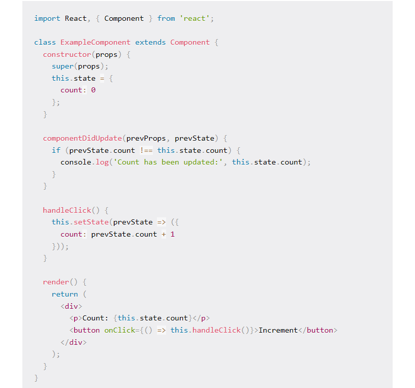
      3. Trong ví dụ này, phương thức được sử dụng để đăng nhập một thông báo vào bảng điều khiển bất cứ khi nào trạng thái đã được cập nhật. Nó so sánh trạng thái trước đó () với trạng thái hiện tại () để kiểm tra xem có thay đổi nào
      4. Bất cứ khi nào phương thức được gọi, trạng thái được tăng lên, kích hoạt kết xuất lại thành phần. Sau khi kết xuất lại, được gọi và nó ghi lại giá trị đếm được cập nhật vào bảng điều khiển.handleClick()countcomponentDidUpdate()
      5. Điều quan trọng là bao gồm kiểm tra có điều kiện bên trong để ngăn chặn các vòng lặp vô hạn. Nếu bạn muốn cập nhật trạng thái dựa trên thay đổi prop, hãy đảm bảo so sánh prop trước đó () với prop hiện tại () trước khi cập nhật trạng thái.componentDidUpdate()prevPropsthis.props
      6. Hãy nhớ rằng không được gọi trong quá trình hiển thị ban đầu của thành phần, chỉ trên các bản cập nhật tiếp theo.componentDidUpdate()
5. Giai đoạn tháo gỡ thành phần
   1. Giai đoạn tháo gỡ đề cập đến giai đoạn vòng đời khi một thành phần đang bị xóa khỏi DOM (Mô hình đối tượng tài liệu) và không còn được hiển thị hoặc truy cập được nữa.
   2. Trong giai đoạn này, React thực hiện một loạt các hoạt động dọn dẹp để đảm bảo rằng component và các tài nguyên liên quan của nó được xử lý đúng cách.
   3. Giai đoạn unmounting là giai đoạn cuối cùng trong vòng đời của một component React và xảy ra khi component đang được gỡ bỏ khỏi cây DOM.
   4. Điều này có thể xảy ra vì nhiều lý do, chẳng hạn như khi thành phần không còn cần thiết nữa, thành phần cha được hiển thị lại mà không bao gồm thành phần con hoặc khi ứng dụng đang điều hướng đến một trang hoặc chế độ xem khác.
   5. Phương pháp vòng đờicomponentWillUnmount()
      1. Trong giai đoạn unmounting, React gọi các phương thức vòng đời sau theo thứ tự:
      2. componentWillUnmount(): Phương thức này được gọi ngay trước khi component được gỡ bỏ khỏi DOM. Nó cho phép bạn thực hiện bất kỳ dọn dẹp cần thiết nào, chẳng hạn như hủy hẹn giờ, xóa trình nghe sự kiện hoặc xóa bất kỳ cấu trúc dữ liệu nào đã được thiết lập trong giai đoạn lắp đặt.
      3. Sau khi được gọi, thành phần được xóa khỏi DOM và tất cả trạng thái và đạo cụ của nó bị phá hủy.componentWillUnmount()
      4. 
      5. Đây là một thành phần React render một thành phần sẽ được hiển thị có điều kiện dựa trên giá trị của state. 
# I. State:
## 1. REnder dữ liệu:
1. Để render bất cứ thứ gì trên màn hình, chúng ta sử dụng phương thức `ReactDOM.render(element, container[, callback])`
   1. element có thể là bất kỳ phần tử HTML, JSX hoặc một thành phần trả về JSX
   2. container là phần tử trên giao diện người dùng bên trong mà chúng ta muốn hiển thị dữ liệu
   3. callback là chức năng tùy chọn mà chúng ta có thể vượt qua được gọi khi một cái gì đó được hiển thị hoặc hiển thị lại trên màn hình
## 2. VD:
- Tạo 1 button tăng giá trị. mỗi lần bấm thì tăng và hiển thị:
- VD:
  - 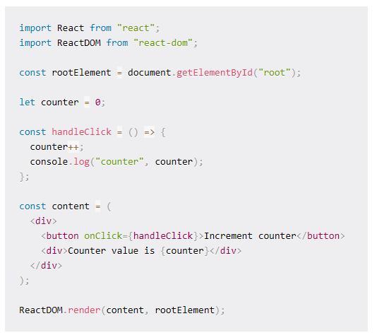
  - Với cách làm như trên dù tăng giá trị nhưng không render ra màn hình
  - Ta làm như sau: Mỗi lần tăng thì gọi render() 1 lần:
  - 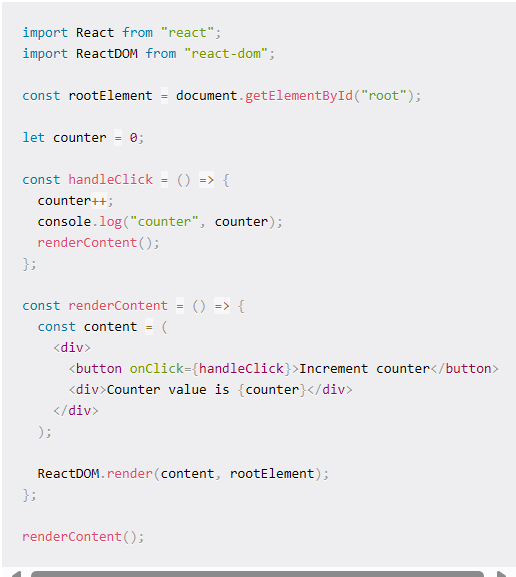
  - TUy nhiên nếu gọi như vậy thì sẽ rất tốn kém thời gian để hiển thị toàn bộ DOM 1 lần nữa trên mỗi lần bấm nút
  - Điều này là do React sử dụng thuật toán Virtual DOM, nơi nó kiểm tra những gì đã được thay đổi trên giao diện người dùng và chỉ hiển thị lại các phần tử đã được thay đổi. Vì vậy, toàn bộ DOM không được hiển thị lại một lần nữa.
  - Trong React, ta có thể chỉ cần cho cái phần tử thay đổi đó render lại bằng State:
## 3. State:
- State cho phép chúng ta quản lý dữ liệu thay đổi trong một ứng dụng. Nó được định nghĩa là một đối tượng trong đó chúng ta xác định các cặp khóa-giá trị chỉ định các dữ liệu khác nhau mà chúng ta muốn theo dõi trong ứng dụng.
- 2 cách:
  - Thành phần dựa trên lớp
    - 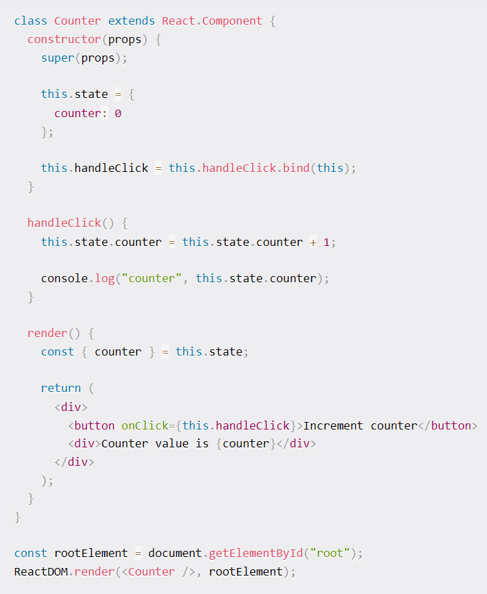
    - tạo count trong constructor
    - gọi đến this.state.count nếu muốn đổi gtri
    - HOặc setState:
      - 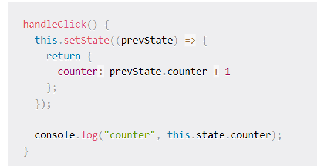
  - funciton conponent:
    - SỬ dụng useState
# II. Props
1. Props: 
   1. lÀ **1 Object** được truyền vào trong 1 Component
   2. Cho phép chúng ta **giao tiếp giữa các Components** với nhau bằng cách truyền tham số qua lại giữa các Components:
   3. Khi 1 Components cha truyền cho Components con 1 Props thì Components con chỉ có thể độc và không có quyền chỉnh sửa nó bên cha
   4. Cách truyền: Như truyền tham số
   5. Kiểu dữ liệu: Tất cả
   6. VD: 2 Tk content nó dùng chung 1 index.js (cùng HTML). => CÙng CSS. nhưng ta muốn nó có content bên trong khác nhau thì sao? => dùng prop truyền data từ component cha xuống component con.
- Sửa thì cứ lấy text ta truyền trong prop lưu vô


# III. Hooks:
## 1. ĐN:
1. Hooks được thêm từ phiên bản React 16.8. Hooks bổ sung thêm những tính năng còn thiếu cho function component để có đầy đủ tính năng giống như class component
2. Chính vì vậy, ngày nay người ta thường code theo hướng funciton vì tính năng đầy đủ, code ngắn, dễ hiểu
3. Hooks bản chất là những hàm được viết sẵn trong ReactJS được dùng cho các tính năng khác nhau, để sử dụng tính năng này ở trong component ta cần gẵn hooks này vào nó

## 2. Các Hooks thường dùng:
### a. UseState:
1. Giúp cập nhật lại trạng thái của dữ liệu. Khi nó thay đổi thì giao diện được update lại theo dữ liệu mới
2. VD: 
   1. Nếu code như bthg: => Ko render ra màn hình
      1. 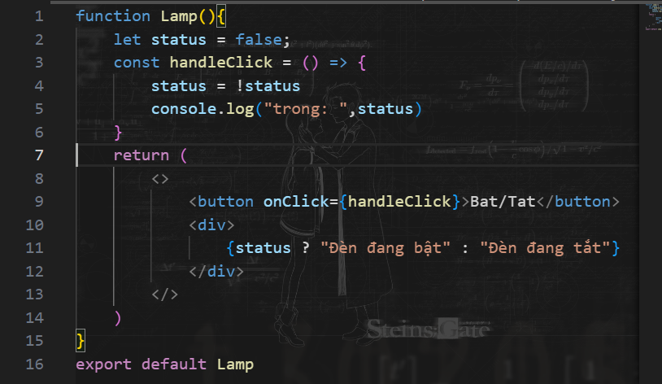
   2. Xử lý: useState
      1. gán giá trị ban đầu bằng phương thức useState:
         1. const [ten_bien, setState] = useState (giatri_bandau). Hàm setState đẻ set trạng thái  **Hàm set có thể đặt tên bất kì nhé (setA,B,.. )**
         2. **hàm setState lúc này có nhiệm vụ là set giá trị cho biến status**
         3. Mỗi lần **update biến, ta gọi hàm setState(giatri)**
         4. 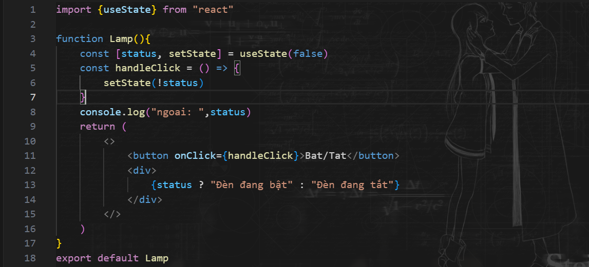

### b. useEffect:
#### 1.ĐN:
1. Dùng để xử lý các logic khi data được thay đổi. 
2. Tk Component sau khi được render ra giao diện lần đầu, thì sẽ gọi tới hàm Callback của UseEffect (vì ưu tiên rander trc, logic sau.)
3. Cú pháp: useEffect(callback, [dependency]);
#### 2. 3 trường hợp:
1. Không dùng dependency:
   1. 
   2. Khi render lại giao diện (từ lần 2) thì callback vẫn được gọi lại
   3. 
2. Dependency cố định:
   1. 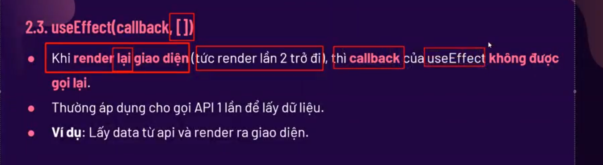
   2. renderl lại => Callback trong useEffect sẽ được thực hiện 
   3. 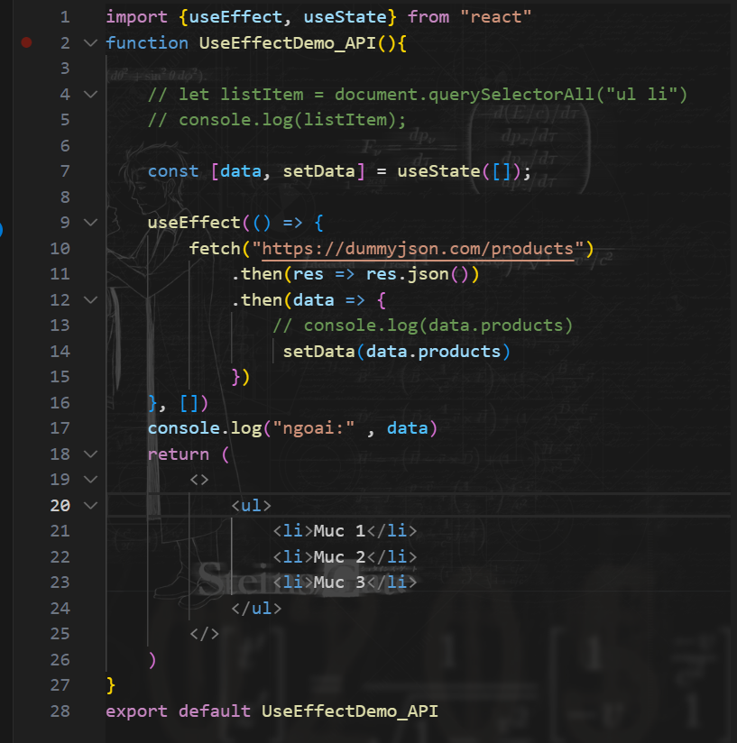
   4. Trong VD trên nếu không để [] thì sẽ gây 1 vòng lặp vô tận, vì: Hàm setData. Khi ta chỉnh sửa giá trị của data, Component sẽ bị render lại. Mà mỗi khi render lại thì sao, thì useEffect sẽ đc khởi động. Và nó lại gọi đến setData => Vòng lặp vô hạn
3. Dependency có thể thay đổi
   1. 
   2. VD: DÙng để tạo page phân các trang tài liệu
### c. useContext: 
1. ĐN: 
   1. Trc kia, Nếu muốn truyền data từ cha => con: ta phải truyền qua props
   2. Nếu dùng useContext thì ta có thể sử dụng trực tiếp
2. Các bước làm:
   1. B1: Tạo ra 1 bối cảnh `ExampleContext= React.createContext();`
   2. Cung cấp bối cảnh để bao bọc lấy toàn bộ lấy các component cần sử dụng data
   3. Giờ tất cả các tk nếu muốn dùng thì gọi useContext + bối cảnh
3. VD:
   1. ```js
      import React from 'react';
      const ExampleContext = React.createContext();

      const App = () => {
      return (
         <ExampleContext.Provider value={{ color: 'red' }}>
            <div className='App'>
            <ChildComponent />
            </div>
         </ExampleContext.Provider>
      );
      };

      const ChildComponent = () => {
      const { color } = React.useContext(ExampleContext);

      return <p style={{ color }}>This text is {color}</p>;
      };

      export default App;
   ```
4. KQ:
   1. 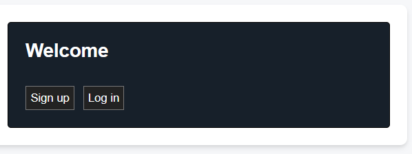

### d. useRef:
1. 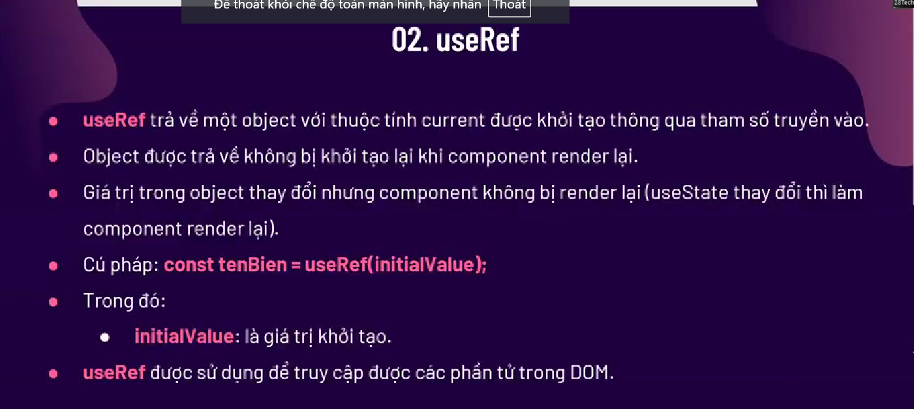
2. Khác với useState là không render lại giao diện

### e. useCallBack:
1. 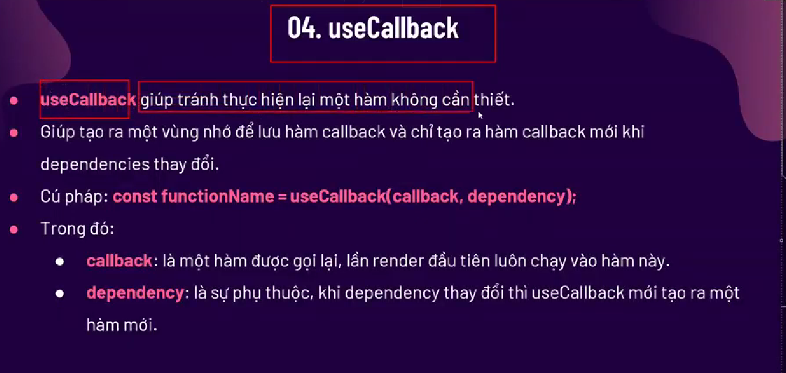
2. 1 cách để tiết kiệm bộ nhớ mỗi khi render lại giao diện, thì ta ko phải khởi tạo lại hàm đấy nữa

### f. Custom Hook ???


# IV. useState()

# V. List and Key

## 1. LIST:
1. Cũng tương tự như JS. Trong React, ta có thể sử dụng luôn các phương thức duyệt List ở trong return:
2. VD:   
   1. ```js
         function Car(props) {
         return <li>I am a { props.brand }</li>;
         }

         function Garage() {
         const cars = ['Ford', 'BMW', 'Audi'];
         return (
            <>
               <h1>Who lives in my garage?</h1>
               <ul>
               {cars.map((car) => <Car brand={car} />)}
               </ul>
            </>
         );
         }

         const root = ReactDOM.createRoot(document.getElementById('root'));
         root.render(<Garage />);
      ```

## 2. KEY:
1. Là các "KHÓA" truyền vào cho các Component trong vòng map
2. VD:
   1. ```js 
         function Car(props) {
            return <li>I am a { props.brand }</li>;
            }

         function Garage() {
         const cars = [
            {id: 1, brand: 'Ford'},
            {id: 2, brand: 'BMW'},
            {id: 3, brand: 'Audi'}
         ];
         return (
            <>
               <h1>Who lives in my garage?</h1>
               <ul>
               {cars.map((car) => <Car key={car.id} brand={car.brand} />)}
               </ul>
            </>
         );
         }

         const root = ReactDOM.createRoot(document.getElementById('root'));
         root.render(<Garage />);
      ```


# VI. Event Handling
## 1. Các nguyên tắc cơ bản của xử lý sự kiện trong React
1. Hệ thống sự kiện thổng hợp:
   1. Là 1 hệ thống sự kiện để đảm bảo các sự kiện hoạt động nhất quán trên các trình duyệt khác nhau. Điều này bao bọc hệ thống sự kiện gốc trong các trình duyệt, cung cấp một API thống nhất bất kể trình duyệt mà React đang chạy.
2. Quy tắc đặt tên:
   1. VD: onClick thì hàm CallBack là: handleClick
3. Passing event handlers as props
   1. Nói đến việc truyền 1 hàm xử lý event vào cho tk con xử lý thông qua props:
   2. VD:
      1. ```js
            // Component cha (ParentComponent)
            import React, { useState } from 'react';
            import ChildComponent from './ChildComponent';

            const ParentComponent = () => {
            const [count, setCount] = useState(0);

            // Hàm xử lý sự kiện
            const handleClick = () => {
               setCount(count + 1);
            };

            return (
               <div>
                  <h1>Count: {count}</h1>
                  {/* Truyền hàm handleClick vào ChildComponent */}
                  <ChildComponent onButtonClick={handleClick} />
               </div>
            );
            };

            export default ParentComponent;
            
            
            
            // Component con (ChildComponent)
            import React from 'react';

            const ChildComponent = ({ onButtonClick }) => {
            return (
               <button onClick={onButtonClick}>
                  Click Me!
               </button>
            );
            };

            export default ChildComponent;
         ```
4. Hàm inline và component methods:
   1. Trong React, các sự kiện thường chạy khi các hàm inline hoặc các hàm độc lập trong thành phần khi được kích hoạt
   2. Hàm inline: Được tạo và định nghĩa ngay tại nơi sử dụng
      1. VD: 
      2.    ```js
               <button onClick={() => setCount(count + 1)}>
                  Increase Count
               </button>
            ```
   3. Component method: hàm đc khai báo và sử dụng trong phần khai báo component:
      1. 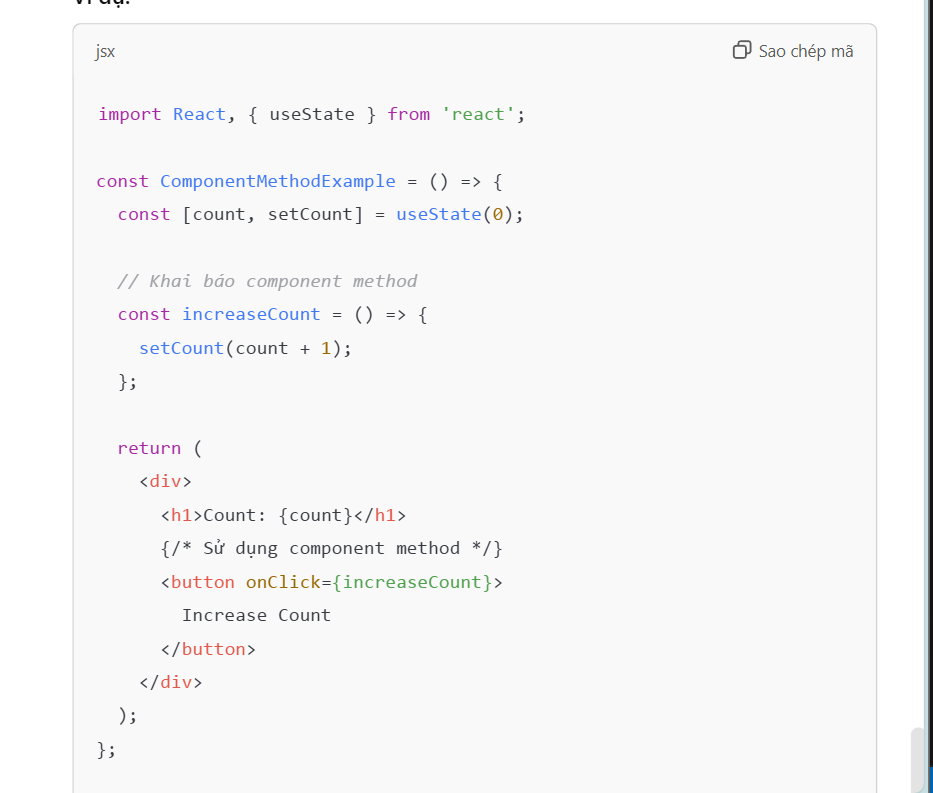
5. Event cũng có các tính chất, kiến thức liên quan tương tụ như trong JS:
   1. Ràng buộc người xử lý sự kiện với để ghi nhớ trình xử lýuseCallback
   2. Trình xử lý sự kiện có tham số (bạn đã thấy điều này trong phần về cách chuyển đối số cho trình xử lý sự kiện)
   3. Xử lý sự kiện có điều kiện
   4. Đoàn sự kiện
   5. Sự kiện sủi bọt
   6. Xử lý tối ưu hóa cho danh sách
   7. Hàm mũi tên nội tuyến (hàm ẩn danh mà bạn chuyển vào trình xử lý sự kiện)

# VII. ReactJS Rendering Elements:
1. Render 1 phần tử trong React:
   1. Để render bất kì Element nào vào Browser DOM, Ta cần phải có 1 container hoặc DOM element.
   2. Cần phải có 1 phần tử có id = "root" hoặc "app" để làm DOM gốc
   3. VD:
      1. 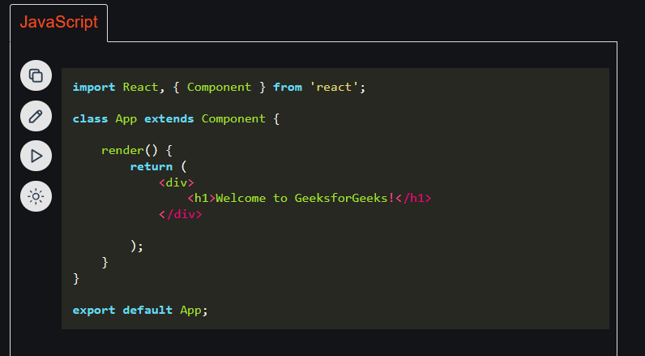
2. Update 1 phần tử trong React:
   1. Nếu sử dụng Class Component: Ta phải thực hiện lại phương thức render mỗi lần ta muốn cập nhật
3. Render có điều kiện: Tương tự việc sử dụng toán tử 3 ngôi