1. 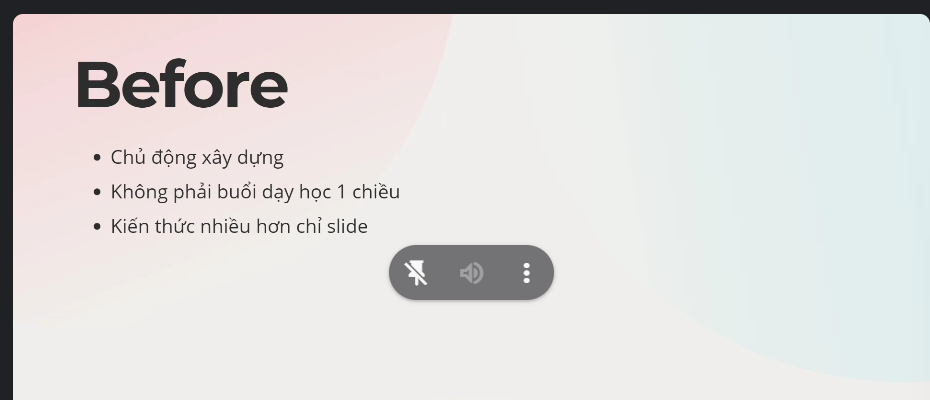
2. Tổng quan:
   1. 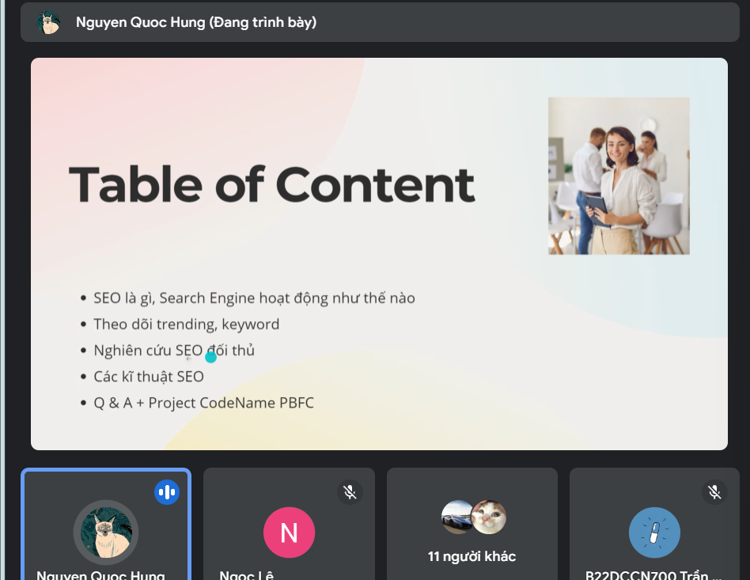
3. Seo là gì:
   2. 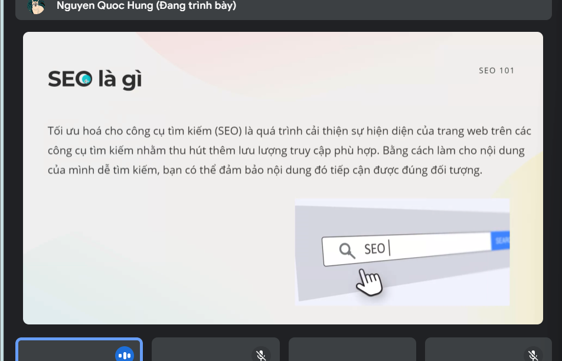
   3. Là cách ta tối ưu hóa công cụ tìm kiếm của browser. => THu hút đc thêm lưu lượng truy cập bằng cách được đảm bảo nội dung dễ tìm kiếm
4. Cách GG Search Hoạt động:
   1. 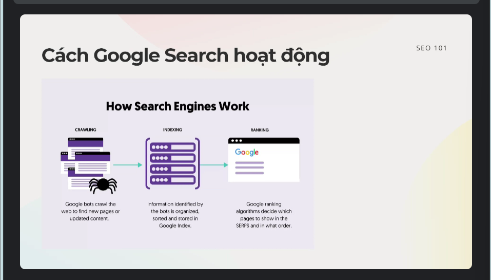
   2. GG có Bot để cào các trang web, bài viết => Tổng hợp
   3. B2: Sắp xếp,...
   4. B3: Đánh giá, xếp hạng xem tk nào cần cho lên trên.
   5. Vậy ta làm sao để can thiệp vào qua trinhf này?
5. Tạo sao phải SEO?
   1. 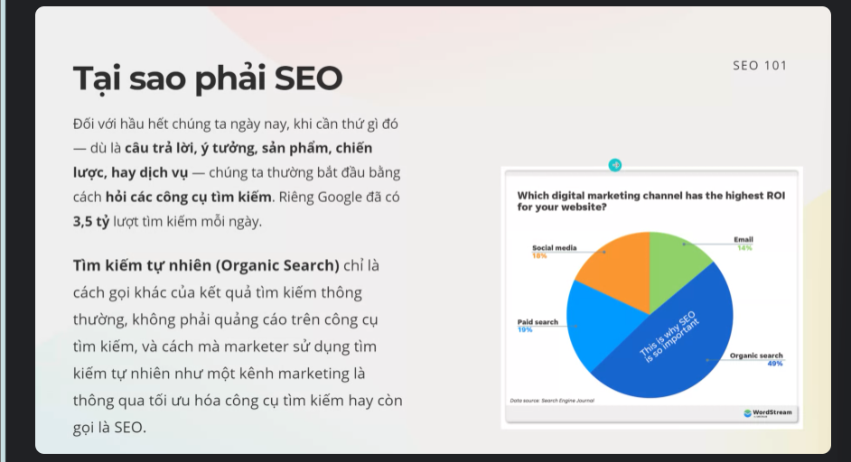
   2. Nghiên cứu: Các kệnh truyền thông nào có tỷ lệ oke nhất: (Cái đồ thị) => Organic Search Là tỉ lệ cao nhất (Ý là nó luôn ở đầu nên ng ta tự tìm đến thôi)
6. Làm SEO tối ưu những j:
   1. 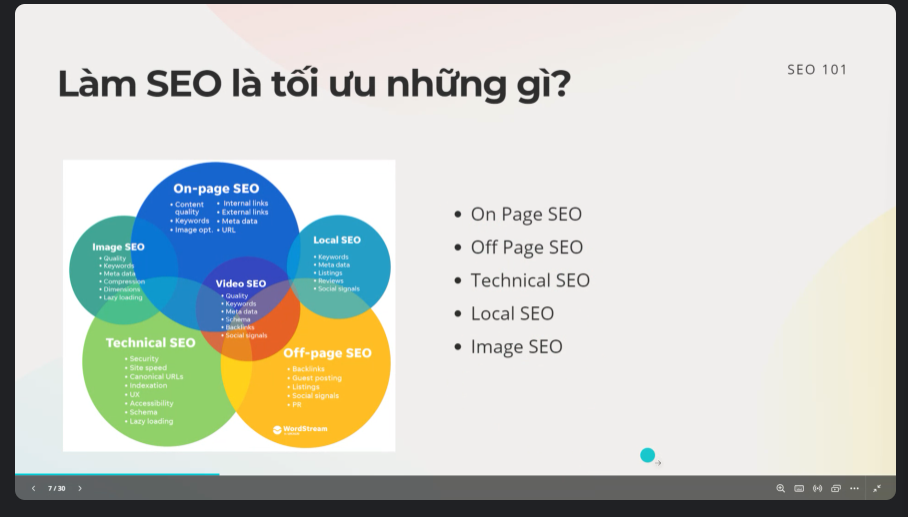
   2. Keyword: 
      1. 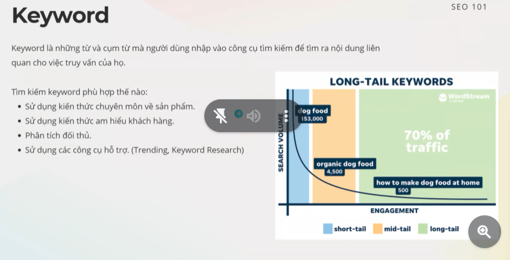
      2. Làm sao để tìm đc những từ khóa phù hợp:
         1. Kiến thức chuyên môn, Khách hàng, phân tích đối thủ
         2. Công cụ hỗ trợ (Trending, KeyWord Search)
      3. Long-Tail KeyWord
         1. 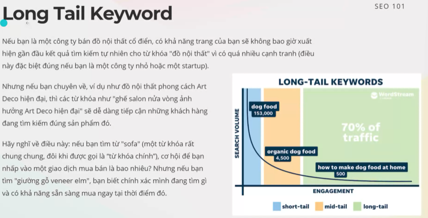
         2. Mk làm 1 cái phổ thông, vậy thì khả năng là khó khăn cạnh tranh về mấy cái từ khóa ngắn (VD: Game, Đồ gỗ,...)
         3. VD: 'Lập trình PTIT' thì khả năng ra đc Pro. Nhưng 'Lập trình' thì khả năng khó để tìm đc Pro.
         4. Những cái từ khóa dài, chi tiết thì nó sẽ dễ cạnh tranh hơn. 
         5. VD:
            1. 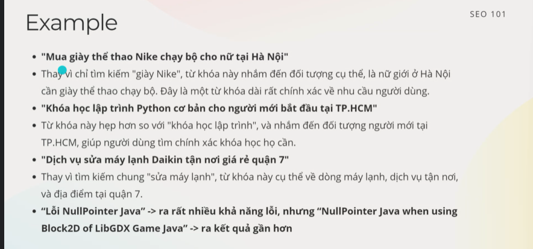 
      4. TIps:
         1. Những từ khóa về Địa lý, Địa chỉ sẽ dễ tìm kiếm hơn.
7. OnPageSeo: Là 1 kĩ thuật SEO:
   1. 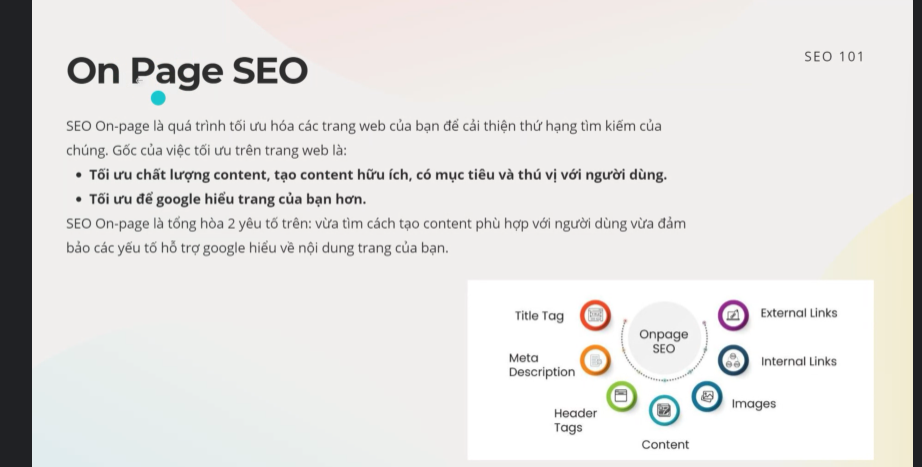
   2. ĐN:
      1. Tối ưu vào 2 hướng chính:
         1. Chất lg content, hữu ích, có mục tiêu, thú vị với ng dùng
         2. Tối ưu để GG hiểu trang của bn hơn.
   3. HeadingTag:
      1. 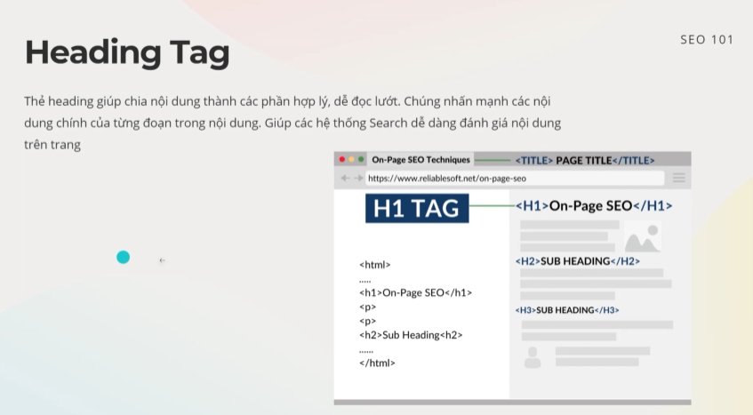
      2. Thẻ Heading giúp ta chia ND thành các thành phần hợp lý, đễ đọc => Nó cũng giúp hệ thóng GG dễ đọc.
   4. URL Structure:
      1. 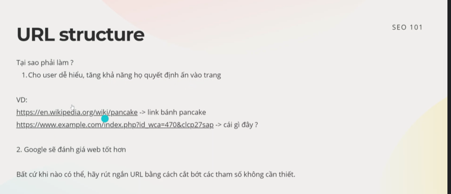
      2. Rút ngắn URL sẽ giúp GG đánh giá web tốt hơn, tránh các tham số.
   5. Link Internal và External:
      1. 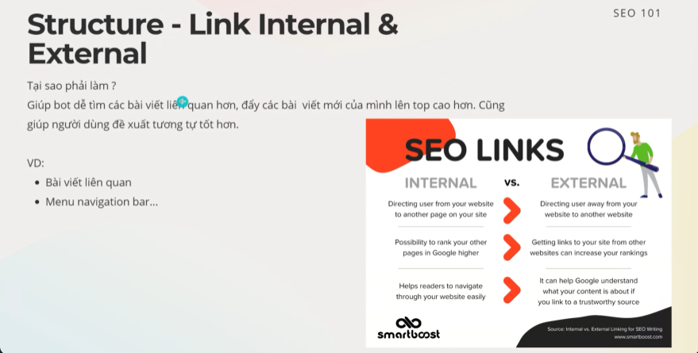
      2. Nó sẽ có những mục Link đính kèm (mà ta có thể truy cập link trong web). Ngoài ra nó cũng giúp GG kiểm tra.
      3. GG vào 1 trang, tìm tất cả link trong trang đó.
      4. Giả sử là Trong trang web xị xịn, nổi tiếng mà có dẫn link đến web của mình thì nó kiểu sẽ tăng uy tín hơn (Giống kiểu seeding trang mình trong comment của 1 page nổi tiếng)  => GG đánh giá cao hơn(Đánh lừa GG rằng trang của ta đc 1 trang uy tín dẫn).
      5. Có 1 số con bot nó auto seeding link của mk vào mấy diễn đàn nổi tiếng (1 vài web nó chặn đấy kkk)
      6. Tuy nhiên nếu lm nhiều qua nó giảm uy tín nên phải chọn chỗ mà seed (ko phản tác dụng)
   6. Structure - Image: Phần tìm kiếm hình ảnh
      1. 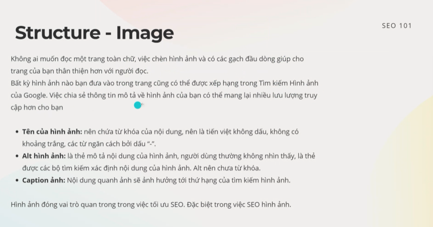
      2. Có 3 mục mà GG đánh giá:
         1. Tên hình ảnh
         2. Alt Img
         3. Caption Img
   7. Meta data:
      1. 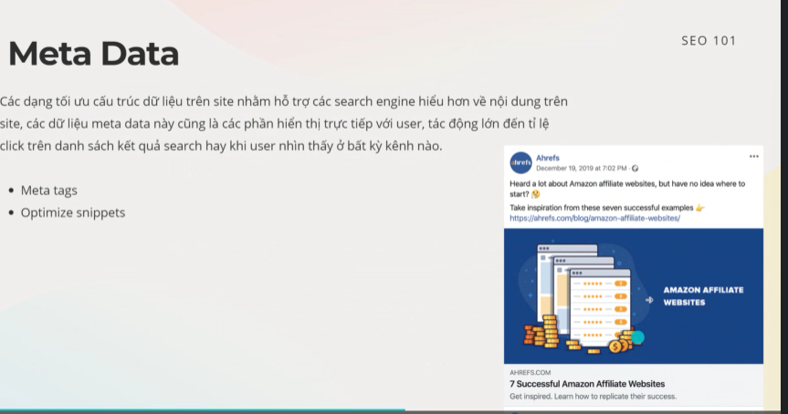
   8. Crawling(Cào):
      1. 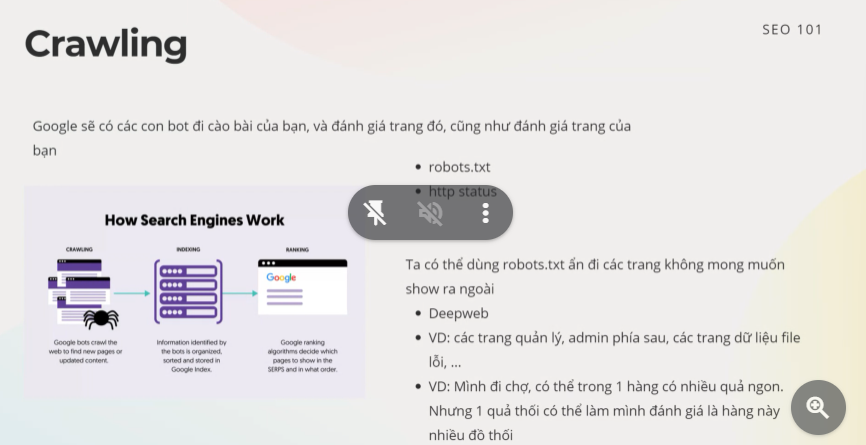
      2. 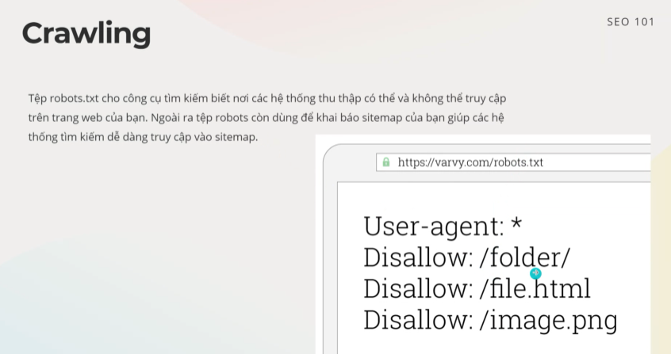
      3. Cái file .robots.txt là chỗ cho con gg nó đoc, ta có thể cho phép,ko cho phép nó đọc cái j (Chẳng hạn nếu ta chưa làm xong cái j đó thì ta cứ disallow nó đi)
   9. Keyword Tool:
      1. 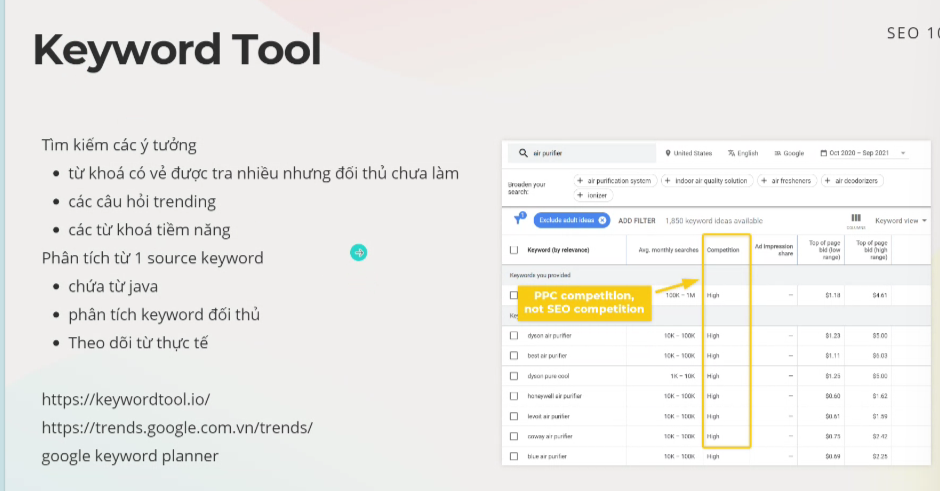
      2. Làm sao để biết đc các từ khóa, chủ đề có trending
      3. Cái tool này giúp tìm kiếm ý tưởng, phần tích keyword
      4. 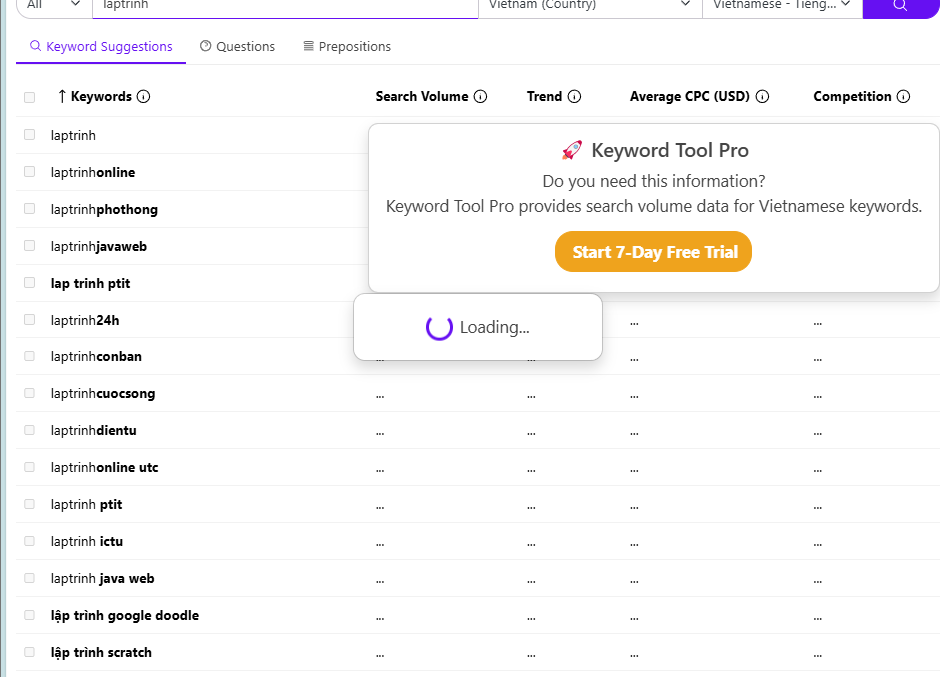
      5. Ta có thể xem xem có những từ khóa nào đang trend để làm còn ten theo hoặc ít đối thủ cạnh tranh......
   10. GG Trend: Để xem có những j đang trend, từ khóa nào trend, chủ đề,...
   11. Page Performance:
       1.  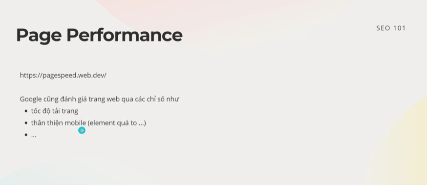
       2.  Tool để đo các chỉ số của trang web
       3. Đánh giá: 
         1. `https://pagespeed.web.dev/analysis/https-genshin-hoyoverse-com-en-home/vl36hw9ep4?form_factor=mobile`
      1. Nó còn đưa ra các cái đề xuất (Kể cả các thẻ, các link, các JS đang lỗi, jj đó, hoặc chạy lâu....)
   12. Monitoring:
      1. 
      2. Để theo dõi tình hình của web, (ytb thì riêng nó cũng có)
      3. Trang : GG Search Console
8. Từ Khái quát => CỤ thể hóa
   1. 
   2. 
   3. 
9. 
10. 
11. 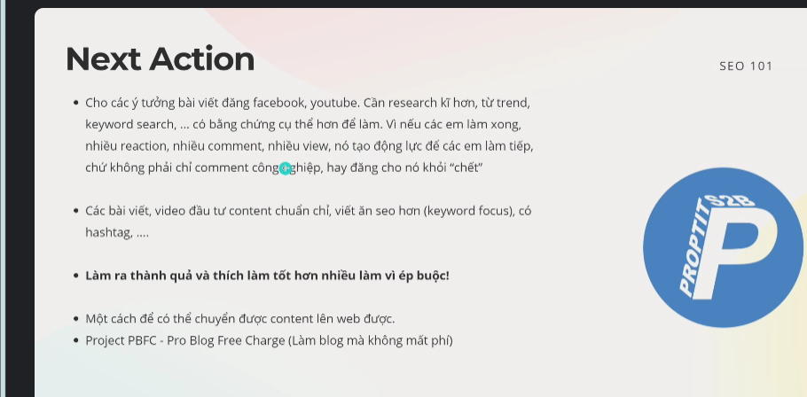

1. PBFC: Blog cho Pro (Không mất phí)
   1. Blog học thuật cho CLB, Xịn, Nổi
   2. Làm Blog ko mất phí
   3. Tính năng:
      1. Đăng bài viết mới, Sửa, Xóa bài viết dễ (Cho 1 ng ko bt j về Front-End có thể đăng content)
      2. Không mất phí
2. Cách 1 trang WEB hoạt động:
   1. FE: (HTML, PHP, JS, CSS) => PC: Giao điẹn Hiển thị ra rồi => WEb Tĩnh => Khó để ng dùng sửa.
   2. Giao Diện => Database => Triển khai... => HIển thị lại
   3. Mấy cái giao diện js,css có thể lưu ở drive.....
   4. Quan trong là phần Backend => Phải lưu riêng ra => Mất tiền để đăng kí server
3. VD: Web của GCC: 
   1. Free
   2. Chinhr sửa đc
   3. Cách SD: Doc: Markdown đc đọc  => Xử lý => HTML (Đây chỉ là giao diện tĩnh).
   4. Tuy nhiên nếu muốn sửa thì phải chui vào file Markdown sửa :vvvvv
   5. => Mong muốn 1 cái trang, họ có trình chỉnh sửa riêng => Up lên.
   6. Vấn đề xảy ra: Phân quyền:.....
4. Cách làm : FireBase:
   1. DD:
      1. Của GG => Co Auth GG
      2. Có tính năng phân quyền
      3. 
   2. Realtime Database: Nó là cái database dưới dạng JSON
   3. Không Free nhưng cũng rẻ.
5. Cách làm 2: Convex
   1. FREEEEEEEEEEEEEE
   2. Thay thể đc cả cục BACKEND.
6. CHuyển content => Giao diên: CÓ thể dùng cái thư viện convert markdown
7. ĐỊnh ra 1 kiểu chung nào đó để ng dùng có thể nhập xuất => Sau đó ta chỉ cần xử lý render là oke.