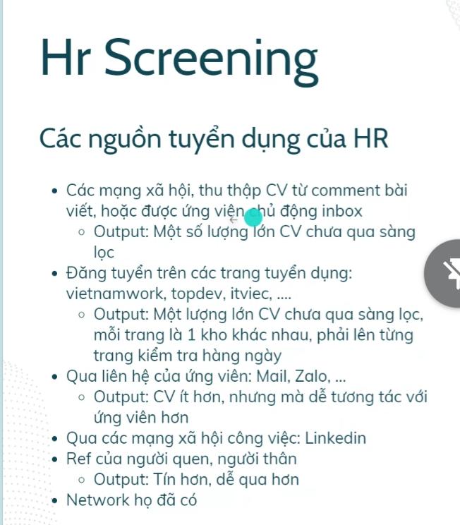

1. 

# I. 
1. Các vòng trong quy tình tuyển dụng:
   1. 
   2. HR Screening:
      1. 
      2. Vòng nộp CV
      3. HR khi tuyển dụng họ làm gì, họ mong muốn điều gì?
         1. 
         2. Họ đc lợi khi tuyển đc nhiều nhân tài, ít tốn công sức.
            1. Kiểu như PV CLB, cứ thương cảm cho qua CV là mình sẽ gây mệt cho cả hệ thống. => Tốn thời gian
      4. Các nguồn tuyển dụng:
         1.  
         2. 
      5. Nhìn nhận:
         1. 
         2. Tỉ lệ cao nhất là liên hệ trực tiếp, linkedin hoặc có nguồn từ bên trong
      6. Cần:
         1. 
         2. Chủ động liên hệ HR nếu có thể
         3. Xâu dựng nguồn liên hệ thụ động
         4. CV cần phải nổi bật hẳn.
   3. VIẾT CV:
      1. 
      2. Quan tâm:
         1. 
         2. **VD CV phèn**:
            1. VD: 
            2. Responsible bị ít quá, chả rõ ràng j
            3. Quá nhiều khoảng trắng
         3. **QUan tâm là ông làm cái j trong hệ thống đấy, hệ thống đấy chạy ra sao?.**
         4. **CV gây ấn tượng:**
            1. 
            2. Chia lề kẻ lối rõ ràng, highlight những phần in đậm.
            3. Tôi đã làm những j, nhờ nó mà đã được j,...
            4. Nếu app clone thì khi ta sử dụng cái công nghệ nào đó => hiệu suất ngon ntn,.... (Kiểu ngầu ngầu hơn cái app chính (dù có thể ko phải :))
            5. Nên viết CV 1 trang (Intern thi tầm thế thôi)
         5. Các cái có thể vẽ:
            1. 1 số cái kinh nghiệm hơi vẽ vời ra 1 tí, viết nó ngầu ngầu ra là xong
            2. 
            3. Có thể viết là tôi dùng cái này => xử lý cái này => cải thiện đc bn %
   4. Marketing bản thân:
   5. Technical Interview:
      1. 
   6. Liên tục cải tiến:
      1. Update CV liên tục
      2. Nếu thấy công nghệ j chưa có thì học thôi. Làm 1 cái dự án về cái công nghệ đó
      3. Đừng ngaị mấy job junior, senior, cứ add vô.
   7. PV dạo
      1. Coi như là 1 bài test free.
      2. Có thể ng ta chỉ cho mk học
      3. CÓ thể đc kết nối với tiền bối
   8. Chọn công ty mơ ước
      1. 
   9. SMT:
      1. Lương đi đôi với trách nhiệm. Nếu mà oke tức là mức cần thiết của CV
      2. KN phát tr đi đôi với mức lương
      3. Nên xếp lịch để có mặt ở cong ty đều, để ng ta còn nhớ
      4. Mentor: Nên có mqh tốt. Nếu muốn hỏi j thì nên tìm hiểu trc đã. CÓ thể lm quen thì tốt
   10. Lương:
       1.  
       2.  Trang xem lương:
           1.  Classdoor: